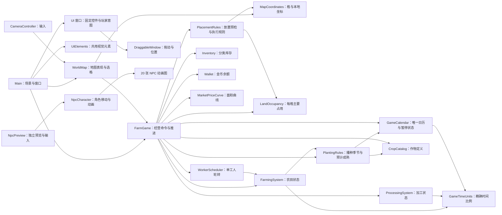

# 当前系统组织与状态归属

本文记录已落地的模块关系，随实施任务更新；未来玩法和目标接口见[系统设计与执行计划](../farm-exchange-system-design-and-execution-plan.md)。

| 状态或计算 | 当前拥有者 | 其他模块的使用方式 |
| --- | --- | --- |
| 每格主要占用类别 | `LandOccupancy` | `FarmGame` 协调建造、拆除，并聚合地块快照。 |
| 建筑描述、范围、占用与余额的放置检查 | `PlacementRules` | `FarmGame` 预检和执行使用同一规则；执行时重新检查并返回实际扣费。 |
| 农田选种、水分、阶段与剩余精确时长 | `FarmingSystem` | `FarmGame` 在步进开始传入显式降雨，协调按作物收获量入库；`WorkerScheduler` 只通过受控工作操作照料。 |
| 播种适宜季节与预计成熟判断 | `PlantingRules` | `FarmingSystem` 执行播种和 `FarmGame` 查询详情共用同一只读结果。 |
| 加工场地配对与进行中批次 | `ProcessingSystem` | `FarmGame` 协调完工入库与领取相位；模块从 `Inventory` 领取原料。 |
| 单工人下一个候选农田索引 | `WorkerScheduler` | `FarmGame` 每 tick 请求至多一次工作。 |
| 累计模拟秒、日历和暂停 | `GameCalendar` | `FarmGame` 每次经营步进推进一秒；主界面读取日期并设置暂停。 |
| 跨日市场更新 | `FarmGame` | 日历进入新日时查询旧市场曲线并刷新当日价格。 |
| 生产共用的时间比例 | `GameTimeUnits` | 日历、农田和加工使用同一整数比例与剩余秒数换算。 |
| 七种作物的定义 | `CropCatalog` | `FarmGame` 查询只读作物表与单种定义。 |
| 各作物的原料和加工品库存 | `Inventory` | `FarmGame` 在生产和交易时查询或修改；界面仍通过 `FarmGame` 查询。 |
| 金币余额 | `Wallet` | `FarmGame` 在建造和交易时扣款或入账；界面仍通过 `FarmGame.MoneyCents` 查询。 |
| 面粉价格曲线 | `MarketPriceCurve` | `FarmGame` 按种子和日期查询价格。 |
| 格坐标范围与等距本地坐标换算 | `MapCoordinates` | `WorldMap` 用于选格、绘制和镜头限制；地图格数引用 `FarmGame.MapSize`。 |
| 地图块缓存、选中格和可见性 | `WorldMap` | `Main` 同步外观；`CameraController` 发起选格与限制镜头。 |
| 摆放模式与所选格 | `Main` | 分发窗口意图，调用 `FarmGame`，在命令完成后刷新。 |
| 窗口位置与拖动 | `DraggableWindow` | 各窗口继承统一标题栏、层级抬升和视窗限制；只在本次运行保留位置。 |
| 目录选择、输入与固定控件 | 各 UI 窗口 | 只更新值和按钮状态，向 `Main` 发出选择、改种、出售或移除意图。 |
| 农田与加工详情状态原因 | `FarmGame` | 通过两类详情快照给对应面板；UI 只映射可见文案。 |
| 独立 NPC 预览的角色选择和键盘输入 | `NpcPreview` | 将图集与移动方向交给 `NpcCharacter`；不修改 `FarmGame`。 |
| NPC 图集帧、朝向与视觉移动 | `NpcCharacter` | 按预览输入显示角色；主地图尚未接入经营工人位置。 |

| 要修改的现行行为 | 先查看 | 同时核对 |
| --- | --- | --- |
| 格中心、选格或镜头位置 | `MapCoordinates`、`WorldMap` | `CameraController`、坐标与镜头测试；区分本地和全局位置。 |
| 建造、占用或拆除 | `FarmGame`、`PlacementRules`、`LandOccupancy`、`FarmingSystem`、`ProcessingSystem` | `Main`、`WorldMap` 的快照同步和建造测试。 |
| 作物、播种季节、供水、加工或库存 | `FarmGame`、`FarmingSystem`、`PlantingRules`、`ProcessingSystem`、`WorkerScheduler`、`CropCatalog`、`Inventory` | 步进开始的降雨、工人浇水、预计成熟、收获清水与经营测试。 |
| 市场价格或出售 | `MarketPriceCurve`、`FarmGame`、`Inventory`、`Wallet` | 当日成交价、交易测试与玩家规则。 |
| 日期边界与生产时间 | `GameCalendar`、`GameTimeUnits` | 同步核对 `FarmGame` 相位、生产模块和日历测试。 |
| 窗口交互 | `Main`、`DraggableWindow`、对应具体窗口 | 玩家操作、固定控件刷新、场景节点名和端到端测试。 |
| NPC 动画、角色图集或预览输入 | `NpcCharacter`、`NpcPreview` | 角色场景、20 张素材和预览集成测试；不要用动画回调推进经营。 |

T01/T02 已将窗口容器、目录、选种、库存、市场和详情从 `Main` 的构造与重建逻辑中抽出；经营刷新保留控件实例。T03 已统一坐标入口，T04A～T04C 已统一状态归属和放置规则。T05A 完成独立历法，T05B 已接管经营时间并切换七作物参数；T06A 的田块水分由 `FarmingSystem` 唯一持有，T06B 的播种判断由 `PlantingRules` 统一提供。道路占格和实际工人移动分别留在 #45、#40。
