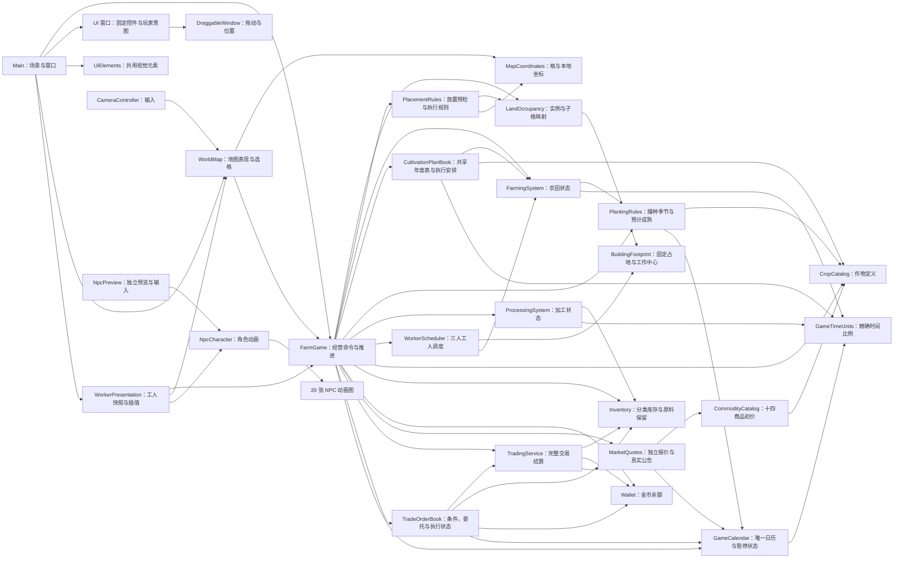

# 当前系统组织与状态归属

本文记录已落地的模块关系，随实施任务更新；后续功能的范围与验收状态见[后续功能计划](../project/deferred-features-plan.md)；已完成的设计与执行历史见[系统设计计划归档](../archive/farm-exchange-system-design-and-execution-plan.md)。

| 状态或计算 | 当前拥有者 | 其他模块的使用方式 |
| --- | --- | --- |
| 实例锚点、类别与子格到实例映射 | `LandOccupancy` | 全占地几何检查、一次登记和整体移除；经营与地图读取同一空间快照，生产状态只在锚点保存一份。 |
| 固定形状偏移与工作中心 | `BuildingFootprint` | 土地、工人和地图共享定义；当前农田/加工 3×3、道路 1×1，不在各调用方重复计算。 |
| 建筑描述、范围、占用与余额的放置检查 | `PlacementRules` | `FarmGame` 预检和执行使用同一规则；执行时重新检查并返回实际扣费。 |
| 农田选种、水分、阶段与剩余精确时长 | `FarmingSystem` | `FarmGame` 在步进开始传入显式降雨，协调按作物收获量入库；禁生换季先促成符合内部阈值的成熟，再完整清理未成熟作物。播种启停支持计划休耕，`WorkerScheduler` 只通过受控工作操作照料。 |
| 共享年度表、农田引用、逐条年度执行凭据、预备安排与下一日期事件 | `CultivationPlanBook` | `FarmGame` 封装计划及手动命令，传入实际农田状态与日历推进；配置与执行缓存集中在计划 Module，UI 只维护未提交草稿。应用和修改保留本轮，编辑及重应用保留本年已执行条的凭据，日期事件区分两种表模式，同条不重复、过期不补种。 |
| 播种适宜季节与预计成熟判断 | `PlantingRules` | `FarmingSystem` 执行播种和 `FarmGame` 查询详情共用同一只读结果；仅当前禁生季节禁止播种，预计时间不足为风险提示。 |
| 加工场地配对与进行中批次 | `ProcessingSystem` | `FarmGame` 协调完工入库与领取相位；模块从 `Inventory` 领取原料。 |
| 工人位置、当前任务、独占认领与候选游标 | `WorkerScheduler` | `FarmGame` 只推进一秒并提供只读快照；三人按编号推进，当前选择算法留在私有方法，外部不读取或修改游标及认领表。 |
| 累计模拟秒、日历和暂停 | `GameCalendar` | `FarmGame` 每次经营步进推进一秒；主界面读取日期并设置暂停。 |
| 行情排期与真实公告 | `MarketQuotes` | `FarmGame` 在换日后传入日历，只在实际前一日与报价日处理；UI 和交易读取同一报价。 |
| 生产共用的时间比例 | `GameTimeUnits` | 日历、农田和加工使用同一整数比例与剩余秒数换算。 |
| 七种作物的定义 | `CropCatalog` | `FarmGame` 查询只读作物表与单种定义。 |
| 各作物的原料、加工品库存与原料保留底线 | `Inventory` | `FarmGame` 在生产、设置和交易时查询或修改；加工领取共用受底线限制的完整操作，界面仍通过 `FarmGame` 查询。 |
| 金币余额 | `Wallet` | `FarmGame` 在建造和交易时扣款或入账；界面仍通过 `FarmGame.MoneyCents` 查询。 |
| 商品名称与初价 | `CommodityCatalog` | 报价与UI共用十四商品目录，合法性复用 `CommodityId`。 |
| 完整交易检查与结算 | `TradingService` | `FarmGame` 转发买卖和全部出售；先检查资源与容量再同步提交，失败零修改。 |
| 委托配置、原现金基准、建单顺序与执行状态 | `TradeOrderBook` | `FarmGame` 统一管理并在行情更新后推进一次；条件、预算数量与生命周期留内部，UI 读取独立快照和发出完整命令。 |
| 金币与商品的冻结总额 | `Wallet`、`Inventory` | 订单只记录每单归属量；建造、加工、即时交易读可用额度，成交使用本单额度并释放差额，撤销只释放本单冻结。 |
| 历史面粉曲线 | `MarketPriceCurve` | 保留独立曲线验证，正式经营不调用。 |
| 格坐标范围与等距本地坐标换算 | `MapCoordinates` | `WorldMap` 用于选格、绘制和镜头限制；地图格数引用 `FarmGame.MapSize`。 |
| 地图块缓存、选中格和可见性 | `WorldMap` | `Main` 同步外观；`CameraController` 发起选格与限制镜头。 |
| 摆放模式与所选格 | `Main` | 分发窗口意图，调用 `FarmGame`，在命令完成后刷新。 |
| 窗口位置与拖动 | `DraggableWindow` | 各窗口继承统一标题栏、层级抬升和视窗限制；只在本次运行保留位置。 |
| 目录选择、未提交输入与固定控件 | 各 UI 窗口 | 只更新值和按钮状态，向 `Main` 发出选择、改种、底线设置、出售或移除意图；库存草稿与焦点保留，底线权威值属于库存模块。 |
| 农田与加工详情状态原因 | `FarmGame` 聚合规则模块结果 | 加工复用 `ProcessingSystem` 与库存的实时可领取判断；通过两类详情快照给面板，UI 只映射可见文案。 |
| 独立 NPC 预览的角色选择和键盘输入 | `NpcPreview` | 将图集与移动方向交给 `NpcCharacter`；不修改 `FarmGame`。 |
| 工人视觉位置与插值段 | `WorkerPresentation` | 从经营快照换算位置并显示三人；没有到达、作业或库存权限，渲染帧率不改变经营结果。 |
| NPC 图集帧、朝向与视觉移动 | `NpcCharacter` | 预览按输入移动；主地图通过 `ShowAt` 展示经营位置与朝向，停止自主物理移动。 |

| 要修改的现行行为 | 先查看 | 同时核对 |
| --- | --- | --- |
| 格中心、选格或镜头位置 | `MapCoordinates`、`WorldMap` | `CameraController`、坐标与镜头测试；区分本地和全局位置。 |
| 建造、占用或拆除 | `FarmGame`、`PlacementRules`、`LandOccupancy`、`FarmingSystem`、`ProcessingSystem` | `Main`、`WorldMap` 的快照同步和建造测试。 |
| 作物、播种季节、供水、加工或库存 | `FarmGame`、`FarmingSystem`、`PlantingRules`、`ProcessingSystem`、`WorkerScheduler`、`CropCatalog`、`Inventory` | 步进开始的降雨、工人浇水、预计成熟、收获清水与经营测试。 |
| 工人选择、认领、移动或工作节奏 | `WorkerScheduler`、`FarmingSystem` 的工作需求与指定动作执行 Interface | 局部版本失效、雨水满足、真实等工时间；替换策略优先改内部选择方法，保持一秒推进与快照 Interface。 |
| 工人画面、朝向或插值 | `WorkerPresentation`、`NpcCharacter`、`MapCoordinates` | 主场景组装、地图变换、暂停与镜头外生产；动画回调不写经营状态。 |
| 行情、公告或即时交易 | `MarketQuotes`、`CommodityCatalog`、`TradingService`、`FarmGame` | 实际报价排期、消息真实因素、执行时价格、容量失败零修改与公共库存守恒。 |
| 原料保留底线与加工竞争 | `Inventory`、`ProcessingSystem`、`FarmGame` | 下次经营领取、新建全场即时领取、稳定格序、手动出售与库存输入刷新。 |
| 道路收费、占用、铺设或外观 | `FarmGame.GetBuildingCostCents`、`LandOccupancy`、`PlacementRules`、`BuildCatalogWindow`、`Main`、`WorldMap` | 道路仅占格、不触发加工领取；UI 显式分派道路详情，未来移动属性只接内部计时。 |
| 日期边界与生产时间 | `GameCalendar`、`GameTimeUnits` | 同步核对 `FarmGame` 相位、生产模块和日历测试。 |
| 共享耕作表、预备安排或手动接管 | `CultivationPlanBook`、`FarmGame`、`FarmingSystem` | 年度环绕、日期事件与精确完成时间、每条一轮、过期跳过、应用编辑保留当前轮；UI 草稿不能推进经营。 |
| 窗口交互 | `Main`、`DraggableWindow`、对应具体窗口 | 玩家操作、固定控件刷新、场景节点名和端到端测试。 |
| NPC 动画、角色图集或预览输入 | `NpcCharacter`、`NpcPreview` | 角色场景、20 张素材和预览集成测试；不要用动画回调推进经营。 |

T01/T02 已将窗口容器、目录、选种、库存、市场和详情从 `Main` 的构造与重建逻辑中抽出；经营刷新保留控件实例。T03 已统一坐标入口，T04A～T04C 已统一状态归属和放置规则。T05A 完成独立历法，T05B 已接管经营时间并切换七作物参数；T06A 的田块水分由 `FarmingSystem` 唯一持有，T06B 的播种判断由 `PlantingRules` 统一提供。T06C 的 `ClearDisallowedCrops(Season)` 把阶段筛选、适宜季节判断与本轮清理收在农田模块内；经营入口只在成熟结算后的换季相位调用。

T08 的底线与领取判定收在 `Inventory` 中，`ProcessingSystem.TryStart` 完成领取及启动批次，状态查询实时复用同一判定；`FarmGame.SetRawReserve` 仅设置，不泄露内部容器或让 UI 协调加工步骤。默认 0、非法值、稳定竞争、设置时点、完工/出售/拆除守恒与库存编辑刷新由现有资源、生产、经营和端到端测试覆盖。

T07 将真实工人状态收在 `WorkerScheduler`，农田 Interface 负责与策略无关的需求和执行凭据重验，表现只读取快照。当前稳定轮转可在内部任务选择方法替换，经营入口与表现的 Interface 保持稳定；后续扩员方式仍待 #43 的后续范围确认。

T10 将道路接入既有占用和放置命令，费用查询由 `FarmGame` 统一提供。道路不创建生产状态；目录和场景协调连续铺设，独立道路详情只发出移除意图，地图复用现有块网格绘制灰色路面。未来确认移动属性后，从只读土地查询接入工人内部计时，不修改当前 UI 和经营推进 Interface。

T09 把正式行情放入 `MarketQuotes`，日历的纯日期查询统一未来报价日换算，公告携带实际参与下期价格的因素。商品标识贯穿目录、报价、唯一公共库存及交易；`TradingService` 在一次命令中预检全部资源与整数容量，再同步提交。`Main` 只转发市场窗口意图，窗口固定十四行和一个数量输入，刷新不重建控件、不覆盖编辑草稿。旧出售查询委托相同报价和结算路径，旧面粉曲线仅保留为历史独立模块。

#42 将共享年度配置与逐田执行安排收在 `CultivationPlanBook`。农田继续拥有当前作物和精确进度，计划仅缓存完成时间对应的后续目标及下一日期事件。手动立即改种、预备下一轮均解除本田引用；播种启停阻止休耕或已执行时间条再次播种，已播种供水不受影响。禁生边界处理和正常成熟共用农田收获终结，经营入口沿原路径入库，不由计划发放库存。四季拖动图与批量选择通过经营 Interface 管理真实表，动效和草稿不修改模拟日期。
