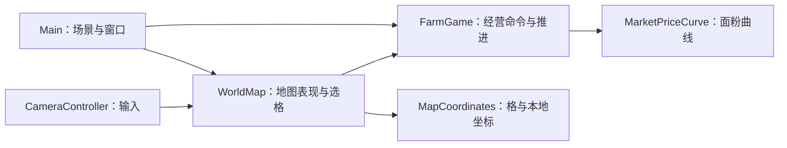

# 当前系统组织与状态归属

本文记录已落地的模块关系，随实施任务更新；未来玩法和目标接口见[系统设计与执行计划](../farm-exchange-system-design-and-execution-plan.md)。

| 状态或计算 | 当前拥有者 | 其他模块的使用方式 |
| --- | --- | --- |
| 地块占用、农田、加工、工人轮转、库存、金币和天数 | `FarmGame` | `Main` 提交经营命令；`WorldMap` 读取地块快照。 |
| 面粉价格曲线 | `MarketPriceCurve` | `FarmGame` 按种子和日期查询价格。 |
| 格坐标范围与等距本地坐标换算 | `MapCoordinates` | `WorldMap` 用于选格、绘制和镜头限制；地图格数引用 `FarmGame.MapSize`。 |
| 地图块缓存、选中格和可见性 | `WorldMap` | `Main` 同步外观；`CameraController` 发起选格与限制镜头。 |
| 摆放模式、窗口位置与控件状态 | `Main` | 通过经营命令和只读快照连接 `FarmGame`。 |

| 要修改的现行行为 | 先查看 | 同时核对 |
| --- | --- | --- |
| 格中心、选格或镜头位置 | `MapCoordinates`、`WorldMap` | `CameraController`、坐标与镜头测试；区分本地和全局位置。 |
| 建造、占用或拆除 | `FarmGame` | `Main`、`WorldMap` 的快照同步和建造测试。 |
| 作物、加工或库存 | `FarmGame` | 当前推进顺序、经营测试与玩法文档。 |
| 市场价格或出售 | `MarketPriceCurve`、`FarmGame` | 当日成交价、交易测试与玩家规则。 |
| 窗口交互 | `Main` | 玩家操作、场景节点名和端到端测试。 |

T03 已统一坐标入口；#46 的占用与建造命令尚未迁移。后续任务落地时，再将实际迁移后的唯一状态拥有者写入本页。
