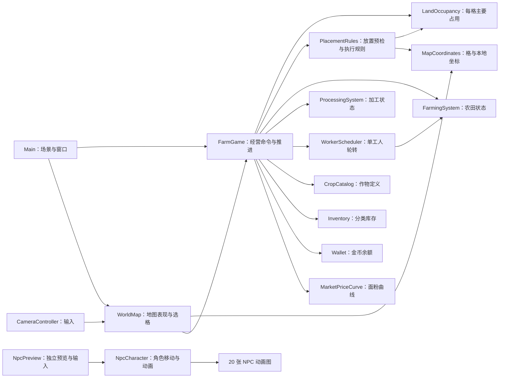

# 当前系统组织与状态归属

本文记录已落地的模块关系，随实施任务更新；未来玩法和目标接口见[系统设计与执行计划](../farm-exchange-system-design-and-execution-plan.md)。

| 状态或计算 | 当前拥有者 | 其他模块的使用方式 |
| --- | --- | --- |
| 每格主要占用类别 | `LandOccupancy` | `FarmGame` 协调建造、拆除，并聚合地块快照。 |
| 建筑描述、范围、占用与余额的放置检查 | `PlacementRules` | `FarmGame` 预检和执行使用同一规则；执行时重新检查并返回实际扣费。 |
| 农田选种、阶段与剩余 tick | `FarmingSystem` | `FarmGame` 协调收获入库；`WorkerScheduler` 只通过受控工作操作照料。 |
| 加工场地配对与进行中批次 | `ProcessingSystem` | `FarmGame` 协调完工入库与领取相位；模块从 `Inventory` 领取原料。 |
| 单工人下一个候选农田索引 | `WorkerScheduler` | `FarmGame` 每 tick 请求至多一次工作。 |
| 当日 tick、天数与市场更新 | `FarmGame` | `Main` 驱动 tick，界面查询当日信息。 |
| 六种作物的定义 | `CropCatalog` | `FarmGame` 查询只读作物表与单种定义。 |
| 各作物的原料和加工品库存 | `Inventory` | `FarmGame` 在生产和交易时查询或修改；界面仍通过 `FarmGame` 查询。 |
| 金币余额 | `Wallet` | `FarmGame` 在建造和交易时扣款或入账；界面仍通过 `FarmGame.MoneyCents` 查询。 |
| 面粉价格曲线 | `MarketPriceCurve` | `FarmGame` 按种子和日期查询价格。 |
| 格坐标范围与等距本地坐标换算 | `MapCoordinates` | `WorldMap` 用于选格、绘制和镜头限制；地图格数引用 `FarmGame.MapSize`。 |
| 地图块缓存、选中格和可见性 | `WorldMap` | `Main` 同步外观；`CameraController` 发起选格与限制镜头。 |
| 摆放模式、窗口位置与控件状态 | `Main` | 通过经营命令和只读快照连接 `FarmGame`。 |
| 独立 NPC 预览的角色选择和键盘输入 | `NpcPreview` | 将图集与移动方向交给 `NpcCharacter`；不修改 `FarmGame`。 |
| NPC 图集帧、朝向与视觉移动 | `NpcCharacter` | 按预览输入显示角色；主地图尚未接入经营工人位置。 |

| 要修改的现行行为 | 先查看 | 同时核对 |
| --- | --- | --- |
| 格中心、选格或镜头位置 | `MapCoordinates`、`WorldMap` | `CameraController`、坐标与镜头测试；区分本地和全局位置。 |
| 建造、占用或拆除 | `FarmGame`、`PlacementRules`、`LandOccupancy`、`FarmingSystem`、`ProcessingSystem` | `Main`、`WorldMap` 的快照同步和建造测试。 |
| 作物、加工或库存 | `FarmGame`、`FarmingSystem`、`ProcessingSystem`、`WorkerScheduler`、`CropCatalog`、`Inventory` | 当前推进顺序、经营测试与玩法文档。 |
| 市场价格或出售 | `MarketPriceCurve`、`FarmGame`、`Inventory`、`Wallet` | 当日成交价、交易测试与玩家规则。 |
| 窗口交互 | `Main` | 玩家操作、场景节点名和端到端测试。 |
| NPC 动画、角色图集或预览输入 | `NpcCharacter`、`NpcPreview` | 角色场景、20 张素材和预览集成测试；不要用动画回调推进经营。 |

T03 已统一坐标入口，T04A 已搬迁资源与配置，T04B 已将占用和生产状态一次性迁出 `FarmGame`，T04C 已统一放置检查、越界结果及执行扣费。#46 的格子底座已覆盖现有农田与加工场地；道路占格和实际工人移动分别留在 #45、#40。
