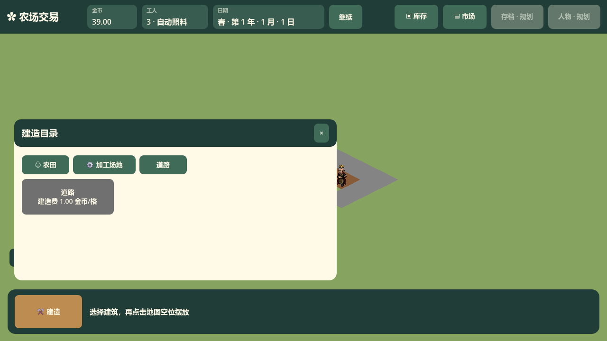

# BuildCatalogWindow 接口

道路分类的实际主场景截图：

对应 `scripts/ui/BuildCatalogWindow.cs`，继承 `DraggableWindow`。构造时创建固定的农田、七种加工场地、道路卡片与无匹配提示；`RefreshCards()` 根据当前分类和搜索词更新文字与可见性，不删除或重建控件。`SelectionRequested(BuildingKind, CropKind)` 只报告选择的建筑意图；道路意图的作物字段没有经营含义。`Main` 接到意图后进入摆放状态，并由 `FarmGame.TryPlace` 在地图点击时校验与扣费。

节点名保留 `BuildWindow`、`FarmTab`、`ProcessorTab`、`BuildSearch`、`BuildCards`、`FarmCard` 和各 `ProcessorCard`，新增 `RoadTab`、`RoadCard`。道路使用灰色卡片并标明每格费用；全部价格读取 `FarmGame.GetBuildingCostCents(BuildingKind)`，与实际放置使用同一查询。目录沿用现行建筑名、初始位置及底栏避让；搜索只筛加工场地，分类切换、经营刷新与关闭重开保持卡片身份和搜索词。

目录不持有地块、金币或正在摆放的状态，也不执行扣款。连续道路模式由 `Main` 拥有，目录只发出选择意图；农田和加工场地沿用单次摆放。后续道路用途不通过目录重新计算工人速度或生产规则。
