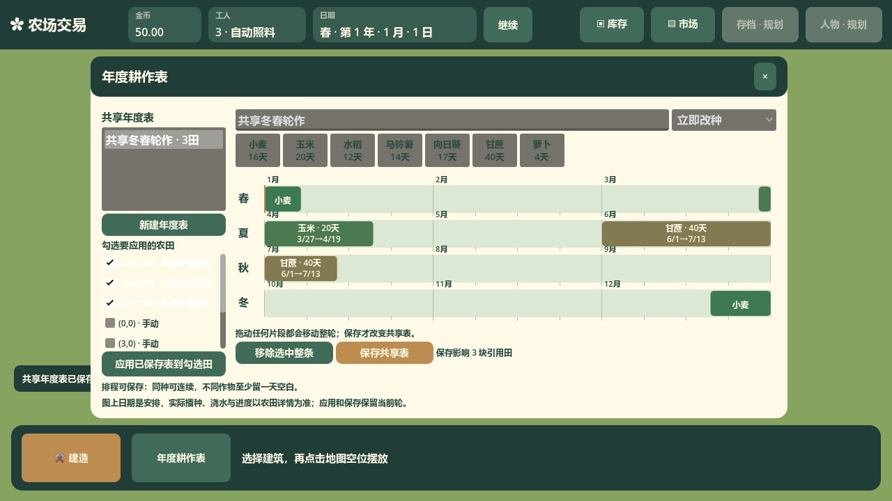
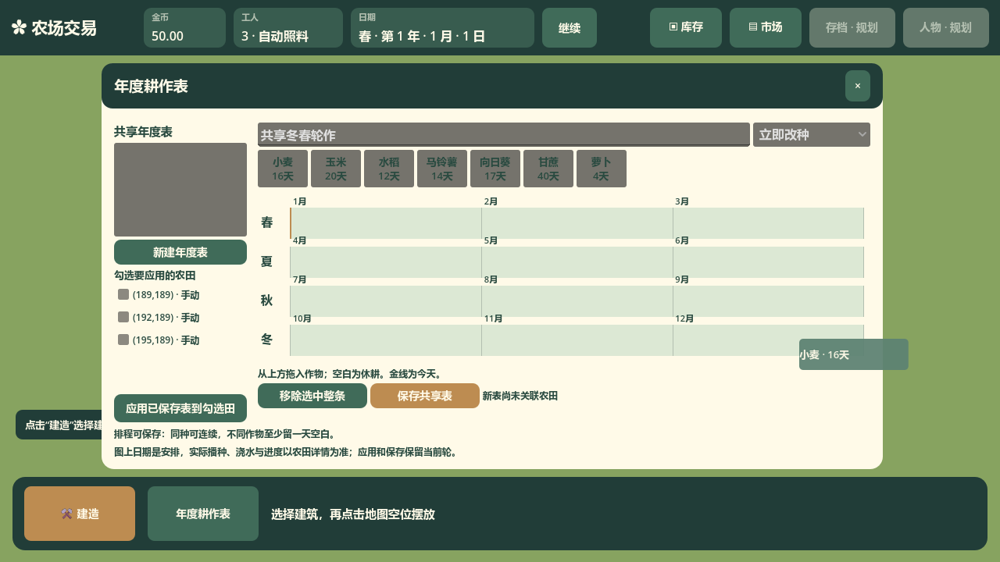
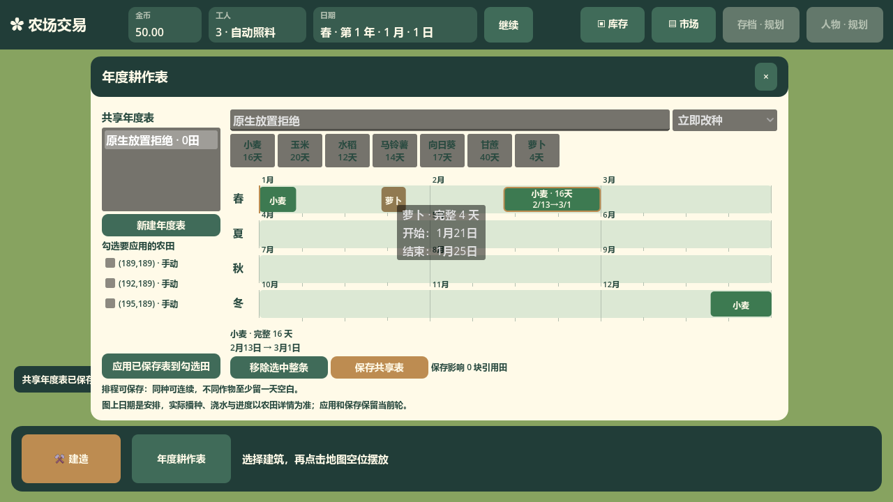
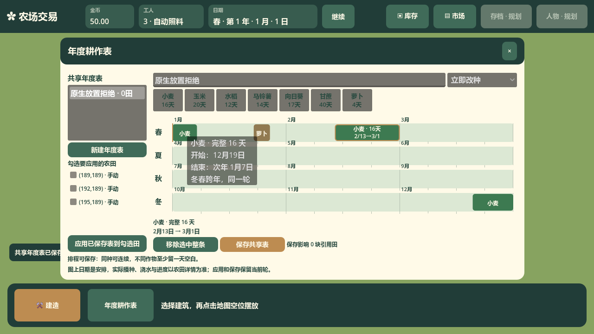
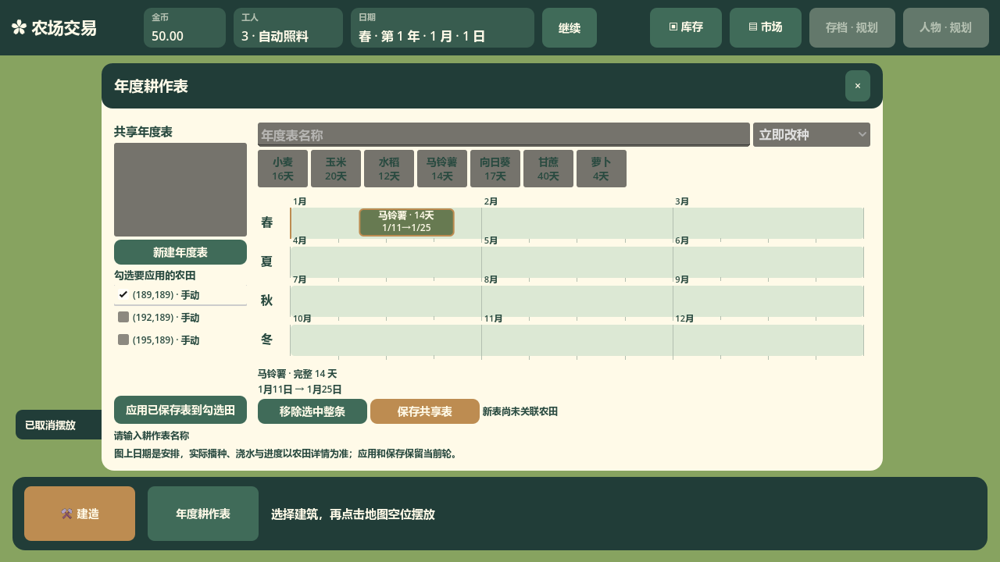

# 年度时间图与拖动实现

履行[耕作表窗口接口](interface-cultivation-window.md)。`scripts/ui/CultivationTimeline.cs` 只负责一份草稿的绘图、选中与拖放；`scripts/ui/CultivationCropCard.cs` 负责从作物区拖出一条完整周期。

时间轴为春夏秋冬四行，每行 84 天、三个月；横向像素转换为年度整数日 `0..335`。条长度读取 `CultivationEntry.LengthDays`，使用作物获水后的完整生长周期。绘制时逐季切片，年度末尾继续回到春行；切片不建立新 ID 或新轮次。任何片段的选中与拖动都返回原条 ID，落位后窗口只更新原条的年度开始日。

Godot 原生拖放预览是一根完整直条，通过零尺寸父控件内的负半宽/半高偏移，使完整条中心位于指针；起点换算使用指针的年度日减半个完整周期，再按336天环绕，跨季片段拖动也遵守此口径。拿起时透明度过渡；放下时选中条的各显示片段在 0.18 秒内回落到对应行。所有动效只使用画面帧时间，不调用经营推进，也不改草稿日期或农田状态。

`CultivationTimeline` 构造时接收窗口的候选检查函数，只把整条 ID、作物和整数起点报告给窗口。`CultivationWindow` 唯一拥有草稿并构造新增/替换后的候选条列表，悬停、实际落位及风险绘制均使用经营入口的 `CheckCultivationEntries`；候选成功前不修改草稿。名称不参与排程编辑，保存才用原名称、模式及条列表调用完整 `CheckCultivationPlan`。因此首次开窗或清空表名不会拒绝合法拖放，也不会隐藏已有风险；无名保存仍明确失败。几何模块不拥有另一份规则或草稿，也不自行计算适季、重叠或空白天数。

条编号由草稿的下一编号递增，新表从1开始，加载已保存表读取领域快照 `NextEntryId`；删除不下降，刷新只提升到持久高水位。候选悬停及失败落位不消耗编号，成功新增才推进，移动保留原 ID。保存空表并重选不会复用已删条编号，年度执行凭据继续由领域拥有。

四季时间带、作物条与风险/选中轮廓使用方形 `StyleBoxFlat`：时间带为浅绿纸色，七种作物以麦黄、浅绿与土色区分，深棕文字与木色细框保持可读；风险框为深红、选中框为橄榄绿；每季仍占50像素，时间带高32像素、作物条高28像素，为下一季月份标签和周刻度留出间距；条内两行12号文字使用紧凑基线。周刻度每7天绘制一次，放在时间带下沿以免被作物条覆盖，月份标签仍保留。每个片段以真实12号字体测量两行完整文字：作物名与完整周期、月/日起止日期（跨年注明次年）。能容纳时两行居中显示；放不下时只绘制能完整容纳的作物名，并通过 Godot 原生 `_GetTooltip` 提供整轮信息，移开沿用原生关闭行为。窄片段不会裁字、缩小字号或借用相邻条空间；原生预览同样只画能完整容纳的文字。

`CultivationWindow` 使用稳定控件保存名称、模式和编辑草稿。每秒刷新只更新真实表列表、引用数量、农田行文案及今日线；农田增加或移除时只处理相关勾选行，不重建其他行。勾选表内多个田只是批量应用命令的参数，不参与地图框选或农田进度同步。

固定的短提示、影响范围与命令反馈使用单行标签；选中条的完整周期和起止日期明确分为两行。避免标签初次未获得容器宽度时按 1 像素自动折行，把窗口撑高并使农田列表失去合理的滚动区域；不通过延时重设尺寸修正。头部和底部按钮保持实际可用区域内可达。#94 为选中条说明始终保留两行文本：新建、移除和重载表时，提示后保留空白第二行，字号变化后也按当前字体自然计算两行高度；外层滚动条不会因说明由两行变一行而在拖动期间消失、使时间图突然扩宽12像素。原生回归在新建之后、释放之前检查轨道位置及尺寸稳定，并仍要求玉米准确落在日166、奇数周期向日葵落在日120，不调整日期取整或排程规则。

原生拖放回归通过 `Input.ParseInputEvent` 注入鼠标，先用视口的真实 `GetFinalTransform` 把逻辑视口坐标换算到窗口坐标。`XformedBy` 换算位置和相对移动，鼠标的 `GlobalPosition` 另外使用同一变换；两者保持相同坐标域。有窗口时，注入每次移动前使用 `Input.WarpMouse` 同步系统鼠标；真实窗口验证已确认，仅注入事件不会移动系统鼠标，原生落点仍读取实际位置而发生偏离。每次拖动保存原屏幕鼠标位置，结束时通过 `finally` 按当前窗口客户区位置换算并恢复；headless 不操作系统鼠标。测试使用真实视口变换；本轮关闭画布拉伸，以1920×1080为默认基准。

时间图、拖放预览不展示内部换季成熟补救阈值，也不以该机制缩短条长或扩大可用时间。

## #86 实际界面取证

以下图片来自指定 Godot 4.7.2 Mono、1280×720 真实窗口与原生鼠标输入；经营保持暂停。#86 历史完整窗口可核对当时的圆角、月份、每7日周刻度，以及能容纳时居中显示的完整条内信息。短条与窄跨年片段显示原整轮的完整信息，移开后原生提示消失的断言由对应 e2e 测试完成。

## #86 后续复现与修复取证

首次打开窗口未填写名称，原生马铃薯条已经成功落在1月11日；按保存仍明确提示填写名称。鼠标悬停左侧已勾选且拥有焦点的农田，其文字保持深色可读。对应红测曾实际复现合法拖放被名称拒绝，以及四种状态字色对比仅1.05～1.07；修复后的目标 headless 与图形场景均通过。删除已执行日0萝卜、保存空表并重选后新增日10的回归也已通过，新条使用新编号且仍定位本年日10。

以下两张来自同一次真实图形回归，分别使用1280×720与1600×900窗口；测试结束恢复原窗口尺寸和鼠标位置。新增证据保存在 `build/issue86-followup-validation/`，不覆盖前一轮的日志及本页上方截图。

## 整体与字体倍率

本轮默认按1920×1080设计，图形验收另覆盖2560×1440与3840×2160。时间图通过统一UiScaling接口读取祖先组合的整体与字体倍率，自绘15号季节、11号月份与12号作物文字均按实际字号测量及绘制。整体倍率改变标签宽度、边距、季轨道、线宽和拖动预览；字体倍率独立调整字形，两行条内文字放大时轨道的竖向间距与最小高度同步增加，日格横向宽度仍由真实控件尺寸决定。

原生预览使用时间图的真实日格宽度、实际字号和竖向倍率构造，以完整条中心跟随鼠标，不在已构造的实宽上再次乘倍率。月份、文字容纳判断、悬浮日期和落位整数日使用同一实际尺寸；不会按分辨率再扩大UI，经营日期不受表现设置影响。

`tests/e2e/TestUiScaling.cs` 通过九组整体0.75/1/1.25与字体0.85/1/1.2组合，检查真实鼠标拖放预览的字号、中心、轨道稳定与日20精确落位；同时检查字号变大后保存仍可滚动到达、新农田勾选和订单条件控件继承倍率、原输入草稿及焦点保持。原始图形证据写入 `build/issue94-scale-validation/`，验证结果由项目测试记录统一登记。
