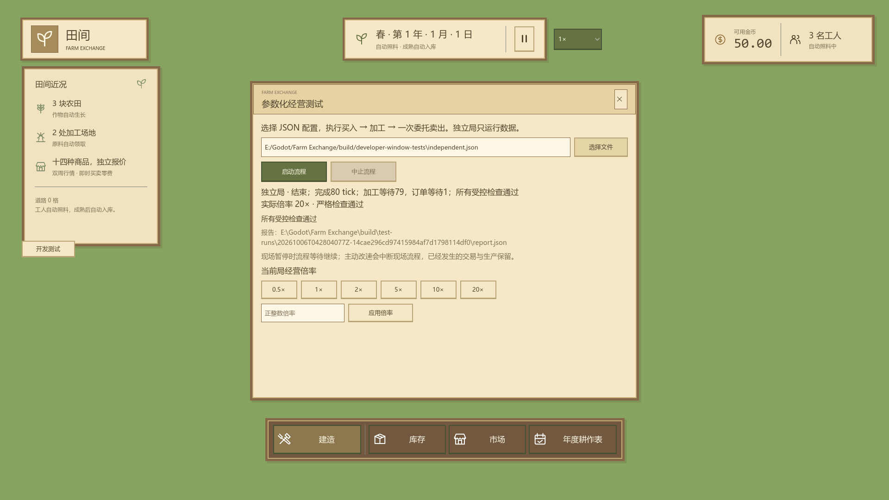

# DeveloperToolsWindow 对外接口

关联 [#101](https://github.com/Fotally/Farm-Exchange/issues/101)，代码位于 `scripts/ui/development/DeveloperToolsWindow.cs`，命名空间保持 `FarmExchange.UI`。该类型只编入开发构建，由 `Main` 的集中 `DEBUG` 入口创建；主场景不序列化开发脚本引用。

本地 dev 包使用 `Windows Dev` / `macOS Dev` 预设，保留 Godot 创建此节点所需的 C# 脚本资源。正式两预设继续排除开发源码、节点资源及专用验收图；编译程序集与资源选择分别验收，不能把 DLL 中存在开发类型等同于节点资源已经可加载。

窗口沿用 `DraggableWindow` 的纸面木框、标题拖动和外层正文滚动，1920×1080 基准尺寸 840×690，避让顶部 143 与底部 180 像素。左侧“开发测试”按钮打开窗口，Esc 或关闭按钮只隐藏窗口；运行流程继续，明确“中止流程”才停止。

上图来自真实 1920×1080 场景验收：独立局 Q=3 共完成80个经营 tick，三份萝卜经正式加工与一次委托卖出，报告实际保存为 `report.json`；背景保留当前地图，独立局没有替换或推进现场。图片从测试绘制完成后的原始截图直接复制，未修改。

| 界面或宿主入口 | 约定 |
| --- | --- |
| 配置路径 / 选择文件 | `ScenarioConfigurationPath` 可输入绝对路径，`ScenarioChooseFileButton` 打开真实 `FileDialog`，选择结果填写同一输入。启动时严格加载一次；运行中的输入不可编辑。 |
| 启动 / 中止 | `ScenarioStartButton` 校验配置并预检报告目录可写后才准备和执行正式经营命令；运行时禁用启动。`ScenarioAbortButton` 中断流程，保留已经发生的经营结果并输出报告。 |
| 进度 / 反馈 / 报告 | 显示运行对象、固定步骤、实际 tick、等待计数、倍率与暂停。配置错误与输出错误明确区分；保存成功显示真实 `report.json` 绝对路径。保存失败保留执行结果，不显示已落盘，不切换目录。 |
| 当前局倍率 | 0.5、1、2、5、10、20 快捷项与有限正整数输入交给同一时间驱动。玩家选择立即发出 `Player` 来源，运行中的现场流程中断，不自动恢复旧倍率。 |
| `ObserveCurrentCheckpoint` / `GetCurrentMaxTicks` | `Main` 唯一驱动借用的完整检查点和限额入口。窗口只转交固定流程的观察结果和下一边界，不计算生产、费用或日历。 |
| `AdvanceIndependent(delta)` | 当前局仅观察暂停变化；独立局用同一 `SimulationDriver` 推进自己的 `FarmGame` 数据对象，完成后停止。不会替换当前地图、人物或现场经营对象。 |

每次自动操作后沿用 `Main` 的统一经营刷新。流程结束在稳定检查点捕获报告快照，落盘不重读现场。宿主退出时中止仍在运行的流程并保存已有结果，释放倍率通知订阅。

输出目录为仓库/编辑器的 `build/test-runs/<run-id>/`，本地 dev 包的包外 `reports/test-runs/<run-id>/`；Windows 从 exe 位置解析，macOS 从 `.app` 父目录解析，不依赖启动工作目录。配置和报告不复制到导出包，保存行为由流程报告模块维护。

`tests/e2e/test_developer_tools_window.tscn` 用开发按钮的真实矩形中心，经视口变换发送原生鼠标移动、左键压下与释放，验证入口没有被近况面板或地图遮挡；随后通过真实控件验证文件弹窗及选择回调、错误反馈、独立 Q=3 流程报告且当前局不变、现场暂停和玩家主动改速中断。图形运行在报告完成后等待三个处理帧及 `FramePostDraw`，再保存 `build/developer-window-tests/independent-report.png`，保证窗口状态和背景地图已真实绘制；headless 不等待图形信号。配置及检查规则见[参数化设计](../../../project/developer-tools-parameterized-tests.md)，构建排除见[本地开发构建](../../../project/development-build.md)。
