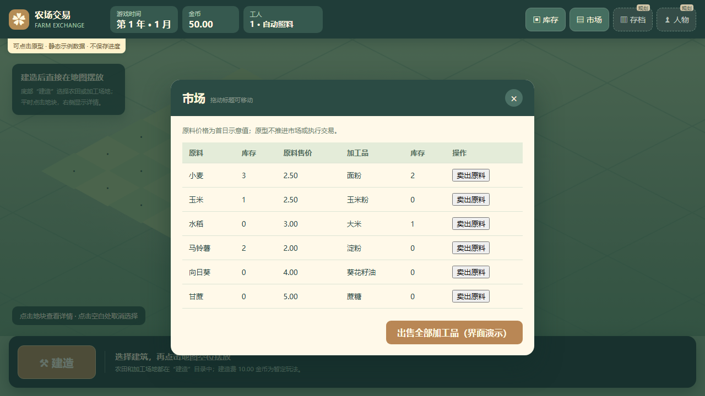
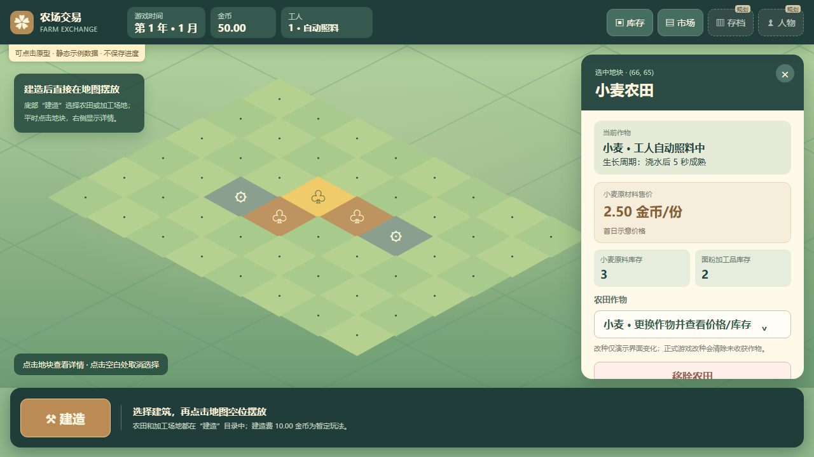
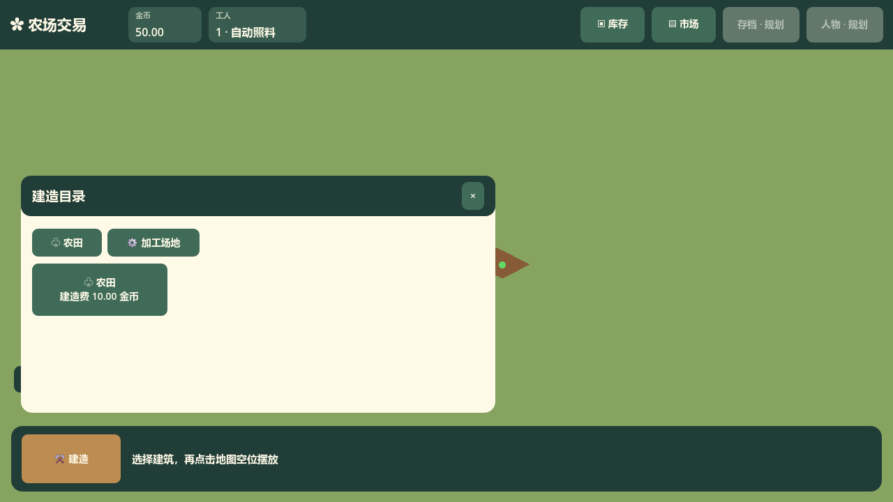
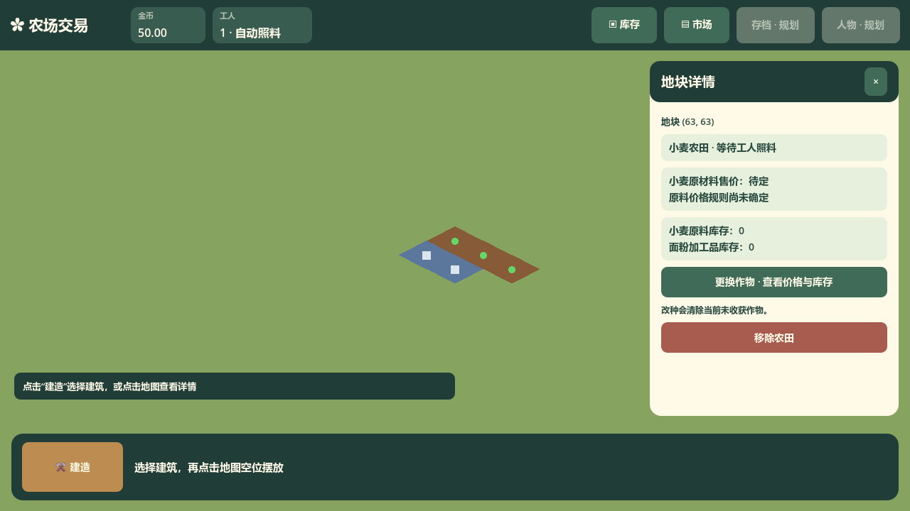

# 主界面目标接口与交互层级

本页对应 [UI issue #24](https://github.com/Fotally/Farm-Exchange/issues/24)，记录 `scenes/main.tscn` 与 `scripts/ui/Main.cs` 的已实现界面接口。具体经营规则仍以 `docs/gameplay/` 为准。

[单文件 HTML 原型](prototype-main.html)用于查看界面层级和点击流程，仅演示视觉与交互；其中的原料价格是首日示意值，库存、交易和建造费不参与真实经营计算。下图为原型市场，实际 Godot 市场以卡片显示两类价格并按品种提供原料出售按钮。

## 当前 Godot 场景

## 玩家看到的层级

| 层级 | 内容与作用 |
| --- | --- |
| 顶部常驻状态 | 金币与工人摘要常驻；库存、市场是全局窗口入口；存档、人物状态保留规划位置。不展示免费选地次数或内部 `tick`。年月换算未确定，**本轮先隐藏时间**。 |
| 地图 | 平时点击地块选择对象；进入建造摆放后，点击符合条件的空位执行建造。拖动和缩放仍交给镜头与地图模块。 |
| 底部建造 | 一个“建造”入口打开目录。目录先选择农田或加工场地，再选具体建筑；选择后进入摆放状态，点击目标空位即执行，不需要第二次确认。摆放可取消。 |
| 选中详情 | 仅在选中地块或建筑后出现；点击农田显示作物、浇水后成熟所需秒数、原材料售价和当前原料库存，并提供改种入口。加工场地显示对应原料、产物与工作状态。 |
| 全局窗口 | 库存与市场窗口只负责查看及调用已确认的交易命令，不自行计算价格或费用。 |

加工场地目录按名称搜索并可滚动；新增建筑只增加目录条目，不增加底栏固定按钮。作物选择列表展示每种作物的原材料当日价格与库存，便于比较。市场每种原料配有卖出该种全部库存的按钮，底部保留出售全部加工品的按钮；无对应库存时按钮禁用。

## 二级及以下窗口的位置约定

**右侧选中详情也是二级窗口**，与建造目录、作物选择列表、库存窗口和市场窗口一样，标题栏可拖动。正文里的选择、滚动与操作按钮不触发拖动。

- 窗口第一次打开时使用预设位置：选中详情靠右，建造目录靠近底栏，其余窗口在地图中央附近。
- 玩家拖动后，以该窗口的身份分别记录最后停留位置；关闭再打开同一窗口时回到该位置，切换所选地块时选中详情也沿用上一次位置。
- 窗口位置应保持在可见画面内；窗口尺寸或视窗变化时，要保证标题栏仍可抓取，底部建造按钮不被建造目录遮住。
- 打开窗口或拖动标题栏时，该窗口来到其他窗口前方；重新选中地图地块时详情来到前方，库存和市场窗口关闭。
- 位置只属于界面状态，不进入 `FarmGame` 的经营状态。**仅在本次运行内保留**：关闭再打开保持位置，重启游戏恢复默认位置；不写入存档。

## 与经营模块的接口

主界面从 `FarmGame` 查询地块快照、作物定义、金币、分类库存和已确定的售价；玩家操作通过其公开经营命令执行，成功后通知 `WorldMap` 更新。农田详情从当前作物定义读取 `GrowthTicks`，按主场景每秒一 tick 显示“生长周期：浇水后 N 秒成熟”；改种后随详情刷新。主界面不复制建造费用、价格曲线或生产时间计算。右侧状态可显示玩家可理解的进展，但不暴露内部 `tick`。

[建造规则 issue #26](https://github.com/Fotally/Farm-Exchange/issues/26)已按当前约定取消土地解锁，并实行暂定的 10.00 金币建造费。年月与市场周波动的换算记录在[市场 issue #25](https://github.com/Fotally/Farm-Exchange/issues/25)；在规则确定前，Godot 界面不显示时间。[原料交易 issue #27](https://github.com/Fotally/Farm-Exchange/issues/27)确定了逐作物价格和按品种出售；详情、作物选择列表与市场均从 `FarmGame` 查询实时原料售价和库存，结算规则见[出售与价格](../../../gameplay/trading/sales.md)。

## 验收对应

`tests/e2e/TestCoreLoop.cs` 覆盖目录选择、单次摆放、占用地块不扣费、详情与作物窗口重新打开时保留位置、库存及两类市场交易。`tests/integration/TestCameraInteraction.cs` 覆盖地图点击与镜头拖动的衔接。窗口只保存当前运行的节点位置，不写入存档。
