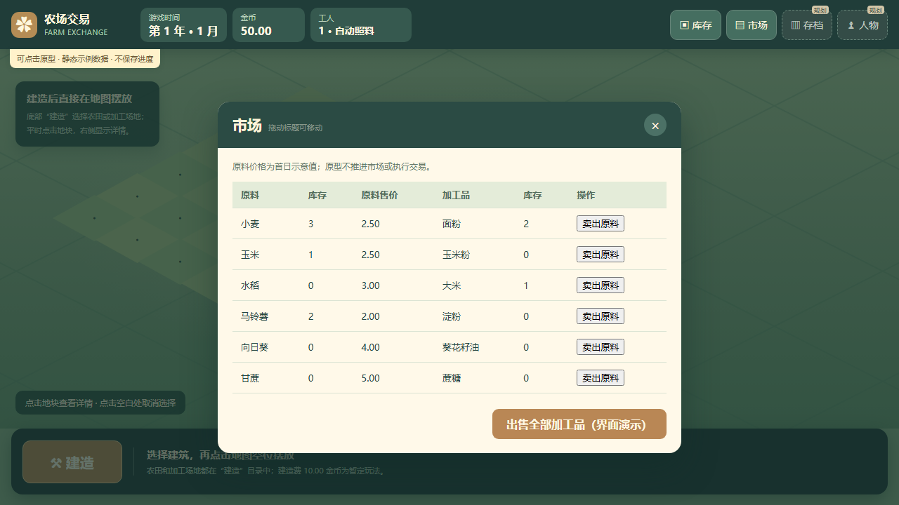
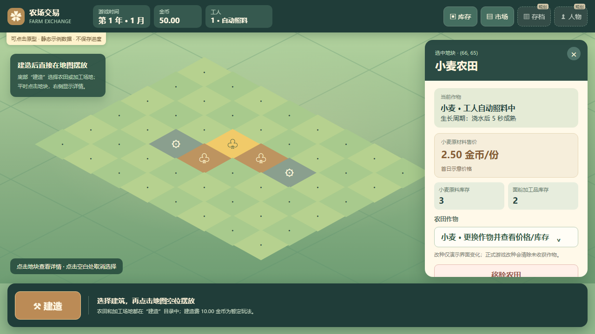
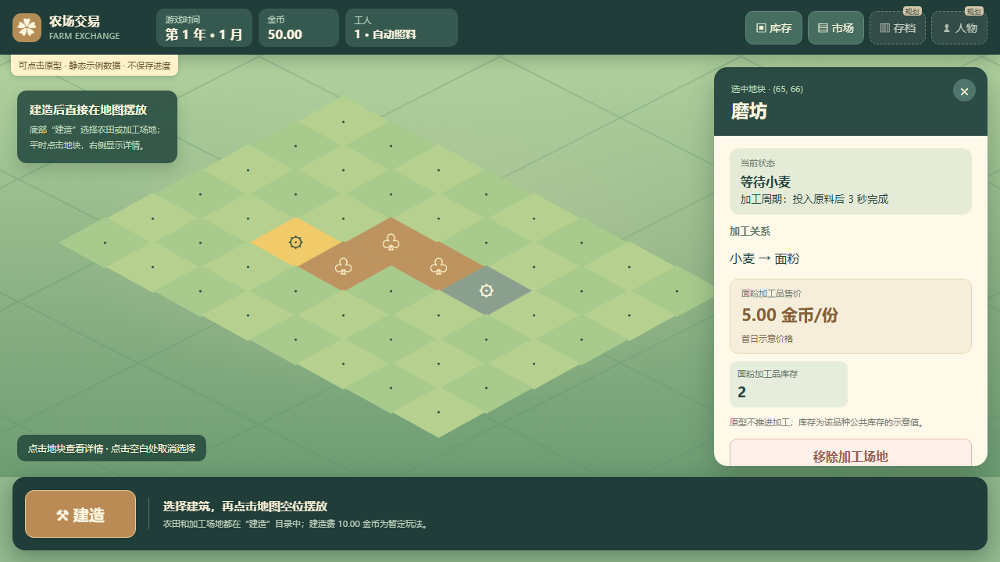
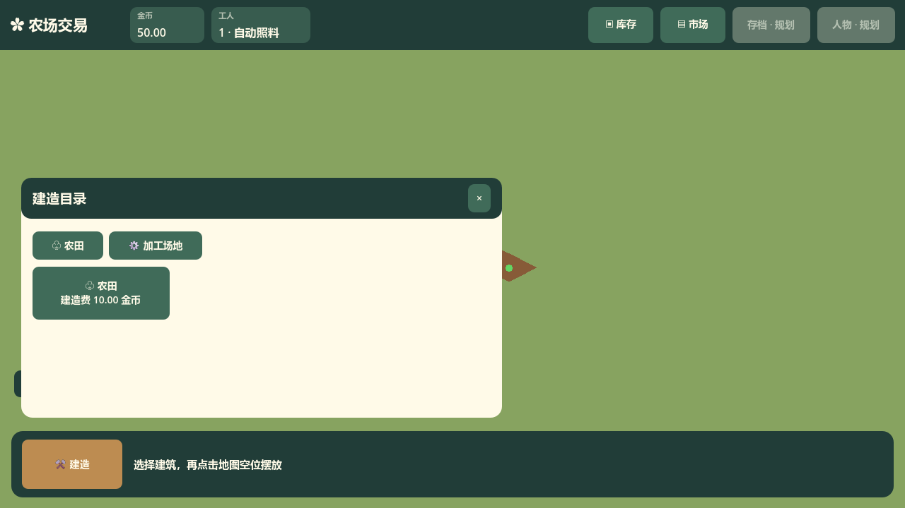

# 主界面目标接口与交互层级

本页对应 [UI issue #24](https://github.com/Fotally/Farm-Exchange/issues/24) 与 [像素田园 UI/UX #94](https://github.com/Fotally/Farm-Exchange/issues/94)，记录 `scenes/main.tscn` 与 `scripts/ui/Main.cs` 的已实现界面接口。正式样式依据为[#94 像素田园主稿与实施范围](../../../project/ui-visual-prototype.md)；旧 #24 原型和截图保留为历史记录。具体经营规则仍以 `docs/gameplay/` 为准。

[单文件 HTML 原型](prototype-main.html)用于查看界面层级和点击流程，仅演示视觉与交互；其中的原料价格是首日示意值，库存、交易和建造费不参与真实经营计算。下图为原型市场，实际 Godot 市场采用十四商品固定行、单一数量输入和独立消息滚动区，见[市场窗口接口](../market-window/interface-market-window.md)。

## #24 阶段 Godot 截图

以下为此前深绿界面的历史截图。#94 正式像素田园界面采用上文的新主稿主题、顶部独立状态、左侧近况和底部四入口，图形验收工件保存于 `build/issue94-validation/`。

## 1080P 原型比例与倍率

正式设计和默认物理窗口使用 1920×1080。依据用户参考图按 1080 高度归一化，默认几何为品牌 277×93、日期 441×93、资源 373×107、近况宽 299、详情 409×727、底部操作栏 774×93。顶部三个独立牌面、左侧近况、右侧设施和底部工具图标保留主稿的信息与留白比例；既有地图和人物素材继续使用。

项目关闭画布自动拉伸。扩大到 2560×1440 或 3840×2160 时，面板保留物理像素尺寸并通过原锚点靠边或居中，地图沿用镜头的“扩大视野、对象保留大小”策略。需要单独调整面板时，使用 [UiScaling 两倍率接口](../ui-scaling/interface-ui-scaling.md)：整体与字体默认为 1，各窗口或面板可分别设置，不增加设置菜单与存档。

品牌保留“田间 / FARM EXCHANGE”身份，两行日期显示真实日期及经营状态，暂停/继续用图标和 Tooltip 发出原命令；不恢复已删除的整组左侧标语。资源、近况、图标与详情预览都接入真实经营快照，不复制原型的固定示例日期、数量或进度。

右侧设施详情在固定 409×727 外框内复刻主稿的标题层级：84 像素标题栏、24 像素标题、12 像素英文分类和 22 像素关闭图标。普通管理窗口保留其既有标题尺寸；详情正文按真实快照重排，长内容可滚动。

## 玩家看到的层级

| 层级 | 内容与作用 |
| --- | --- |
| 顶部常驻状态 | 左上品牌、顶部居中“季 · 第 N 年 · N 月 · N 日”与暂停、右上金币与工人摘要，三个独立牌面之间留出地图。人数读取真实工人快照数量，开局显示“3 名工人”，副文本显示真实照料或暂停状态；金币主数值为可用金币，悬停可读总余额与冻结。暂停/继续控制经营时间；不显示未实现的存档和人物入口，不展示内部 `tick`。 |
| 地图 | 平时点击地块选择对象；摆放时鼠标跟随完整占地预览，实际冲突/越界格标红，正常格淡绿。左键短按松开时建造，拖动时隐藏预览且松开不建造；镜头和窗口变化后重新定位。界面或窗口外隐藏预览并拦截建造。 |
| 底部经营入口 | 居中木色操作栏保留 `BuildButton`、`InventoryButton`、`MarketButton`、`CultivationButton` 四个入口。一个“建造”入口打开目录，所有类型成功或失败都保持摆放，期间不弹详情。 |
| 左侧近况与反馈 | `FarmCountLabel`、`ProcessorCountLabel` 分别读取真实农田与加工实例数量，近况采用图标与说明分行；`ActivityLabel` 显示真实道路数量及暂停或自动照料状态；`MessageLabel` 保留实际经营与命令反馈。摆放 `BuildHint` 显示名称、占地属性格数、操作提示与候选预检原因，`BuildCost` 显示标准费用、不足时标红并显示可用金币。右键、Esc 和 `CancelPlacementButton` 共用取消入口。 |
| 选中详情 | 仅在选中地块或建筑后出现；农田显示作物状态、获水后成熟所需天数、对应原料当前报价和公共原料库存，并提供改种入口。湿润空田显示待播种状态；不适季或剩余时间不足时显示播种等待原因。加工场地显示加工状态、从投入原料到完成所需天数、原料与产物关系、对应加工品当前报价和公共加工品库存。道路显式显示布局用途和拆除不退款说明，并提供拆除按钮。 |
| 全局窗口 | 库存显示两类公共库存并逐作物编辑非负整数保留底线；市场负责已确认的交易命令。窗口不自行计算价格、费用或加工规则。 |

加工场地目录按名称搜索并可滚动；新增建筑只增加目录条目，不增加底栏固定按钮。作物选择列表展示每种作物的适宜季节、生长周期、每轮产量、原料当前报价与公共原料库存，便于比较。市场显示十四商品当前/上次报价、实际涨跌与公共库存，选择商品后用一个数量输入买入、卖出或全售该商品；每种原料表行保留按品种全部出售快捷，底部保留出售全部加工品。报价日期与已公布真实因素/节日改期消息直接读取经营快照；无对应库存时全部出售按钮禁用。

## 二级及以下窗口的位置约定

**右侧选中详情也是二级窗口**，与建造目录、作物选择列表、库存窗口和市场窗口一样，标题栏可拖动。正文里的选择、滚动与操作按钮不触发拖动。

- 窗口第一次打开时使用预设位置：选中详情靠右，顶部 143 像素、右侧 31 像素；建造与其余经营窗口为居中浮窗，整体垂直中心上移 20 像素，随后限制在可用区域。
- 玩家拖动后，以该窗口的身份分别记录最后停留位置；关闭再打开同一窗口时回到该位置，切换所选地块时选中详情也沿用上一次位置。
- 窗口位置应保持在可见画面内；窗口尺寸或视窗变化时，要保证标题栏仍可抓取，底部建造按钮不被建造目录遮住。
- 打开窗口或拖动标题栏时，该窗口来到其他窗口前方；重新选中地图地块时详情来到前方，库存和市场窗口关闭。
- 位置只属于界面状态，不进入 `FarmGame` 的经营状态。**仅在本次运行内保留**：关闭再打开保持位置，重启游戏恢复默认位置；不写入存档。

## 与经营模块的接口

`Main` 负责组装窗口、唯一保留摆放类型与候选生命周期、保留普通所选格、分发玩家命令，并在命令或 tick 完成后统一刷新。建造目录发出建筑意图，地图短按松开时调用 `FarmGame.TryPlace` 重验，失败显示真实原因，成功显示实际扣费 `ChargedCents`；所有类型成功和失败都保留模式，并清普通选框、不弹详情。右键、Esc、按钮交给同一个 `CancelPlacement()`，统一清类型、候选和地图预览；重新打开目录或年度表也经该入口结束摆放。Esc 在摆放期间优先取消，输入在 `_Input` 接收，避免被已聚焦的界面控件拦截。

每帧在镜头处理后读取当前鼠标位置，检查窗口内状态、镜头拖动及可见界面矩形，使用 `WorldMap.ScreenToCell` 得到未裁剪的候选锚点并调用 `UpdatePlacementPreview`。界面遮挡检查递归穿过忽略鼠标的透明容器，遇到接收鼠标的面板只检查其自身矩形，不读取滚动区域外被裁切子项的矩形。透明 `TopBar` 容器忽略鼠标、仅三个真实顶部面板阻挡地图；间隙可继续操作地图。界面遮挡、离窗或拖动时清候选并调用 `ClearPlacementPreview`，不重同步生产地图块。整体原因复用 `FarmGame.CheckPlacement` 的现有顺序；空间逐格染色由地图读取实际占用，费用独立读取 `GetBuildingCostCents`，不能使用失败预检的零费用。摆放反馈每帧读取 `AvailableMoneyCents`，使经营、交易和冻结变化即时反映；预览不持有金币或生产状态，不推进经营，进入摆放保持暂停状态。

原始鼠标移动和左键松开也在 `_Input` 同步候选，沿用同一界面、窗口与拖动隐藏检查，避免同一帧的新位置尚未进入 `_Process` 就被提交。选择信号的经营提交入口再通过共用的 `SetPlacementCandidate` 同步释放格、地图覆盖、预检与费用，并将同一个释放格参数交给 `TryPlace` 重验，不从可空状态字段反读目标。回归用例在主场景挂树前订阅真实 `SelectionChanged`，先于经营回调观察候选与未扣费、未建状态；覆盖连续移动/松开和小于 8 像素跨格短按，验证提交前就已一致，不依赖建成后下一帧自愈。

左侧摆放提示和费用按明确换行排布，不进行逐字自动折行；预检原因独立一行，费用与取消按钮在其下方。端到端验收检查底部四入口及左侧近况控件的真实矩形均位于可见范围，逐行文字宽高足够，提示、费用与取消按钮纵向不重叠；有效、冲突、余额不足和窗口变化后均检查布局。

`MessageLabel` 初始无消息时隐藏；所有消息写入共用内部 `SetMessage`，文字与可见性同时更新。暂停期间第一次取消摆放、无效交易数量与建造拒绝也立即可见，不等待下一次经营刷新或 tick。

放置端到端夹具在所有类型验收开始前将实际窗口设为 1920×1080 并等待尺寸更新，结束恢复原尺寸；headless 的默认物理窗口可能只有 64×64，不能只按 1920×1080 基准视口假定远离中心的目标格仍可见。候选断言始终检查真实悬停；镜头操作后以实际视口鼠标位置重新换算预期格，包含有窗口模式下整数鼠标像素的取整。

库存、市场和选种窗口只更新固定控件并发出操作意图；农田与加工详情分别读取 `FarmGame` 的语义快照，道路按 `BuildingKind.Road` 显式显示固定 [RoadDetailsPanel](../road-details-panel/interface-road-details-panel.md)，不对道路调用作物或加工详情查询。地图外观仅在影响地块或 tick 的命令后同步，交易只刷新经营窗口，不同步地图或直接启动加工。

库存的 `RawReserveRequested` 交给 `FarmGame.SetRawReserve`；成功后 `Main` 调用窗口确认输入并统一刷新，失败显示稳定原因。底线修改只刷新经营窗口，不同步地图、不启动加工。库存窗口的草稿、焦点与滚动由窗口自身维护。加工详情区分缺料、底线限制、待领取与进行中；底线编辑与生效规则见[原料加工](../../../gameplay/production/processing.md)。

`Main` 在地图下创建[WorkerPresentation](../../world/worker-presentation/interface-worker-presentation.md)，提供同一局 `FarmGame` 与地图坐标变换；不为显示调用经营推进或接收到达回调。工人摘要标签为 `WorkerCountLabel`，每次经营刷新从 `GetWorkers().Count` 更新。暂停同时停止经营与工人插值/动画，恢复不补现实时间；主地图的三名角色与独立 NPC 预览使用同一角色 Module。

当前农田详情显示“生长周期：获得水后 N 天成熟”，加工详情显示“加工周期：投入原料后 N 天完成”。生产详情各显示自己负责的库存与售价，库存仍按品种共享；道路详情仅显示当前用途和拆除操作。主界面不计算建造费用、价格曲线或生产时间，也不暴露内部 `tick`。窗口实现见 [DraggableWindow](../draggable-window/interface-draggable-window.md)、[BuildCatalogWindow](../build-catalog-window/interface-build-catalog-window.md)、[CropSelectionWindow](../crop-selection-window/interface-crop-selection-window.md)、[InventoryWindow](../inventory-window/interface-inventory-window.md)、[MarketWindow](../market-window/interface-market-window.md)、[FarmDetailsPanel](../farm-details-panel/interface-farm-details-panel.md)、[ProcessorDetailsPanel](../processor-details-panel/interface-processor-details-panel.md)、[RoadDetailsPanel](../road-details-panel/interface-road-details-panel.md) 和 [UiElements](../ui-elements/interface-ui-elements.md)。

[建造规则 issue #26](https://github.com/Fotally/Farm-Exchange/issues/26)已按当前约定取消土地解锁，并实行暂定的 10.00 金币建造费。年月日和季节由 `GameCalendar` 给出；独立双周行情与即时交易对应[市场 issue #25](https://github.com/Fotally/Farm-Exchange/issues/25)及[完整接入 issue #73](https://github.com/Fotally/Farm-Exchange/issues/73)。[原料交易 issue #27](https://github.com/Fotally/Farm-Exchange/issues/27)是按品种出售原料快捷操作的历史来源；当前独立报价与完整结算遵循 #25 / T09 [市场规则](../../../project/market-proposal.md)，详情、作物选择列表与市场均从 `FarmGame` 查询当前报价和公共库存，现行交易规则见[出售与价格](../../../gameplay/trading/sales.md)。

## 验收对应

`tests/e2e/TestUiVisualLayout.cs` 以至少 1920×1080 验证真实挂树矩形、顶部面板、底部四入口、全部窗口避让上下常驻区、纸面次按钮全部字色与输入光标、实际实例近况更新。有窗口模式在 `build/issue94-validation/` 保存主画面、三种详情及各窗口截图供人工检查。地图和人物沿用原素材，不复制 HTML 原型的示例日期、库存或进度。

`tests/e2e/TestCoreLoop.cs` 覆盖目录选择、连续模式下成功保持及取消后查看详情、占用地块不扣费、两类建筑详情的状态、周期、售价与库存、春季甘蔗的不适季提示、窗口拖动、底栏避让、关闭重开位置、市场刷新后滚动与按钮身份，以及两类市场交易。`tests/e2e/TestBuildPlacement.cs` 对农田、七加工品种和道路验证成功继续、三种取消及冻结资金，并经原生输入分发验证短按、冲突、UI 与跨 UI 操作、左键拖动、缩放、键盘、窗口、离窗及暂停；有窗口运行保存 `build/issue87-validation/` 下的有效、冲突、边缘与镜头截图。`tests/integration/TestCameraInteraction.cs` 覆盖地图点击与镜头拖动的衔接。窗口只保存当前运行的节点位置，不写入存档。

道路端到端用例另覆盖灰色目录卡片和每格费用、连续两格各扣 100 分、重复铺设失败保持模式且不扣费、Esc/取消退出、道路固定详情和不退款拆除；分类切换保持卡片身份，加工搜索在经营刷新时保留焦点。地图灰色路面与分块缓存由 `tests/integration/TestRoadMap.cs` 验证，仍通过根 `TestSuite` 汇总。

库存编辑用例还验证按钮与回车提交、非法文本拒绝、下一步领取和提高底线不退料，以及经营刷新、失焦、关闭重开时保留草稿、焦点、光标、滚动与控件身份。

市场数量意图由 Main 调用 FarmGame.Buy/Sell/SellCommodityAll；主界面与市场内反馈同时显示实际数量、金额或 TradeResult.ErrorMessage。七原料快捷与全部加工品快捷同样检查 SaleResult.Success，并显示容量不足等原因，不把拒绝当成交。金额格式接受 long，金币和库存经营容量仍为 int。输入非法时窗口不发出交易意图，Main 只同步输入错误消息。暂停允许主动交易；刷新不改数量草稿或商品选择。

#36 从市场“委托与策略”打开 [TradeOrdersWindow](../trade-orders-window/interface-trade-orders-window.md)。Main 组装创建、同 ID 编辑、撤销、持续启停意图到 `FarmGame` 的真实命令，成功和拒绝交回窗口并统一刷新；不计算条件、手续费、保留线或冻结资源。委托命令只刷新经营窗口，不启动加工或重同步地图。每个未暂停 tick 在经营模块完成委托执行后，Main 刷新可见委托窗口；经营暂停只停止 tick，仍允许管理单据。Esc 优先关闭委托窗口，打开库存、市场、建造或选择地图时也关闭它，重新打开保留草稿和位置。顶栏主数值显示可用金币，悬停补充总余额和冻结；委托窗口明确区分总、可用和冻结资源，建造费用和实际可用资金仍由经营入口重验。

委托端到端验收由 `tests/e2e/TestTradeOrdersWindow.cs` 通过真实主场景完成，包含创建与同单编辑、条件分组、锁定现金基准、单次冻结撤销、持续启停、暂停编辑、真实成交费用、终态记录与市场可售按钮。窗口布局检查读取挂树后的真实矩形和滚动结果，不只检查构造尺寸。

市场端到端检查额外覆盖数量与资金/库存失败零修改、暂停交易、买卖两类商品、全售、报价变化后按执行时报价成交、草稿/焦点/光标/滚动与关闭重开，以及有真实十五行公告时窗口/消息/按钮与最后一行的可见布局。

#75 接入384×384基础格后，`Main._Ready` 用同一地图换算将镜头定位到分数中心 `(191.5,191.5)`。建造目录标明当前生产设施3×3、道路1×1；#87 摆放提示改为从占地属性动态计数。任意空小格可作生产设施锚点。`Main` 保留实际点击小格，详情标题通过 `GetBuildingSpace` 显示唯一锚点及占用格数；改种、农田/加工详情和拆除全部将该小格交给经营入口解析整座实例，不自行遍历九份状态。地图同步仍只在改变地块外观的命令和经营tick之后执行，库存/市场/只读详情刷新不全图重同步。

`TestCoreLoop.CheckFootprintUi` 验证真实主场景中心五座免费3×3布局、各田中央工人出生、九子格同详情、非三格对齐锚点一次扣费、子格改种与末端子格拆整座。坐标/输入测试迁移到新中心与四边；生产负载按16,384实例和147,456占用子格分别验收，避免把小格数量作为实体数量。

## 季节耕作表连接

`Main` 从开局底部 `CultivationButton` 和农田 `FarmCultivationButton` 打开共享年度表；接收保存及批量应用意图，调用 `FarmGame` 的同名计划命令并展示真实结果。每秒可见窗口刷新不覆盖编辑草稿；Esc 关闭年度表。

共享表保存成功后同步地图，包括暂停时由表编辑改变空田当期作物的情况，不等待下一经营步。移除选中农田成功时先关闭依赖该田的作物选择窗口，再刷新详情和其他窗口；立即改种与预备下一轮都遵守此生命周期。

农田两个手动按钮分别组装作物窗口模式。立即改种继续调用 `SetFarmCrop`，预备下一轮调用 `PrepareFarmCrop`；窗口选种前告知清空本田安排和立即改种损失。农田详情独立显示实际进度与计划引用。窗口与经营的约定见[耕作表窗口接口](../cultivation-window/interface-cultivation-window.md)。
