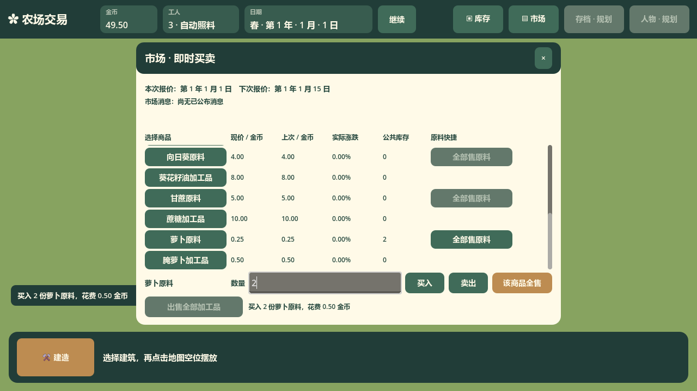
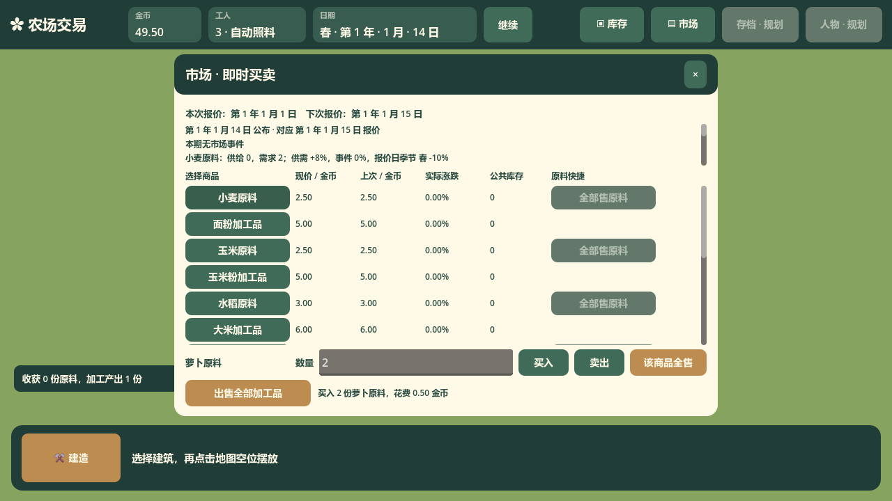

# MarketWindow 接口

实际主场景截图（初始日暂停买入 2 份萝卜；669 经营秒后，1 月 14 日公布对应 1 月 15 日报价的消息）：

对应 `scripts/ui/MarketWindow.cs`，继承 `DraggableWindow`；关联 [issue #73](https://github.com/Fotally/Farm-Exchange/issues/73)，采用[已确认市场方案](../../../project/market-proposal.md)。

构造时创建十四商品固定行，按作物的原料、加工品相邻排列。每行包含商品选择按钮、当前报价、上次报价、实际涨跌百分比和公共库存；七个原料行另有真实可点击的按品种全部出售按钮。顶部显示本次和下次实际报价年月日，并在独立有界滚动区显示已公布消息：标明公布日期及对应报价日期，直接呈现经营快照的真实因素和改期理由。消息保留最近公告，不能把旧公告的因素解释为下一次报价。

`Refresh(FarmGame)` 读取 `GetMarketSnapshot()` 和 `GetStock(CommodityId)`，只更新现有标签与库存相关按钮状态。数量输入、所选商品、焦点、光标、表格与消息滚动、窗口位置和控件身份保留；关闭重开保留当前运行的草稿与选择。界面不计算价格、季节因素、事件、报价排期或交易金额。

| 玩家意图 | 事件与结果 |
| --- | --- |
| 选择商品，输入数量后买入或卖出 | `BuyRequested(CommodityId,int)` / `SellRequested(CommodityId,int)`；输入接受 1～int.MaxValue 整数，空白、负数、小数、0、溢出都不发出交易意图，窗口显示错误并通过 `TradeInputRejected(string)` 通知 Main。 |
| 出售选中商品全部公共库存 | `SellCommodityAllRequested(CommodityId)`；不读取数量草稿，库存为 0 时按钮禁用。 |
| 原料行快捷、全部加工品快捷 | `SellRawRequested(CropKind)` / `SellAllRequested`，保持完整结算入口，无对应库存时禁用。 |
| 经营入口执行后反馈 | `ShowFeedback(string)` 在窗口内显示真实成交结果或正常失败原因；Main 同时更新全局消息。 |

数量买卖按钮保留可用，以便数量、资金或库存不足时由执行入口给出明确失败。点击执行时 Main 查询的生效报价用于成交，不能使用窗口上次刷新时的价格。暂停期间这些按钮仍可使用，主动交易不推进经营。

默认窗口位置 (250,78)、尺寸 780×520，避让底部建造区域；1280×720 基准视窗中窗口终点 Y=598，位于底部起点 Y=611 之前。消息滚动区高 60，十四行表格独立滚动；交易数量与三个操作共用一行，全部加工品按钮及反馈固定在底部。数量标题与交易反馈固定为单行；反馈在首次排版前不以零宽自动换行，避免临时最小高度撑大窗口且排版后仍保留超出视窗的尺寸。正文长消息仅在独立消息滚动区换行，不扩大窗口或挤出数量操作。实际布局 E2E 已通过，真实运行截图见本文前部。

保留节点名 `MarketWindow`、`MarketRows`、`MarketScroll`、`SellRaw{作物}Button`、`SellButton`。新增 `MarketDates`、`MarketNewsScroll`、`MarketNews`、`MarketQuantityInput`、`SelectedCommodityLabel`、`Commodity{作物}{Raw/Product}Button`、`BuyCommodityButton`、`SellCommodityButton`、`SellCommodityAllButton`、`MarketFeedback`；单个报价字段为 `Quote{作物}{Raw/Product}{Price/Previous/Change/Stock}`。
