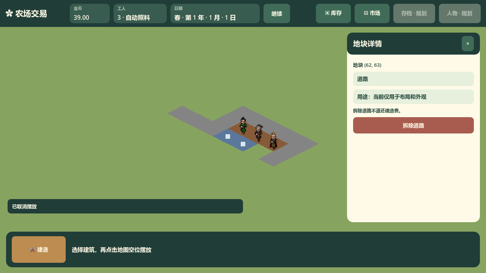

# RoadDetailsPanel 接口

对应 `scripts/ui/RoadDetailsPanel.cs`，由 `Main` 在场景创建时放入地块详情窗口，节点名为 `RoadDetailsPanel`。它创建固定的道路名称、当前仅用于布局和外观的用途说明、拆除不退款说明以及 `RemoveRoadButton`；经营刷新不重建这些控件。

`RemoveRequested` 只表达拆除当前道路的玩家意图。`Main` 根据所选格调用 `FarmGame.RemoveBuilding`，再统一同步地图与详情；面板不扣钱、不修改占用，也不持有经营状态。

`Main` 只在 `PlotSnapshot.Building == BuildingKind.Road` 时显示本面板。道路没有当前作物或加工进度，面板无需 `Refresh` 生产数据，不调用 `GetFarmDetails`/`GetProcessorDetails`，不显示价格、库存或作物周期。其他详情面板按明确类型独立分派。

道路规则与费用由土地专题维护，后续速度或属性尚未实施，本面板只展示当前用途。`tests/e2e/TestCoreLoop.cs` 覆盖道路详情显式分派、控件身份、拆除释放占用且不退款，以及相邻道路保持。

实际主场景截图：

