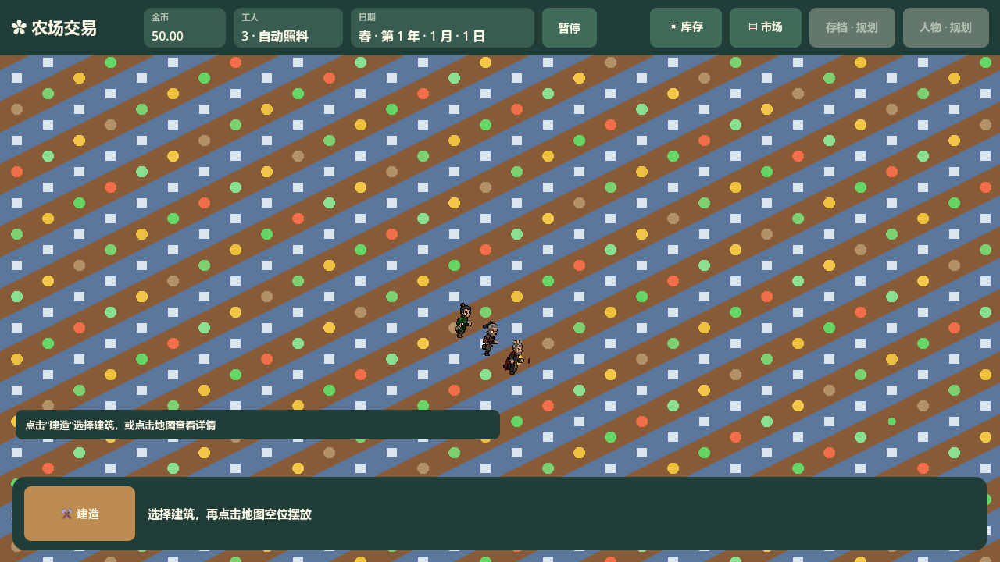

# WorkerPresentation 对外 Interface

满地图图形验收中使用既有角色图集展示三名工人，移动与动画由经营快照驱动：

对应 `FarmExchange.World.WorkerPresentation`，代码位于 `scripts/world/WorkerPresentation.cs`。这是只读工人表现 Module，负责将三名经营工人的快照转换为角色位置、朝向与按帧插值，不提交经营命令，不持有任务、认领或移动耗时的权威状态。

| 成员 | 调用约定 |
| --- | --- |
| `SetGame(game, map)` | 节点挂树后、首个显示帧之前调用一次；从 `FarmGame.GetWorkers()` 的固定编号快照创建三名 `NpcCharacter`，初始视觉位置直接使用快照。主场景将表现节点挂在 `WorldMap` 下。 |
| `_Process(delta)` | 每帧读取暂停与累计模拟秒；检测到新模拟秒时读取一组独立工人快照，以当前视觉位置为起点、经营位置为终点，在随后一秒显示时间内线性插值。相同模拟秒不重复查询快照，不推进经营。 |

经营快照由 `FarmExchange.Workers.WorkerSnapshot` 提供：编号从 1 开始，`GridPosition` 是分数格位置，`TargetCell` 和 `Activity` 是只读经营结果。显示不使用目标格自行估计经营位置，也不从 `Activity` 推断到达时点；朝向取经营位置段在地图本地坐标中的方向。即使移动最后一秒的经营状态已为播种或浇水，画面仍可完成这一段插值。

暂停不累计插值时间，动画停在当前帧；恢复继续原插值段，不补暂停的现实时间。工人停步保留当前朝向的首帧。节点隐藏、镜头位置和不同帧率只影响画面，不影响播种、浇水、收获、库存或经营位置。跨多个模拟步之后首次刷新只展示最新快照，不补算遗漏的经营动作。

位置共用 `MapCoordinates.GridPositionToLocal` 与 `WorldMap.GetGridWorldPosition`，不复制等距公式。地图平移、旋转、缩放时，对全局目标应用地图变换，再换回表现父节点的本地坐标。角色脚点对齐地图格位置，三人的图集依次复用 `npc_animation_001/002/005.png`；节点名 `WorkerPresentation/Worker1`、`Worker2`、`Worker3`。角色可以交叉或重叠，不互相碰撞。

只有角色节点、前后视觉格位置与插值经过时间属于本 Module。`NpcCharacter.ShowAt` 停用这些实例的自主物理移动与碰撞；独立预览保留原 180 像素/秒控制方式。没有动画完成或 `MoveAndSlide` 到达反馈，所有生产规则仍由经营层决定。

`TestWorkerPresentation.RunChecksAsync` 在真实树上的三实例验证起点、半段插值、朝向、地图变换、暂停帧保持与恢复、不同帧序列，以及镜头外的相同经营结果；主场景检查真实角色数量与顶部统计。FPS 场景维持满地图实体数，额外重置三个适季远田，确保预热后及采样结束仍有三名工人移动，覆盖动画与插值负载。
