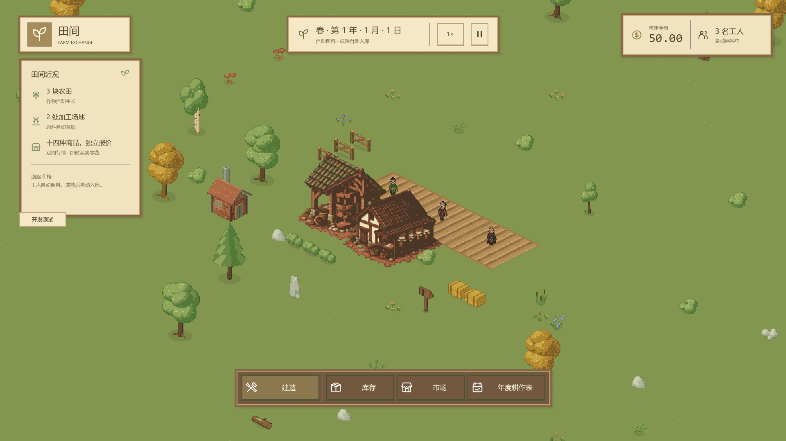

# WorldMap 分块缓存与静态资源实现

对应[WorldMap 对外接口](interface-world-map.md)。空间权威仍属于 LandOccupancy/BuildingFootprint，生产状态仍由 FarmingSystem/ProcessingSystem 拥有；WorldMap 只保留从快照得到的绘制缓存，不推进经营。

## 地面与实例缓存

地面仍按8×8基础格组成48×48块，草地采用清亮v2三元mesh图集的全草编码80；稳定格坐标选择变体0/1。每块缓存带UV的ArrayMesh与道路布尔状态，灰色道路覆盖草地。道路变更只重绘受影响可见块，屏幕外脏块进入视野时重绘。镜头只改变可见性，农田或加工外观不重建草地。

`SyncFromGame`按稳定空间快照每生产实例读取一次`GetPlot`。实例外观键为建筑类别、作物类别、作物阶段、湿润和三档索引；不把每秒变化的精确进度加入键。`GrowthProgress`由经营入口以精确时间单位计算，三档是`[0,1/3)`、`[1/3,2/3)`、`[2/3,1)`。Seeded显示通用种子，None无作物，Growing选择对应七作物之一。改种或同种重启、自动收获、换季清理均按新快照撤掉旧层；拆除立即释放土层/表层节点，同锚点重建使用当前类别与作物。

资源映射、q0路径、pivot、外观键和节点缓存均为WorldMap内部实现，不把纹理路径或字典暴露给场景协调入口。仅提取七建筑、两土层、播种和七作物三档、一个地形图集，共32张原字节PNG。来源见各`assets/gameplay/{terrain,soil,crops,buildings}/source_notes.md`与[素材总览](../../../project/asset-sources.md)。

## 统一层级

从后至前依次为：

1. 草地/道路分块（Z=-2）。
2. 农田干湿土（Z=-1）。土层永远不会盖住人物脚根。
3. 共同YSort层（Z=0）：建筑、通用播种及四种静态整田作物以工作中心为节点原点，小麦/甘蔗/萝卜各独立植株以根点为节点原点，人物以脚根为节点原点，Y较大者后画。人物容器也启用YSort，使各人物跨容器参与排序；同Y按场景节点顺序稳定排列。
4. 地图边缘与整设施金色选框（Z=10）。
5. 候选设施半透明图、逐格冲突覆盖/外围线与锚点环（Z=11）。候选属于交互提示，置于真实设施前方，不参与世界遮挡；先画候选图再画冲突覆盖，不能让屋顶遮掉红格。

建筑画布256×240/pivot(128,176)，农田224×192/pivot(112,128)，均保留原透明边并对齐`WorkCell`；逻辑3×3占地不由PNG大小推断。玉米、水稻、马铃薯、向日葵仍按静态整田工作中心排序，不裁切原图；小麦、甘蔗、萝卜采用原包独立植株，每株原点为根点，经两层嵌套YSort参与同一世界排序。磨坊body→sails→hub在单个建筑内部保持局部顺序，不能将叶片抬为全场高Z。

## 跨块与视野边缘

设施静态层作为独立Sprite2D、实际动效作为同级FacilityMotion绘制，不隶属锚点地面块，不按8×8块裁剪。可见性使用保留的整幅画布矩形；工作中心已经离开视口但屋顶仍与视口相交时仍显示。镜头变化只检查块与实例可见性，不读取或推进生产。工人不受地图块开关影响。选框按真实占地外边单独绘制，任一子格仍操作同一实例。

## 验收

`TestWorldArt.RunChecksAsync`经真实经营命令得到七作物待水、湿润与三个实际生长档，并从真实Godot视口取样与四种静态作物/五种静态建筑PNG不透明像素比较；两种动态建筑另核对拆分底图下墙，九个动态作物档位由TestFacilityMotion验收真实根部像素与冻结；同种重启检验撤图留水，拆除与同锚点重建检验旧图清理。真实NpcCharacter经`AttachDepthSorted`嵌套容器挂入，分别站在建筑工作中心之前/之后，比较人物与墙面不透明交叠像素；屋顶边缘检查根点离屏仍保留画布。独立场景`tests/integration/test_world_art.tscn`以1920×1080运行，截图保存`coverage/world-art-*.png`、`world-depth-*.png`与`world-roof-edge.png`。headless验证真实状态流与加载，像素断言仅由有窗口渲染执行，不能将headless当作图形验收。

`TestRoadMap`保留道路跨块、九子格选择、完整选框、改种和整体拆除，并用真实土层/建筑纹理替代旧彩点断言。相邻屋顶可能遮住农田右侧，因此土层采样取左侧无遮挡区；九子格占用仍全部核对。`TestPlacementPreview`保留三种候选、局部冲突、越界、取消和镜头输入检查。

满地图仍为16,384生产实例、147,456占用小格，性能门槛与镜头轨迹见[构建与验收](../../../project/build-and-validation.md)。性能优化仅影响绘制，不延后经营。预览性能场景的`--placement-preview`参数继续使用相同负载与FPS/P95门槛。

#108整合后，WorldMap只为视口与完整画布相交的实例创建FacilityMotion，离屏释放局部节点；经营快照缓存继续保留，重新入屏按当前状态创建而不积压历史结果。含蒸汽的保守可见矩形相对工作中心为(-128,-208)、尺寸256×272，原图pivot不变。每帧只推进可见列表，公共倍率跟随Driver，高开发倍率视觉1×，暂停零推进；结果消费/原实例有效性约定见接口。地图同步及镜头变动重算可见列表，不为全图16,384实例展开数十万植株节点。

## 真实图形证据

以下为2026-10-07指定Godot 4.7.2 Mono实际渲染，原图1920×1080；主场景使用玩家默认1.25倍率，独立遮挡夹具使用1倍以逐像素核对。完整测试、覆盖率和性能数据见[验收记录](../../../archive/project/testing.md#2026-10-07-105-清亮-v2-首批素材动作动效与环境验收)。

[人物在建筑前](godot-bright-depth-front.png)与[人物在建筑后](godot-bright-depth-behind.png)使用同一地图排序接口及真实角色图，测试实际不透明重叠像素；[局部动效专项画面](godot-bright-motion-stages.png)对应两建筑和三作物固定根检查，不是素材包示例工程。

#109内部EnvironmentDecorations一次生成固定视觉布局，WorldMap每次真实占地同步删除其中的根点。剩余记录与按画布可见懒建的Sprite分开，离屏释放Sprite不影响已清除事实；环境Sprite与建筑、作物、人物共用实体层。环境种子、人工点与密度见[环境实现](implementation-environment-decoration.md)。

图形诊断保留了两个夹具修正证据：稀疏播种层5像素步长仅命中9个不透明点，改用2像素步长，仍维持至少10点和原色差门槛；选框会正确盖住相邻屋顶，因此原图检查清除选框，下一帧重新选中检查金框，不把金框色误判为建筑图错误。原始日志在交付工作目录的world-art-diagnostic/road-map-diagnostic中，当前用例保留具体原图/屏幕坐标与颜色的失败报告。

年度耕作表的暂停保存回归 `TestCultivationWindow.CheckPausedSaveMap` 已按新外观迁移：空田保存新计划作物仍为None和相同干土，不应重绘草地/道路或出现彩点。测试保留原表/原条编号、农田引用、正式萝卜选种、暂停与经营秒不变；图形夹具位于主镜头内锚点(196,186)，工作中心(197,187)避开开局屋顶/人物及固定环境树冠。先将前后两帧的工作中心及周围9个不透明像素分别与独立干土PNG基准核对，证明没有一致残留的旧彩点，再比较整座占地内部含中心的前后实际像素。随后打开真实设施详情核对萝卜文字，恢复后经Main统一驱动推进并确认真实Sow结果和农田作物均为萝卜。测试不以虚假地面重绘满足旧彩点期待。
