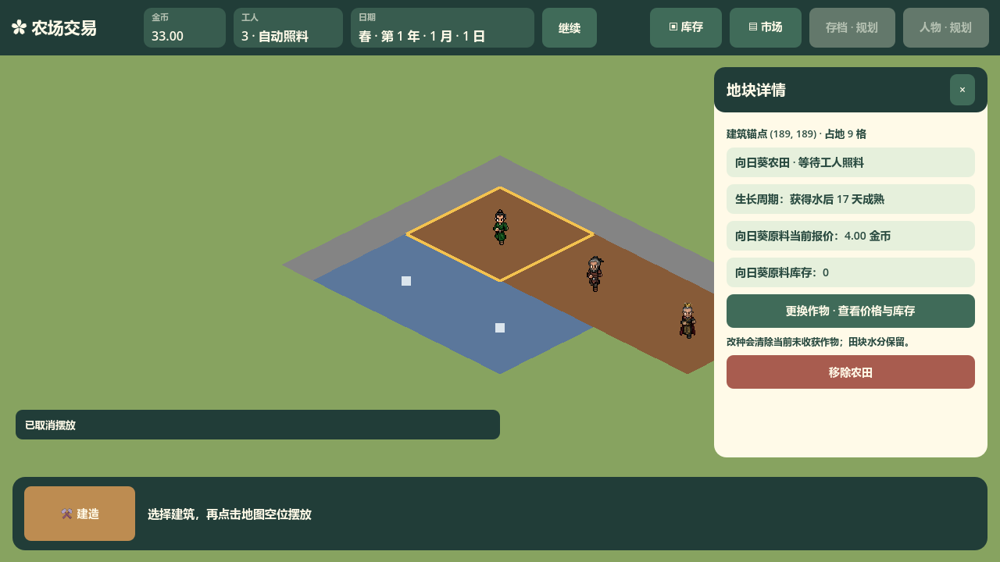

# WorldMap 对外接口

对应类型：FarmExchange.World.WorldMap，代码位于 scripts/world/WorldMap.cs。该模块负责地图表现、屏幕输入与节点坐标变换、格子选择及镜头范围，不保存或推进经营状态。等距格坐标公式统一由 [MapCoordinates](../map-coordinates/interface-map-coordinates.md) 提供。

| 成员 | 输入与输出 | 调用约定 |
| --- | --- | --- |
| SetGame | FarmGame | 初始化地图的视觉状态；主场景启动时调用 |
| SyncFromGame | 无参数 | 经营命令或 tick 结束后调用；只读取快照并更新外观 |
| SelectAtScreenPosition | 屏幕坐标 | 选择有效格后发出 SelectionChanged(cell) |
| GetCellWorldCenter | 有效格坐标 → 全局位置 | 在地图本地格中心上应用节点变换 |
| GetGridWorldPosition | 分数格位置 → 全局位置 | 调用统一坐标换算并应用地图节点变换；供工人快照和视觉插值定位，不取整 |
| ClampGlobalCameraCenter | 全局镜头中心 → 限制后的全局位置 | 先换算到地图本地网格，再应用地图节点变换返回 |
| LocalBounds | 无参数 → 地图本地外接矩形 | 供地图范围检查和测试，不表示全局矩形 |

WorldMap 通过 `FarmGame.GetBuildingSpaces()` 读取稳定锚点顺序的空间快照，每座只调用一次 `GetPlot(anchor)` 获取生产外观，再按土地拥有的 `Footprint.Offsets` 填充占用小格。`GetBuildingSpace(anyCell)` 解析当前选中的整座占地；不另存锚点与生产权威状态。SyncFromGame 的次数、镜头位置及可见块数量不得影响农田、加工、库存、价格或日期。绘制缓存的内部结构见[实现](implementation-chunk-cache.md)，格子坐标与玩家操作见[地图规则](../../../gameplay/world/map-and-camera.md)。

主场景在地图下组合[WorkerPresentation](../worker-presentation/interface-worker-presentation.md)，其角色随地图变换且覆盖地块网格。地图块可见性只影响块绘制，不隐藏或停止经营工人；工人经营位置由调度 Module 持有，地图不判断到达或作业完成。

道路快照显式使用 `BuildingKind.Road`。`SyncFromGame` 将它存入现有块外观值，道路以灰色地块顶点颜色绘制，不生成农田作物圆点或加工场地标记；非农田的作物字段不参与外观。新增与移除道路沿用8×8块变化检测和重建，选框仍独立绘制；道路选择、平移地图与镜头限制没有另一条坐标路径。

`TestRoadMap.RunChecksAsync` 在挂树并等待显示帧后验证相邻块道路同步、平移地图后的道路选择、选框不重建地块、移除与相邻道路保持。headless 覆盖连接与重建；独立有窗口运行还读取实际灰色/空地像素，保存 `coverage/road-map-before.png` 和 `road-map-after.png`。原满地图FPS夹具继续保持三名移动工人与原农田/场地数量，道路图形另由本场景验收。

农田和加工场地完整着色九个小格，仅在快照 `WorkCell` 绘制一个生产标记。任一子格点击仍发出原点击小格，详情和经营命令由 `FarmGame` 解析同一实例；选框直接按同一空间快照绘制完整占地外侧边，不绘制内部小格边。跨8×8块设施的建造、改种、拆除同步全部受影响外观；拆除后选框恢复为当前空小格。

`TestRoadMap` 同时验证非三格对齐锚点 `(183,183)` 的生产设施横纵跨四块、九子格选择、中心单一标记、子格改种、末端子格拆除无残片以及相邻加工设施保持。有窗口运行保存 `coverage/production-footprint-before.png` 与 `production-footprint-after.png`，并检查九格实际像素和四条完整选框边。

#75 原始视窗截图：点击 `(191,191)`，解析到锚点 `(189,189)`、占地 9 格的同一农田。金色选框包围整座，道路各占一个基础格；截图使用真实地图选择与详情，停止计时器并暂停，不是研究示意图。

选框图形断言按公开矩形几何检查四条外边各自的1/4、1/2、3/4位置，共12个真实像素，道路1×1和生产3×3共用此约定；保留原金色色差要求。独立线段端点的像素中心可能位于线帽之外，右顶点单点会读到路面，因此不能用端点像素代替完整边框验收。实际复现证据中右顶点为灰色而四边内部均为金色，等待额外绘制帧仍相同；检查边内部同时覆盖四边并避开3×3各小格边段的连接点，不放宽颜色或跳过图形验收。
