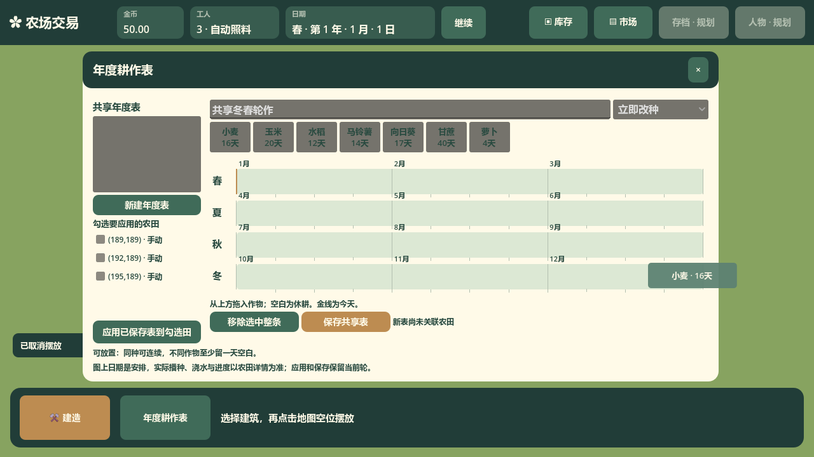
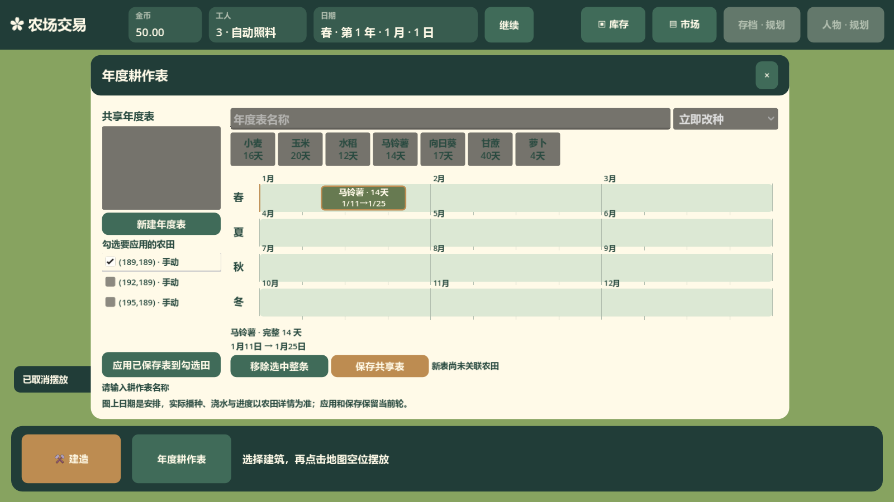

# 年度时间图早期图形取证

归档日期：2026-10-11。关联 issue：#86。已核实状态：以下截图记录当时 1280×720 与 1600×900 窗口的原生拖放和修复取证，不作为现行至少 1920×1080 的视觉验收基准。现行入口见[年度表窗口接口](../../../../architecture/ui/cultivation-window/interface-cultivation-window.md)、[时间图实现](../../../../architecture/ui/cultivation-window/implementation-annual-timeline.md)与[统一倍率接口](../../../../architecture/ui/ui-scaling/interface-ui-scaling.md)。截图保持原字节。

## 当时的真实界面取证

以下图片来自指定 Godot 4.7.2 Mono、1280×720 真实窗口与原生鼠标输入；经营保持暂停。#86 历史完整窗口可核对当时的圆角、月份、每7日周刻度，以及能容纳时居中显示的完整条内信息。短条与窄跨年片段显示原整轮的完整信息，移开后原生提示消失的断言由对应 e2e 测试完成。

## 后续复现与修复取证

首次打开窗口未填写名称，原生马铃薯条已经成功落在1月11日；按保存仍明确提示填写名称。鼠标悬停左侧已勾选且拥有焦点的农田，其文字保持深色可读。对应红测曾实际复现合法拖放被名称拒绝，以及四种状态字色对比仅1.05～1.07；修复后的目标 headless 与图形场景均通过。删除已执行日0萝卜、保存空表并重选后新增日10的回归也已通过，新条使用新编号且仍定位本年日10。

以下两张来自同一次真实图形回归，分别使用1280×720与1600×900窗口；测试结束恢复原窗口尺寸和鼠标位置。新增证据保存在 `build/issue86-followup-validation/`，不覆盖前一轮的日志及本页上方截图。

