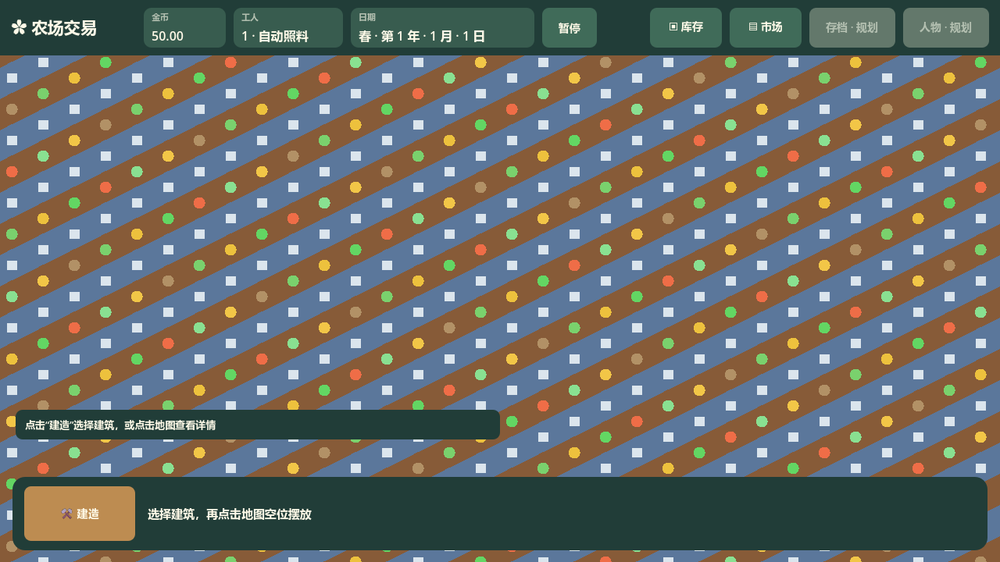
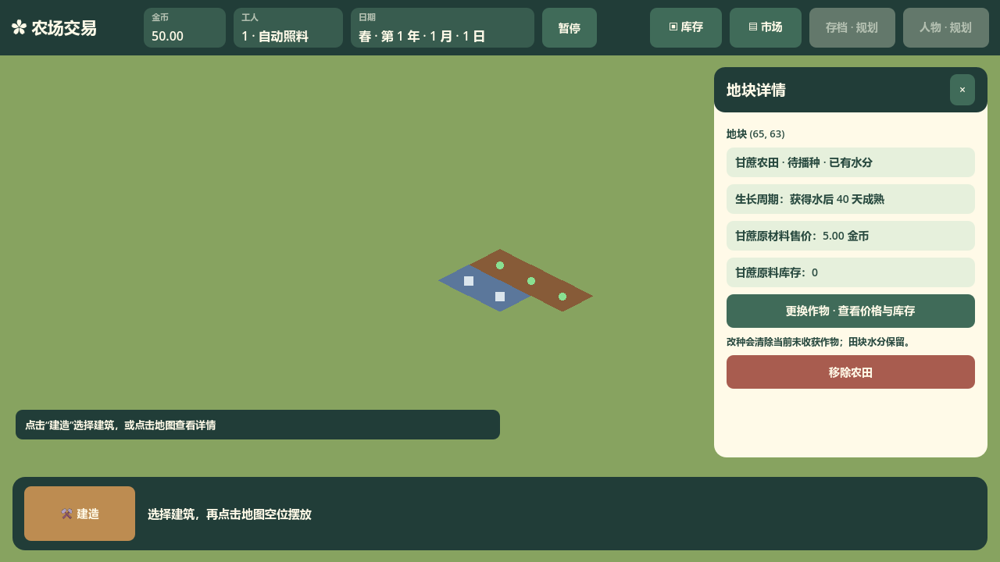

# 早期 Godot 主界面截图

归档日期：2026-10-11。关联 issue：#24。已核实状态：以下截图属于早期深绿界面，不能作为现行像素田园界面的验收基准。现行入口见[主界面接口](../../../../architecture/ui/main/interface-main.md)与[视觉基准](../../../../project/ui-visual-prototype.md)。

这些截图保留当时的建造目录、日历与作物、雨后田块和不适季播种提示，图片保持原字节。

