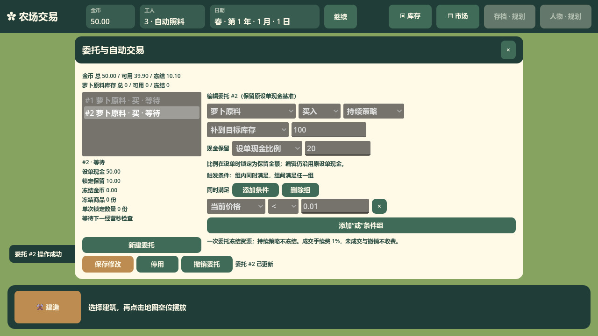

# 早期委托窗口截图

归档日期：2026-10-11。关联 issue：#36。已核实状态：截图记录早期委托窗口的一次冻结买单与持续策略，视觉早于现行像素田园界面。现行入口见[委托窗口接口](../../../../architecture/ui/trade-orders-window/interface-trade-orders-window.md)与[委托规则](../../../../gameplay/trading/orders.md)。

原始截图保持原字节。

