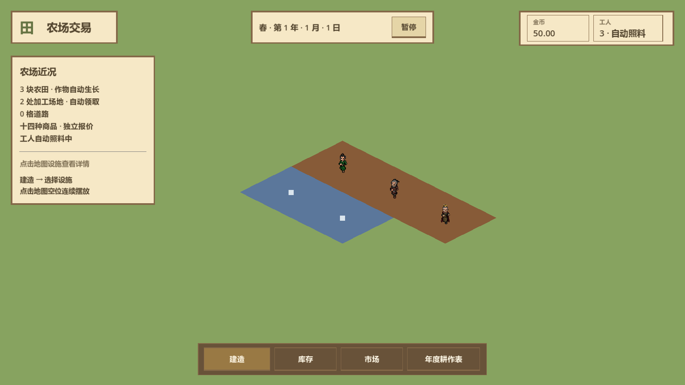

> 历史归档（2026-10-07，整理任务 [#123](https://github.com/Fotally/Farm-Exchange/issues/123)）。关联：#94；PR #95已合并。现行入口：[当前说明](../../project/ui-visual-prototype.md)。正文中的“当前”“待确认”“待合并”描述写作当时，不作为现行规则或交付状态。

# UI 原型与早期验收历史

## 上一轮 Godot 界面实测图

正式界面以真实主场景读取当前局状态；下图分别来自 1280×720 和 1600×900 窗口，地图与人物使用既有素材。两尺寸的建造末项、七作物末项与详情拆除可滚动到达，输入与勾选沿用统一主题。完整验收结果见[测试记录](testing.md)，最终独立审查及交付状态以 #94 为准。

| 工件 | 实际经营入口 |
| --- | --- |
| [农田详情](../architecture/ui/main/godot-visual-farm-detail-1280.png) | 作物状态、实际剩余、产量、报价和两种手动接管 |
| [建造目录](../architecture/ui/main/godot-visual-build-1280.png) | 九项设施、名称搜索、费用与连续摆放 |
| [库存](../architecture/ui/main/godot-visual-inventory-1280.png) | 十四商品、总量/可用/冻结及底线草稿 |
| [市场](../architecture/ui/main/godot-visual-market-1280.png) | 实时报价、消息与数量交易 |
| [委托](../architecture/ui/main/godot-visual-orders-1280.png) | 条件、预算、真实单据与草稿 |
| [年度表](../architecture/ui/main/godot-visual-cultivation-1280.png) | 共享配置、四季时间图与农田引用 |

## 浏览器验收记录

2026-10-04 使用本机 Microsoft Edge 无头浏览器检查离线 HTML：

- A / B / C × 1440×900 / 1280×720 × 建造 / 库存 / 市场 / 年度表 / 委托，共 30 组窗口边界与横向溢出检查通过。
- 目录九项、名称搜索、连续建造扣费、重复占地拒绝、退出摆放通过。
- 实际鼠标预览、道路建造、重复占地拒绝、拖动不建造、右键取消及键盘 Enter 选择设施通过。
- 买卖、余额不足、非整数拒绝、暂停交易、输入框方向键不切换方案通过。
- 库存底线合法 / 非法输入、两种改种动作、标题拖动、Esc 关闭通过。
- 浏览器 JavaScript 异常为零；截图人工检查 1280×720 主稿、市场、年度图与 1440×900 建造目录。长窗口内部滚动，较矮窗口中详情末尾操作可滚动到达。
- 田园布局＋像素风格修订后重跑上述 30 组检查及交互，全部通过；主稿弹窗默认避开顶部日期／暂停和底部操作栏，基准窗口的地图缩放位于详情下方。三行标语及对应节点已删除，七张截图同步更新。

| 工件 | 用途 |
| --- | --- |
| [B 主稿 1440×900](../../architecture/ui/main/prototype-visual-pixel.png) | 默认像素田园全景，采用田园布局 |
| [B 主稿 1280×720](../architecture/ui/main/prototype-visual-pixel-1280.png) | 基准窗口适配 |
| [A 田园](../architecture/ui/main/prototype-visual-pastoral.png) | 圆角浮动布局对比 |
| [C 轻简](../architecture/ui/main/prototype-visual-minimal.png) | 纵向工具栏布局对比 |
| [建造目录](../../architecture/ui/main/prototype-visual-build.png) | 建筑卡片与费用 |
| [市场](../../architecture/ui/main/prototype-visual-market.png) | 表格密度与交易操作 |
| [年度表](../../architecture/ui/main/prototype-visual-cultivation.png) | 四季轨道与共享应用层级 |

本轮静态检查通过，共检查 91 份文档、规则链接与脚本路径；`git diff --check` 通过。仅设计工件，未修改 C#、Godot 场景或正式玩法；不适用业务模块覆盖率、Windows 导出验收和功能 PR 闭环。独立审查结果在 #94 记录。
