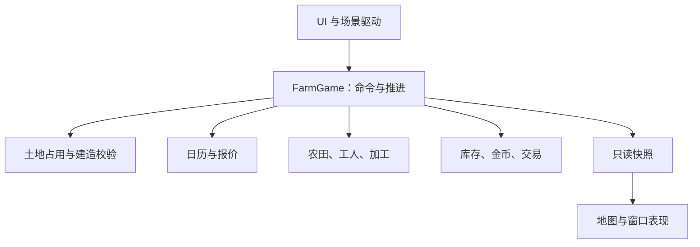

# Farm Exchange 系统组织与深接口设计：AI 实施说明

版本：1.0 · 2026-09-26
适用仓库：[Fotally/Farm-Exchange](https://github.com/Fotally/Farm-Exchange)
代码基线：`main@3fd1558091e16eb3541f2f79116752d4a220bf0a`；本次核对时 `dev@91cd6f6daab5340172f01a585c0c6e02020668d0` 与 main 的文件内容一致。
文档性质：实施设计，不代表代码已经改造，也不代表尚待确认的玩法已经获得确认。

## 执行记录（持续更新）

| 完成日期 | 部分 | 简略记录 |
| --- | --- | --- |
| 2026-09-27 | T00 基线核对 | 关联 #46；远端 `dev@91cd6f6`、`main@3fd1558` 与本文基线一致。现行代码仍为 `FarmGame`、`WorldMap` 等原结构，六作物与 10 tick/日规则未切换。保护未跟踪的 `assets/npc/` 和本文。指定 Godot 4.7.2 Mono 的基线 Debug 编译、headless 场景套件及满地图 50 tick 通过，业务行覆盖率 94.15%（`coverage/coverage.cobertura.xml`）；本轮选择 #46 的 T03 坐标入口统一，保留现有格尺寸、选格、镜头和分块表现。 |
| 2026-09-27 | T03 坐标入口统一 | 完成 #46 的坐标部分：`MapCoordinates` 统一格范围、格中心、逆变换和本地镜头限制；`WorldMap` 包装全局格中心与全局镜头限制，平移地图后的选格和镜头测试通过。现有 128×128、64×32 地块及分块表现保持。静态检查、Debug 编译、headless 套件、满地图 50 tick、Release 编译、Windows 导出和导出程序启动均通过；业务行覆盖率 94.53%，图形测试平均 1128.1 FPS、P95 1.29 ms，截图已检查（`coverage/`）。#46 的占用与建造部分仍待 T04；未切换玩法。 |

## 0. 给执行 AI 的第一条指令

先阅读本节，再选一个任务执行。不要一次性实施整份文档。

1. 读取仓库根 `AGENTS.md`、`docs/project/roadmap.md` 和目标目录的 `AGENTS.md`。目录规则原文在 `.claude/rules/`；链接处理遵循 `.codex/rule-loading.md`。
2. 获取当前 dev、main 和相关 issue 正文、评论；对照本文件基线。若已有同等实现，复用并调整任务，不创建第二套系统。
3. 从第 7 节选取一个已满足前置条件的任务。检查该任务关联的 issue；没有覆盖结构重构的 issue 时，按仓库约定先建立范围与验收标准明确的重构 issue。
4. 把任务拆成清单，列出本轮会修改的文件、保留的行为、验证方法。只实施选中的范围。
5. 没有涉及待定玩法的结构重构，可以正常进行。遇到第 8 节的待确认规则，仅暂停受影响的功能步骤，不替用户猜数字，不阻断无关任务。
6. 在 dev 开发。不要直接修改远端 main，不自动合并 PR。现有提交、测试、导出与人工合并流程继续生效。
7. 完成后按第 10 节提交结果。编译或运行受环境限制时，明确列出未执行项，不能写“全部通过”。

本文件使用方法名表达接口意图，不提供真实 C# 代码。执行时可以根据现有类型调整签名，但不得改变输入、输出、状态所有权和失败语义。本文中的“公开接口”首先指模块边界，不要求把所有类型都声明为 C# `public`，更不要求为每个类创建 `Ixxx`。

## 1. 目标与范围

### 1.1 要达到的结果

- Agent 从目录判断业务领域，从文件名判断职责，从接口文档判断调用方式。
- UI 只表达玩家意图、展示结果，不拼装经营规则。
- 一个操作的检查、状态修改和结果生成在系统内部完成。
- 每份业务状态只有一个拥有者；其他系统读取快照或调用命令。
- 新增季节、供水、工人移动、保留库存和行情时，修改集中在对应系统。
- 结构重构与玩法变更分开交付，便于回归和定位问题。

“深接口”的验收口径：调用方能用一次业务命令完成一件事，不需要先扣钱、再占格、再初始化建筑、最后自行触发生产。文件多或方法少都不是独立目标。

### 1.2 当前不用做

- 不为每个方法创建文件，不为每个类创建 interface。
- 不引入 ECS、依赖注入容器、全局事件总线、通用事务框架或插件式系统注册。
- 不把 128×128 地图改成无限地图，不把格子细分成四份。
- 不实现多格建筑、复杂寻路、道路速度加成、通用配方、物流、自动挂单。
- 不在此轮添加存档和离线收益；当前新设计已确认暂停和关闭后不推进。
- 不因猜测性能不足而改写分块渲染。先保留当前缓存和全图同步，再按测量决定优化。

### 1.3 事实、方案、待定规则的区别

| 标记 | 含义 | 执行方式 |
| --- | --- | --- |
| 当前行为 | 基线代码已经实现 | 纯重构必须保持 |
| 本文方案 | 为实现目标提出的组织与接口设计 | 随选定的结构任务实施 |
| issue 已确认方向 | 已确定玩法，但部分仍未实现 | 在对应 issue 内实施，不夹带到纯重构 |
| 待确认 | issue 明确未定的规则 | 记录阻塞点，取得规则后实施 |

## 2. 基线与需要解决的问题

### 2.1 主要文件

| 文件 | 当前职责 | 本次关注点 |
| --- | --- | --- |
| `scripts/gameplay/FarmGame.cs`，294 行 | 地块、农田、加工、工人、库存、金币、时间、交易 | 状态集中是优点，但新规则需要独立职责；保留统一入口 |
| `scripts/ui/Main.cs`，700 行 | 场景组装、全部窗口、摆放、拖动、状态解释、刷新 | 多种变化聚在一处；窗口反复销毁重建 |
| `scripts/world/WorldMap.cs`，338 行 | 坐标、选格、镜头边界、分块表现 | 保留表现职责；提取统一坐标入口 |
| `scripts/world/CameraController.cs`，108 行 | 镜头与鼠标键盘输入 | 当前职责较清楚；仅跟随坐标接口调整 |
| `scripts/market/MarketPriceCurve.cs`，69 行 | 确定性面粉价格曲线 | 当前规则继续保留；未来独立商品行情不能只改倍率 |

行数仅描述基线，不是拆分门槛。

### 2.2 问题到任务的映射

| 问题 | 具体影响 | 对应任务 |
| --- | --- | --- |
| 建造遇到越界坐标抛异常，缺少统一预检查 | 预览、实际放置可能各写判断 | T03、T04 |
| 格中心公式重复，局部坐标与世界坐标名称不清楚 | 工人移动容易复制公式或使用错坐标 | T03 |
| 作物、加工、行情和 UI 都认识 tick 时间细节 | 改日历时容易漏改、出现边界差异 | T05 |
| 工人同时决定农田规则并修改农田阶段 | 加入季节与降雨后职责继续混在一起 | T04、T06、T07 |
| 没有独立水分状态 | 无法表达空田留存雨水 | T06A |
| 多段逻辑直接增减库存 | 保留量、买入和加工竞争容易不一致 | T04、T08、T09 |
| UI 从阶段和倒计时推断原因 | 新增等待条件后展示失真 | T02、T06、T08 |
| 每秒重建窗口控件 | 将来数量输入、焦点和选择难以保留 | T01、T02 |

### 2.3 纯重构必须保留的行为

以下是当前行为，不是未来最终数值。

1. 地图 128×128；每格一种现有建筑；开局中心 3 块农田和 2 处加工场地，同种子得到同样布局。
2. 初始 50.00 金币；现有建筑每座 10.00 金币；占用或余额不足时不扣钱、不覆盖；拆除不退款。
3. 六种作物的现有名称、时长、售价倍率、原料价格比例保持，具体值以当前玩法文档为准。
4. 每 tick 一个工人动作；生长和加工完成后入库；空闲加工场地自动领取匹配原料。
5. 当前顺序：推进已有生长和加工 → 空闲场地领取 → 工人动作 → 换日及行情。
6. 新建加工场地时，有匹配原料会立即启动；不要在重构中改成下一 tick 才领取。
7. 改种丢弃未收获作物；拆除加工场地丢弃已投入原料；同品种重复改种沿用当前无变化语义。
8. 每 10 tick 换日；当前面粉曲线、成品倍率、原料 50% 定价以及 SellAll/SellRaw 行为保持。
9. 界面摆放、拖动窗口、关闭重开保留位置、选格与镜头交互保持；内部时间当前仍隐藏。
10. 现有满地图基准、覆盖率范围和性能要求保留。

不得在纯重构 PR 中同时把六作物改成七作物、把秒改成游戏日、加入道路收费或修改加工吞吐量。

## 3. 系统边界与状态所有权

### 3.1 统一入口

保留 `FarmGame`。UI、场景驱动和整体经营测试通过它提交业务命令、推进经营、读取快照。

内部模块可以相互调用明确的只读查询或完整操作，但不能取得对方可变容器。内部模块不得反向调用 `FarmGame`，防止循环依赖。场景中的各个窗口不直接持有库存、工人或农田内部对象。

图中合并展示的方框不代表必须合成一个类。直接依赖以本节表格为准。

### 3.2 唯一状态拥有者

| 状态 | 唯一拥有者 | 其他系统如何使用 |
| --- | --- | --- |
| 地图范围、每格主要占用物 | `LandOccupancy` | 查询空地/农田/加工场地；通过 FarmGame 放置和拆除 |
| 农田选种、本轮作物、水分、生长进度 | `FarmingSystem` 内部的 `FarmState` | 读农田快照；提交播种、供水、清理等受控操作 |
| 加工配对、进行中批次、剩余加工量 | `ProcessingSystem` 内部状态 | 查询加工状态；系统统一领取和完工 |
| 工人位置、当前任务、任务目标 | `WorkerScheduler` 内部的 `WorkerState` | 读工人快照；动画只展示 |
| 商品公共库存与原料保留底线 | `Inventory` | 入库、出售扣除、加工领取，不返回可变数组 |
| 金币 | `Wallet` | 经验证的收入与支出，外部只有余额查询 |
| 累计模拟时间、日期派生值 | `GameCalendar` | 查询日期与时间区间，不允许其他模块自行维护天数 |
| 当前商品报价、报价历史及事件 | `MarketQuotes`，随 #25 增加 | 读取生效报价；不由 UI 或交易系统重新算价 |
| 选中格、摆放模式、窗口位置、输入值 | 对应 UI 组件 | 不写回成经营状态 |
| 网格缓存、可见块、视觉插值 | `WorldMap` 及后续工人表现 | 可以重建；不得决定库存、生产或到达时点 |

占用表与农田/加工状态承担不同职责，不是两份相同状态。必须始终满足：某格占用为农田时，恰好存在一份农田状态；占用为加工场地时，恰好存在一份加工状态；空地没有这些状态。道路未来只有占用和表现，不创建空农田或空加工对象。

### 3.3 允许的内部依赖

- `FarmGame` 组装各模块，协调建造、拆除和每步执行顺序。
- `FarmingSystem` 读取作物定义、日历结果和显式环境输入；不读取 UI 或场景节点。
- `WorkerScheduler` 查询农田任务需求，并向农田提交操作；农田不认识工人动画。
- `ProcessingSystem` 通过 Inventory 的完整领取/入库方法操作库存，不自行读取余额后再扣库存。
- `TradingService` 读取 MarketQuotes，协调同一个 Inventory 与 Wallet 完成买卖。
- `LandOccupancy` 不依赖农田、工人、加工或行情；它不判断季节和生产。
- `MapCoordinates` 只处理坐标，不检查金币、道路连通或业务可达性。
- `WorldMap` 可继续持有 FarmGame 并读取只读快照。现在不为这个唯一实现增加只读接口抽象；用代码约束和审查保证不调用经营命令。

## 4. 目录与文件组织

### 4.1 文件创建原则

1. 一个主要职责一个主要类型文件。小型、只供一个类使用的枚举或记录可以放在所属文件内。
2. 只有多个调用方确实使用的契约类型才单独建文件；不要创建只有一个转发方法的类。
3. 本表是逐步形成的目标。相关任务尚未开始时，不建立空目录、空系统或抛 NotImplemented 的占位实现。
4. 不设置统一的 `Models/`、`Managers/`、`Interfaces/`、`Utils/` 大杂烩目录。
5. 目录小写英文，C# 文件名 PascalCase 并与主要类型一致；命名空间依实际路径同步维护规则和静态检查。

### 4.2 文件职责与创建时点

| 路径 | 负责内容 | 创建/整理时点 |
| --- | --- | --- |
| `scripts/gameplay/FarmGame.cs` | 统一经营入口、组装、执行顺序 | 保留并逐步收口 |
| `scripts/gameplay/CommandResult.cs` | 成功/失败、稳定原因码；特定命令另返回费用等必要结果 | T04，确有多个命令共用时 |
| `scripts/land/LandOccupancy.cs` | 地图范围与唯一主要占用表 | T04 |
| `scripts/land/PlacementRules.cs` | 同一放置检查用于预览与执行 | T04 |
| `scripts/world/MapCoordinates.cs` | 格坐标与地图局部坐标的双向换算 | T03 |
| `scripts/world/WorldMap.cs` | 分块表现、选择、世界坐标入口 | 保留 |
| `scripts/world/CameraController.cs` | 镜头输入和平移缩放 | 保留 |
| `scripts/time/GameCalendar.cs` | 累计模拟时间、日历与时间边界 | T05 |
| `scripts/farming/FarmingSystem.cs` | 农田生命周期与受控修改入口 | T04 迁移旧逻辑；T06 扩展 |
| `scripts/farming/FarmState.cs` | 农田内部状态 | T04；仅类型足够独立时拆文件 |
| `scripts/farming/FarmSnapshot.cs` | 农田只读详情、工作需求与等待原因 | T06；迁移前沿用 PlotSnapshot |
| `scripts/farming/PlantingRules.cs` | 播种合法性和预计成熟时间判断 | T06B |
| `scripts/farming/CropCatalog.cs` | 作物定义、名称和生产参数 | T04，仅搬迁现有表 |
| `scripts/workers/WorkerScheduler.cs` | 任务选择、执行调度；未来移动时序 | T04 保留旧轮转；T07 扩展 |
| `scripts/workers/WorkerState.cs` | 真实需要移动状态时才建立 | T07 |
| `scripts/processing/ProcessingSystem.cs` | 原料领取、加工推进、完工入库 | T04 |
| `scripts/inventory/Inventory.cs` | 商品数量和原料保留规则 | T04；T08 增加底线 |
| `scripts/economy/Wallet.cs` | 金币余额与受控收支 | T04 |
| `scripts/market/MarketPriceCurve.cs` | 当前价格曲线算法 | 保留至 #25 决定替换或复用 |
| `scripts/market/MarketQuotes.cs` | 当前报价、排期、消息与因素关联 | T09，不在纯重构时提前建 |
| `scripts/trading/TradingService.cs` | 完整的交易检查与结算 | T09；T04 仍由 FarmGame 保留现有出售协调 |
| `scripts/ui/Main.cs` | 场景组装、连接输入、统一刷新 | T01、T02 |
| `scripts/ui/DraggableWindow.cs` | 标题栏拖动、窗口位置与边界 | T01 |
| `scripts/ui/BuildCatalogWindow.cs` | 建造目录、搜索和选择意图 | T01 |
| `scripts/ui/FarmDetailsPanel.cs` | 农田展示、改种/移除意图 | T02 |
| `scripts/ui/ProcessorDetailsPanel.cs` | 加工展示、移除意图 | T02 |
| `scripts/ui/InventoryWindow.cs` | 分类库存展示，未来保留量编辑 | T02、T08 |
| `scripts/ui/MarketWindow.cs` | 报价、库存与交易输入 | T02、T09 |
| `scripts/ui/CropSelectionWindow.cs` | 作物选择和只读价格库存 | T02 |

暂时继续使用 Vector2I 表示格坐标，不为消除一个 Godot 值类型依赖引入替代数学库。作物显示颜色继续属于表现侧；新增作物时检查颜色映射完整性，不能把颜色搬到经营规则里。

### 4.3 Agent 导航与规则文件

在 `docs/architecture/implementation-system-organization.md` 维护本方案落地后的系统图、状态所有权和“改什么先看哪里”表。在 `docs/README.md` 增加链接。各实际新增模块的接口文档使用仓库既有 `interface-模块名.md` 规则。

不要把这份未来方案整段覆盖到现行玩法文档。已实现部分写进现行文档，未实现部分保留在设计与 issue 中。

仅在目录确有额外约束时增加该目录 AGENTS.md。若增加 Claude/Codex 共用规则，更新规则原文、`.codex/rule-links.json` 与链接检查；不要把规则复制成多份以后各自修改。

| 要改的行为 | 首先查看 | 必须考虑的连接 |
| --- | --- | --- |
| 建造和占用 | land、FarmGame 建造命令 | Wallet、农田/加工状态创建 |
| 选格与位置 | MapCoordinates、WorldMap | 相机与后续工人表现 |
| 作物季节/供水/成熟 | farming | Calendar、WorkerScheduler、Inventory |
| 人力与移动 | workers | 农田任务需求、目标有效性 |
| 加工与保留量 | processing、inventory | 买入、出售及完成入库 |
| 日期与报价排期 | time，随后 market | 生产跨界、消息前一日 |
| 价格公式 | market | 当前报价稳定性、交易成交价 |
| 买卖 | trading | Wallet 与 Inventory 一致结算 |
| 窗口交互 | ui 对应窗口 | 只读快照与业务命令 |

## 5. 对外接口设计

本节名称为建议。一次迁移只选一套正式名称；允许在过渡期保留旧入口委托到新实现，但不得存在两套业务逻辑。调用方迁移完成后再删除旧入口，并同步测试和文档。

### 5.1 通用结果约定

| 数据 | 至少包含什么 | 注意事项 |
| --- | --- | --- |
| 命令结果 | 是否成功、稳定原因码 | 中文文案由 UI 映射，不用字符串判断分支 |
| 放置检查结果 | 是否允许、原因、当前费用 | 查询不修改状态；查询通过不保证稍后的执行必定成功 |
| 放置执行结果 | 是否成功、原因、实际扣费、目标格 | UI 显示实际扣费，不再自行读取统一常量拼结算信息 |
| 地块快照 | 格坐标、主要占用类别 | 可附加现有 PlotSnapshot 兼容信息；不暴露内部对象 |
| 农田快照 | 所选作物、本轮阶段、水分、进度、等待原因 | 水分和扩展原因随对应任务增加 |
| 加工快照 | 场地类型、当前阶段、投入品/产物、剩余时间、等待原因 | 保留量不足与完全无原料分开解释 |
| 时间快照 | 累计模拟秒、日期、季节 | 不向 UI 暴露需要自行换算的裸 tick |
| 工人快照 | 任务、位置、目标、移动/工作进度 | #40 实际定义移动后再增加 |
| 交易结果 | 商品、方向、成交数量、成交单价、总金额、失败原因 | 报价版本等字段在 #25 真正需要时增加 |

原因码按真实需求增加，如 OutOfBounds、Occupied、InsufficientFunds、NotFarm、WrongSeason、InsufficientTime、WaitingForWorker、ReserveLimit。不一次性预设几十种错误。

普通玩家操作失败是返回结果，不是异常；内部不变量被破坏属于编程错误，应由断言或异常暴露，不能伪装成“金币不足”。无效作物或商品标识在修改任何状态前拒绝。

### 5.2 FarmGame：外部经营入口

| 操作 | 输入 | 输出与承诺 |
| --- | --- | --- |
| 查询地块 | Cell | 有效地块快照，或明确越界；不让外部直接索引数组 |
| CheckPlacement | Cell、现有建筑描述 | 完整检查结果，不扣钱、不占格 |
| TryPlace | Cell、建筑描述 | 完整放置结果；内部负责检查、扣钱、占用、初始化 |
| TryRemove | Cell | 拆除结果；内部清理相应生产状态 |
| TrySetFarmCrop | Cell、CropKind | 改种结果；内部处理当前作物，未来水分按已确认规则处理 |
| 读取详情 | Cell | 农田或加工的只读语义快照 |
| AdvanceTick（过渡） | 无 | 保留当前一步推进语义 |
| AdvanceSimulationStep（未来） | 确定的一步模拟时长及所需显式环境输入 | 完整推进，返回本步结果；不由 UI 逐个推进系统 |
| 设置原料保留量 | 原料、非负数量 | 检查后更新底线，不擅自退回已投入原料 |
| TryTrade（未来） | 商品、方向、数量 | 一次结算；失败不改变金币或库存 |

已有 BuildFarm、BuildProcessor、RemoveBuilding、SetFarmCrop、SellRaw、SellAll 可在迁移时继续存在并转发。什么时候删旧入口，必须写入对应任务；不能在不改 UI 和测试的情况下直接删掉。

### 5.3 地图与坐标

| 操作 | 输入与输出 | 约束 |
| --- | --- | --- |
| ContainsCell | Cell → 是否在地图内 | 所有业务入口复用同一地图范围定义 |
| CellToLocalCenter | Cell → 地图局部中心 | 一个公式来源，不包含 Node2D 的变换 |
| LocalPositionToCell | 地图局部位置 → 候选格 | 转换可产生越界候选，调用选择入口时再统一检查 |
| GetCellWorldCenter | 有效 Cell → Godot 全局位置 | 由 WorldMap 包装局部中心并应用节点变换，给工人表现使用 |
| SelectAtScreenPosition | 屏幕位置 → 选中事件 | 屏幕到局部再到格；地图外不修改选择、不发送建造命令 |

保留数学层与节点变换层的区别。工人经营状态不能把像素坐标当成地块标识；路径/任务仍引用格。仅当前地图是原点、不旋转，不足以证明两种坐标可以混用。

### 5.4 农田与工人之间的接口

| 接口意图 | 由谁提供 | 隐藏的细节 |
| --- | --- | --- |
| 查询需要的工作 | FarmingSystem | 季节、播种时间、水分和阶段判断 |
| 尝试完成一次播种 | FarmingSystem | 二次验证、建立本轮状态、湿地立即进入生长 |
| 尝试完成一次浇水 | FarmingSystem | 已有水时不重复操作、生长只启动一次 |
| 应用显式降雨输入 | FarmingSystem | 未播种留水、待水作物启动、重复降雨处理 |
| 推进生长与处理季节边界 | FarmingSystem | 进度、失败、成熟、产量；返回完成结果用于入库 |
| 推进工人任务 | WorkerScheduler | 选任务、移动、重新验证、执行及释放 |

不将“GetMutableFarmState”作为模块接口。不让工人直接写 CropStage。UI 显示等待原因也读取同一规则的结果，不能再实现一套播种合法性判断。

### 5.5 库存与加工之间的接口

- 查询库存：返回数量，不返回数组或可变引用。
- 收获/完工入库：增加对应商品数量；数量为负或溢出时在修改前拒绝。
- 加工领取：检查原料、数量和保留底线，成功才扣除；检查和扣除属于同一次操作。
- 出售扣除：检查公共库存，与加工保留底线无关。
- 设置保留底线：只改变自动领取限制，不改变已有库存、不撤回加工中原料。

T04 可先保留按作物区分原料和成品的现有接口；T09 再引入统一商品标识。可用“作物种类＋原料/成品类别”作为首版商品标识，无需通用内容 ID 框架。同一份库存只能保存一次，旧接口若保留必须委托到同一个底层。

### 5.6 UI 组件接口

窗口提供“显示/隐藏”“用快照更新”“读取未提交输入”，并发出“请求建造某类型”“请求改种”“请求出售”等意图。

Main 接收意图 → 调用 FarmGame → 显示结果 → 统一刷新。窗口不知道 Wallet、Inventory、PlantingRules 的存在。快照可包含界面所需商品名称和状态数据，但不要把颜色、Godot 控件或节点对象塞进经营层。

不引入通用反射式命令执行器。使用明确命令处理方法和一个共用刷新出口即可。

## 6. 关键代码逻辑说明（非真实代码）

### 6.1 建造与占用一致性

**检查流程：**

1. 检查建筑描述是否有效，得到当前建造费用。
2. 检查坐标范围；越界返回 OutOfBounds，不访问数组。
3. 查询 LandOccupancy；非空返回 Occupied。
4. 查询 Wallet；余额不足返回 InsufficientFunds。
5. 返回允许和费用。上述全部是只读操作。

**执行流程：**

1. TryPlace 重新执行同一检查，不信任较早的预览。
2. 预先构造该类型需要的初始状态；所有可预见的失败在这一步之前结束。
3. 在同一同步调用中扣费、登记占用、登记对应农田或加工状态；不在中间发送事件，不允许 UI 或其他命令重入。
4. 如果是当前规则的加工场地，按现有 StartIdleProcessors 行为尝试立即领取。迁移期保留“扫描全部空闲场地”的原语义，不顺手改成仅扫描新场地。
5. 状态一致后返回成功与实际扣费。此时才能刷新表现。

这是当前单线程模拟下的完整操作，不要求数据库事务或加锁框架。实现者必须避免在扣费后才发现类型无效、状态重复等业务失败。内部程序错误不能吞掉后继续运行。

**拆除流程：**

1. 校验范围和占用；空格返回明确失败。
2. 清理该占用物的生产状态，按当前/已确认规则丢弃未收获或加工中资源。
3. 清除占用，不退款。
4. 若已实现工人任务，撤销指向被拆对象的任务；其后重建的同格对象不能继承旧任务。
5. 返回结果后统一刷新。

首次开局免费建筑不能通过“临时加钱再扣钱”创建。保留一个仅初始化使用的内部登记入口，跳过费用但复用占用一致性检查。满地图基准也使用专用内部夹具路径，不向普通玩家暴露任意填图命令。

### 6.2 旧状态迁移到独立模块

迁移顺序必须保证任何时刻只有一个真实状态来源。

1. 先建立 Inventory 和 Wallet，把原数组/余额移入其中；旧 FarmGame getter 和出售方法委托过去。
2. 再把作物定义表移到 CropCatalog；FarmGame.Crops/GetCrop 暂时转发。
3. 接着将 `_plots` 的占用信息交给 LandOccupancy，将农田/加工各自的状态交给对应系统；同一次变更删掉原来的权威 PlotState 存储。
4. 继续由 FarmGame.GetPlot 聚合生成旧 PlotSnapshot，让 UI 与 WorldMap 暂时无需变化。
5. 迁移工人游标到 WorkerScheduler，农田状态修改通过 FarmingSystem 完成；选择顺序仍按原行优先索引轮转。
6. 开局布局继续使用原种子与原随机调用顺序；改变随机调用顺序会改变固定种子的开局，不属于纯搬迁。
7. 满地图测试状态同步迁移。加工中批次由夹具显式建立；不得为了复用建造入口而偷偷多扣一份库存。

内部状态可以使用数组或字典，以迁移简单、顺序稳定为优先。若使用字典，不依赖其遍历顺序实现工人公平性或加工领取优先级。不要为了“将来大地图”同时更换空间存储结构。

### 6.3 时间推进与边界

**T04 结构重构期间：**严格保留第 2.3 节的旧 tick 顺序和 10 tick/日，不修改 UI 时间文案。

**T05 新日历：**

1. 场景计时器只请求固定模拟步。动画帧率不参与经营时钟。
2. GameCalendar 保存 uint32 累计模拟秒；暂停时不推进；关闭重开不以现实时间差补算。
3. 日历换算集中在此模块。#33 已确认一周 360 秒、7 日；建议整数有理数比较，例如用足够宽的中间值比较“秒数×7”和“天数×360”，避免每次把一天先舍入成 51 秒。
4. uint32 存储不意味着中间乘法也用 uint32；必须防止乘法和累计溢出。达到存储上限时的处理列入 T05 技术约定，至少不得静默回绕日期。
5. 一步返回旧时间、新时间和跨越的日期边界。生产与行情共享同一时间区间，不分别计算今天是几号。
6. 若支持一次推进多秒，先实现为逐个固定步执行，保证与连续调用等价；不要跳到终点后只结算终点日期。
7. 关于非整数日长：保存累计秒与有理时间阈值，按确认的取整/越界口径判断完成。不要用“整数天数差”代替实际已生长时长。

**新玩法执行顺序尚需确认：**换季失败、恰好成熟、降雨供水、工人到达、加工领取、报价更新同时发生时，最终顺序由 #33/#37/#38/#39 确认。本文不把某一种新顺序写成既定规则。

实现方法是：把上述行为写成具名阶段，先保留旧顺序；规则确认后在一处调整调度，并用边界用例固定。只拆清楚阶段不等于引入全局事件系统。

### 6.4 农田生命周期与供水

把“生命周期阶段”和“为什么暂时不能工作”分开。生命周期可以是空田、已播种待水、生长中；等待原因由规则计算，不必为每种原因新增永久阶段。

| 当前状态与输入 | 执行逻辑 | 结果 |
| --- | --- | --- |
| 空田，需要播种 | 检查适宜季节与可成熟时间 | 不通过保持空田和选种，返回具体原因 |
| 空田，通过检查，工人完成播种 | 建立本轮作物；读取现有水分 | 有水立即开始生长，无水等待供水 |
| 空田，显式降雨 | 按规则给地块供水 | 水分可保留给之后播种 |
| 已播种待水，降雨或工人供水 | 进入统一 SupplyWater 逻辑 | 标记有水，启动一次生长 |
| 已经生长，再次降雨 | 保留已经启动的生长进度 | 不重置生长期 |
| 生长达到成熟阈值 | 生成本轮收获结果，清理本轮状态和水分，保留选种 | 每轮最多入库一次，后续允许再播种 |
| 已播种待水或生长中进入禁生季节 | 按已确认边界顺序判定失败 | 无本轮收成，清理本轮状态和水分，保留农田与选种 |

农田内部至少区分：玩家所选作物、本轮阶段、是否有水、生长进度。新增天气进度修正时再加入必要的累计量，不提前保存尚未定义的天气效果。

收获不能只返回一个总数量供外部猜测品种。返回明确的“农田格、作物/原料、数量”；由 FarmGame 统一立即入库，再按既定顺序处理加工。结果列表仅供本步消费，不作为可重复投递的异步消息队列。

改种、拆除的水分处理，以及持续下雨中收获后是否立即重新润湿仍待确认。未确认前可以完成通用供水入口和其他明确用例，但不能自选默认值后声称 #39 全部完成。

### 6.5 播种合法性

1. 验证目标仍为农田，并处于可以开始新一轮的阶段。
2. 读取该作物允许生长的季节。
3. 当前不允许：返回 WrongSeason。
4. 找到下一段禁生季节的开始时刻。若当前和下一个季节连续允许，使用整个连续允许区间，不截断在本季末。
5. 按已确认口径估计“现在到供水完成的等待＋基准生长期”。不预知尚未生成的未来天气。
6. 按已确认边界规则比较预计成熟时刻与禁生时刻；不够则返回 InsufficientTime。
7. 工人真正执行播种时重新检查，防止任务分配时可以播种、到达时已经不可以。

未来耕作表只决定尝试的品种与时机，必须复用本检查；不能绕过检查强行改作物阶段。

### 6.6 工人调度与移动

**结构重构阶段：**只搬迁旧轮转逻辑，保持一次 tick 最多一个动作，不新增移动时间。

**#40 规则确认后的目标流程：**

1. 空闲工人查询需要工作的农田；农田返回播种/供水需求和当前是否有效。
2. 调度器按已确认优先级选择任务；不把缺少道路当作不能分配。
3. 记录工人任务及目标。只有真实存在多工人时才增加任务认领管理，防止两人重复处理同一任务。
4. 经营层推进移动/工作进度；表现层读取快照按帧插值。由经营层决定到达，不能由画面动画完成回调决定生产。
5. 到达时重新检查：目标仍存在、仍是同一轮/同一对象、仍需要该工作。
6. 若目标已拆除、改种或被降雨满足，取消失效动作并释放任务，不重复浇水。
7. 有效时调用农田的播种/供水操作，再返回空闲或下一任务。

任务有效性可以通过拆除/改种时主动取消，并在执行前检查实现；若同格重建仍有歧义，再为任务加入对象代次或生产轮次。不要仅比较 Cell 就认定仍是原目标，也不提前建立全局实体 ID 框架。

移动速度、距离算法、是否绕过建筑、两日目标如何起算和可支撑规模均由 #40 确认。“不用道路也能到田”不自动等于可以穿过所有建筑，也不等于已授权复杂寻路。

### 6.7 加工与保留量

1. 先推进已投入批次。完成时生成一份明确产物并入库，清除该批次的进行中状态。
2. 在既定领取阶段按稳定顺序访问空闲加工场地。
3. 调用 Inventory.TryTakeForProcessing，内部判断：公共库存减去本次领取后，是否仍不低于保留底线。
4. 不满足：不扣库存、不开始加工；返回“没有原料”或“受保留量限制”。
5. 满足：扣除一份公共原料，创建一个进行中批次。批次完成前，这份投入物不属于公共可售库存。
6. 多场地依次调用同一领取操作，后一个看到前一个扣除后的数量，不会重复领取。
7. 提高底线不召回投入物；降低底线何时触发新领取按 #41 确认。设置底线本身不能意外重复启动两次。

在 #35 确认改变配方之前，继续每份原料产出一份成品。新产量和加工天数只在对应功能任务切换，不能在保留量任务中同时更改。

数量守恒测试分别记录：公共原料、已投入批次、已完成成品、已出售数量、因拆除而丢弃的投入。原料与成品是不同商品，不能只看一条原料库存线就断言丢失。

### 6.8 商品行情与交易

**报价：**

1. GameCalendar 提供日期和已跨越的时间区间；报价排期按 #33 确认规则得到实际报价日。
2. MarketQuotes 保存实际生效报价；非报价日查询必须返回原报价，不因查询次数改变。
3. 如果消息反映下一次实际价格因素，先保存那次报价所使用的已确定因素，再生成对应消息；不能报价后随机编理由。
4. 消息在实际报价日前一个游戏日公布。节日调整同时作用于报价和消息排期。
5. 原料和成品各有价格；共享因素不等于固定比例。
6. 同种子、同规则、同时间和输入应得到同结果。开局、市场和未来天气的随机过程不能通过临时 UI 查询互相扰动；是否拆分子种子在引入新随机系统时明确，不在 T04 改变原开局结果。

**即时交易：**

1. 校验商品、方向、数量和有效报价。
2. 在命令执行时读取一次生效价格；UI 上次看到的价格只是显示信息，不直接作为最终结算依据。
3. 计算金额并检查范围；有费用/价差时只按 #25 已确认规则计算。
4. 买入：验证金币足够和库存可增加；卖出：验证公共库存足够和金币可增加。
5. 全部通过后，在同一同步命令内一起修改金币和库存，之后才通知表现刷新。
6. 失败不留下任何部分修改；返回实际成交量、单价、总金额。
7. 买入原料进入与自产原料完全相同的公共库存。买入后是否立即触发加工领取需要明确，不能由不同按钮路径产生不同结果。

首版不引入锁定库存、挂单或手续费默认值。保留 SellAll 快捷入口时，它必须使用同一价格与库存规则，明确同次调用使用的生效报价，不能重新写一套出售算法。

### 6.9 UI 与地图刷新

1. 创建窗口时建立固定控件和引用；固定六/七种商品行可以按标识缓存。
2. 每次刷新读取只读快照，更新文本、进度和按钮可用性。
3. 只有目录条目改变、过滤条件改变或详情类型改变时重建必要区域；普通倒计时变化不删除输入控件。
4. 用户尚未提交的数量、输入焦点、窗口位置和滚动位置由窗口保留。经营刷新不能覆盖正在编辑的值；提交成功后是否清空由具体交互决定。
5. Main 将“经营命令后刷新”和“tick 后刷新”收口到一个出口。该出口可以先保守刷新可见窗口、同步地图，不必立即精细计算变更集合。
6. WorldMap 保留现有块缓存和全图快照同步。不要把所有内部系统都接成独立刷新事件，否则一步过程中会展示半完成状态。
7. 未来若测量显示全图同步成为瓶颈，再由本次命令/推进返回受影响地块或版本变化；不是本方案第一阶段的必做项。

## 7. 分步实施任务

### 7.1 总体依赖与推荐顺序

任务编号是标识，不表示所有任务必须按数字顺序串行完成。

| 任务 | 性质 | 前置 | issue 关系 | 是否现在可开始 |
| --- | --- | --- | --- | --- |
| T00 核对基线 | 准备 | 无 | 当前选中 issue | 可以 |
| T01 窗口拆分第一批 | 纯重构 | T00 | 新建/关联专门重构 issue | 可以 |
| T02 详情、刷新和查询语义 | 纯重构 | T01 | 同主题独立小任务 | 可以，只表达现有状态 |
| T03 坐标入口统一 | 底座整理 | T00 | #46 | 可以 |
| T04 状态归属与放置命令 | 纯重构＋明确的边界修正 | T03 | #46 覆盖占用；其他迁移另立重构 issue | 可以，分批交付 |
| T05 日历与调度边界 | 新玩法 | T04 | #33，参数切换关联 #34/#35 | 独立换算可做；经营接入受 D02/D08 阻塞，节日另受 D01 阻塞 |
| T06A 水分生命周期 | 新玩法 | T04 | #34/#39 | 部分可做；完成受 D04 阻塞 |
| T06B 播种规则 | 新玩法 | T05、农田水分语义明确 | #37 | 受 D02/D03 阻塞 |
| T06C 越季失败 | 新玩法 | T05、T06B | #38 | 受 D02/D03/D04 阻塞 |
| T07 工人到田与调度 | 新玩法 | T03/T04、T05/T06 的相应规则 | #40 | 受 D05 阻塞 |
| T08 保留量 | 新玩法 | T04 | #41 | 核心领取判断可做；完整交付受 D06 阻塞 |
| T09 商品行情与交易 | 新玩法 | T04/T05/T08 的库存接口 | #25，部分 #33/#35 | 受 D01/D07/D08 阻塞 |
| T10 道路 | 新玩法 | #46 完整完成 | #45 | 受 D09 阻塞 |
| T11 远期功能 | 后续 | 相应基础功能 | #36/#42/#43/#44 | 本轮不实施 |

推荐主线：T00 → T03 → T04 → T05 → T06 → T07。T01/T02 是界面整理支线，可在主线前做，也可随相关界面变更完成；不是格子底座的强制前置。T08 可在 T04 后独立完成，无需等待复杂工人移动。T10 不依赖市场。

一个 AI 一次领取一个任务或其明确子步骤。不要为了执行本文而把所有重构塞入 #46；#46 只负责其原本的格子与占用范围。

### T00：核对当前状态并记录基线

**目标：**防止按旧设计覆盖新实现。

**操作：**

1. 读取当前仓库规则、roadmap、选中 issue 与评论。
2. 确认工作区无需要保护的用户改动；已有改动不覆盖、不丢弃。
3. 对比本文件基线与当前 dev，记录系统是否已拆分、规则是否已更新。
4. 读取本任务涉及的源码与测试；用 `rg` 找公开方法调用方、类型引用和 `res://` 引用，不只看被修改的一个文件。
5. 检查指定 Godot、.NET、Windows 导出环境是否可用。环境不符时先记录能做/不能做的验证，不擅自升级引擎或放宽门槛。
6. 若无可信的当前提交验证结果，运行仓库规定的基线验证；保存提交号、命令、结果和失败原因。

**产出：**本轮变更清单、关联 issue、基线记录。T00 本身不修改玩法。

### T01：先从 Main 拆出窗口容器和建造目录

**主要文件：**Main、DraggableWindow、BuildCatalogWindow；必要时对应 scenes 与 UI 架构文档。

**步骤：**

1. 将标题栏、拖动开始/移动/结束、抬升层级、保持位置、窗口边界限制整理到 DraggableWindow。
2. 保留当前可见性和窗口避让底栏规则，避免顺便改交互。通用窗口通过明确配置获得可用区域，不在内部判断“是不是市场”。
3. 将建造目录卡片、分类切换、搜索逻辑移入 BuildCatalogWindow。
4. 目录选择只返回建筑意图；Main 继续拥有当前摆放状态、接收地图点击、调用 FarmGame。
5. 保留现有按钮/节点名，尽量不改 e2e 查找路径。移动脚本则同步场景引用。
6. 从 Main 删除已经搬走的实现，不能留一个旧版备用。

**验收：**目录搜索、选择后摆放、取消、占用提示、费用、窗口拖动、关闭重开位置与旧行为一致；没有新增业务接口用于绕过 FarmGame。

**停止位置：**此任务不拆库存状态、不添加道路卡片、不把 UI 重构变成整套 UI 框架。

### T02：拆详情与市场窗口，停止每秒重建控件

**前置：**T01。

**主要文件：**Main、FarmDetailsPanel、ProcessorDetailsPanel、InventoryWindow、MarketWindow、CropSelectionWindow；FarmGame 的必要只读查询。

**步骤：**

1. 按一个窗口一小步搬迁：先库存，再市场，再选种，最后农田/加工详情。每次保证场景可编译。
2. 固定布局和控件在初始化时创建，Refresh 仅更新值和按钮状态。
3. 将当前农田/加工状态解释移到业务查询边界，返回稳定状态。只添加当前能确定的等待工人、待水、生长、加工、无原料；未来原因待规则实现再补。
4. Main 集中处理窗口发出的玩家意图，保持调用现有经营命令。
5. 将 tick 和各经营命令后的刷新收口到统一方法。保持业务全部执行完成后再刷新。
6. 保持场景测试原节点名或同步修改测试中的定位方式。测试应验证行为，不强制某个私有字段仍存在。
7. 删除已搬走的 Main 控件构造与状态判断；保留场景组装、选择/摆放协调、命令分发。

**验收：**持续推进时窗口数据更新；窗口位置、滚动和现有输入状态不被刷新破坏；农田详情不展示加工专属字段，加工详情不展示农田专属字段；关闭后仍能重开；现有经营 e2e 通过。

**注意：**当前市场尚无数量输入框，不为了测试焦点保留而提前加交易功能。T09 加输入时补充该回归。

### T03：统一坐标换算入口

**关联：**#46 的坐标部分。

**主要文件：**MapCoordinates、WorldMap、CameraController、TestWorldMap；必要时 TestCameraInteraction。

**步骤：**

1. 列出当前格中心、逆变换、选中框和镜头限制所用的坐标公式。
2. 将通用局部坐标转换放入 MapCoordinates；地图大小来自同一配置/常量，不能再维护两个不同的 128。
3. 将块内格中心、选中框中心等重复计算改用同一入口。块包围盒的专有计算仍留在表现层。
4. WorldMap 提供有效格到全局中心的包装，并明确应用本节点变换。
5. 点击处理保持“屏幕→地图局部→候选格→范围检查”。
6. 更新相机调用中局部/全局坐标约定。当前根场景不变，但接口不能误标坐标域。

**验收用例：**四角、中心、边界两侧、地图外；格中心往返正确；地图节点发生非零平移后全局中心与选格仍匹配；镜头限制与拖动选择不回归；分块缓存效果保持。

**不做：**不加道路，不写寻路，不改变格尺寸。

### T04：收口状态与放置规则，分三批交付

**目标：**内部职责独立，但外部旧经营循环保持可用。

**T04A：资源与配置搬迁。**

1. 建立 Inventory、Wallet、CropCatalog，搬迁原存储与定义。
2. FarmGame 的原 getter/出售命令继续存在，委托到这些唯一状态。
3. 各新增方法先检查参数与数值范围，避免扣款后才失败。
4. 通过当前生产、建造、出售回归；暂不增加保留量或新商品体系。

**T04B：占用和生产状态拆分。**

1. 建立 LandOccupancy、FarmingSystem、ProcessingSystem。
2. 一次性消除旧 `_plots` 权威状态；改由 FarmGame.GetPlot 聚合旧快照。
3. 将成熟推进、加工推进分别搬迁，保持旧顺序、遍历顺序、结果和种子行为。
4. 搬迁 WorkerScheduler 的旧轮转，使用农田受控操作，仍然每 tick 一个动作。
5. 同步初始化与满地图夹具。验证“占用类型与生产状态恰好对应”。

**T04C：统一放置检查与执行。**

1. 建立 PlacementRules，按第 6.1 节执行。
2. 统一范围、占用、费用和结果；旧 BuildFarm/BuildProcessor 调用新路径。
3. RemoveBuilding、SetFarmCrop 与公开地块查询也定义一致的越界结果。数学转换接口仍可返回候选越界格，不等于经营查询必须接受。
4. 新建加工立即领取语义保持；建造费用来自执行结果。
5. 为道路保留“主要占用类别可扩展”的明确位置，不提前允许建路。初版仍只有现有合法类型，未知类型必须拒绝。

**验收：**

- 所有现有生产和交易测试通过。
- 空地建造成功；已占用/越界/钱不够/类型无效时失败且不修改余额和占用。
- 先检查允许，再通过其他命令改变余额或占用，最终执行会重新验证。
- 拆除再建造正常；开局与满地图无重复状态。
- 建筑查询与实际占用一致；任一系统都不能通过快照修改状态。

**交付要求：**T04A、T04B、T04C 可以各自独立 PR。T04B 需要在同一可验证批次保持占用与生产状态一致，不能合并“新旧两份状态暂时都写”的中间版本。

### T05：接入新日历，明确边界调度

**关联：**#33，生产参数切换同时关联 #34/#35。**阻塞：**D02/D08 影响经营接入；D01 只影响节日与报价排期。不要因为节日未定阻断独立日历换算。

**T05A：建立并验证日历，不接管经营。**

1. 记录 #33 已确认比例、累计秒单位和暂停规则。
2. 补齐所测换算的舍入和时间上限处理。建立 GameCalendar，以固定输入独立验证，不触碰经营循环或生产数值。
3. 主游戏此时继续完整采用原规则。新的日历是有行为、有测试的待接入模块，不创建第二个后台运行的游戏时钟；报告标注“日历换算已完成，经营未接入”。

**T05B：统一切换时间与生产基准。**

1. D02、D08 补齐后，建立范围明确的时间与生产参数切换实施 issue，关联 #33/#34/#35。该批次不打包市场公式、随机天气或季节耕作表。
2. 在同一个可交付变更内接入新日历、七作物定义、第 8.2 节的生长/收获/加工参数，以及时间显示所需的查询。测试期内中间代码可未完成，但不发布半切换版本。
3. 将 FarmGame 的日期状态迁移为读取日历，统一推进入口；删除旧 10 tick/日作为经营权威来源的路径。
4. 根据已确认顺序组织经营阶段；同一步使用同一时间区间。季节合法性尚由 T06 实现，不能在本批次自己补允许季节。
5. UI 通过时间快照展示所需年月/季节；生产时长显示明确的游戏日单位，不能继续把 GrowthTicks 当成秒。
6. 第七种的目录、名称、显示资源、开局参与规则和匹配加工内容一并完整接入；当前价格的临时兼容处理必须在本实施 issue 明确，不能猜萝卜价格。D08/D07 中所需的最小兼容价格未明确时，此步骤不交付。
7. 市场仍采用旧曲线的过渡行为还是同步切换，必须在该实施 issue 明确。推荐先保留旧定价算法，并明确按新日历的游戏日取旧曲线报价；这会改变现实时间上的换价速度，属于需要确认的过渡玩法，不视为纯重构默认授权。

若第七种或临时定价尚未确认，T05A 可以交付，T05B 留待确认。不要私自采用“先六种”“临时免费”“继续按旧秒数长大”等替代版本。

**验收：**7/14/28/84/336 日边界、跨月跨年、暂停不推进、恢复不补算现实时间；累积一步与多次固定步等价；动画帧率不影响日期；有理日长不累计漂移。只有所选 issue 范围内的节日部分完成，才声称该部分完成。

### T06A：增加水分与统一供水入口

**关联：**#34/#39。**阻塞：**D04 的未定边界。

**步骤：**

1. 在 FarmState 增加独立水分状态，禁止使用 CropStage 代替是否有水。
2. 建立统一 SupplyWater 操作，人工与显式降雨均使用。
3. 让播种读取已有水分；有水时直接启动本轮生长。
4. 修改工人需求查询：已有水不生成浇水工作。
5. 收获和季节失败执行统一的本轮清理；按确认结果处理改种、拆除和持续降雨。
6. 更新农田快照，UI 显示业务查询提供的状态。

**验收：**雨前播种、雨中播种、雨停后利用留水、人工供水后遇雨、重复降雨不重置、生长完成后清水、节省不必要浇水动作。用显式天气序列，不添加随机天气生成器。

### T06B：增加播种前检查

**关联：**#37。**阻塞：**D02/D03。

**步骤：**

1. 将已确认的作物适宜季节填入作物定义。没有确认的作物不能随意设为四季可种。
2. 建立 PlantingRules，按第 6.5 节进行连续适宜区间比较。
3. 所有自动播种都进入同一检查；工人查询需求和实际执行复用同一逻辑。
4. 增加 WrongSeason、InsufficientTime 等查询原因。
5. 检查被拒绝后，选种、库存与农田均保持。

**验收：**不适季、时间不足、刚好边界前后、跨两个连续适宜季节、等待供水计入预计成熟、条件满足后自动恢复。

### T06C：越季失败、清理与恢复

**关联：**#38。**阻塞：**D02/D03/D04。

**步骤：**

1. 按确认的阶段顺序，在跨季时检查进行中的作物。
2. 只对进入禁生季节的本轮作物失败；连续适宜季节不能误杀。
3. 失败无收成，清理本轮作物和水分，保留农田与所选品种。
4. 同一步取消或使相关工人任务失效，防止后续旧任务重新播种。
5. 空田由统一播种规则阻止反复失败重种；改种或条件恢复后再生产。

**验收：**待水与生长中两种越季失败；失败一次；历史库存不扣；无退款；相邻适宜季节继续生长；同刻成熟按明确约定处理。

### T07：工人移动与稳定调度

**关联：**#40；#43 为后续。**阻塞：**D05。

**步骤：**

1. 把“尽量一天、最多两天”的起算点、结束点、规模和移动计时写成验收条件。
2. 建立 WorkerState，保存单工人的明确任务及位置，不通过地图上的动画节点保存权威工作状态。
3. 农田返回工作需求，调度器选择；沿用已确认的稳定策略，不按容器偶然顺序分配。
4. 用统一格坐标获得目标；移动按确认规则推进，未铺路不拒绝目标。
5. 到达时重新验证目标，再调用播种/供水；失效任务可退出，不无限停留。
6. 增加工人表现，按快照插值；镜头外仍移动和生产。
7. 未开始 #43 前不加入雇佣成本、工资和无限扩员，也不暗中提高单人工速以通过测试。

**验收：**一田至少三轮；多个农田不长期遗漏；明确规模内达到供水目标；拆除/改种/降雨令旧任务失效；无路与断路都能工作；画面帧率变化不改变生产结果。

### T08：原料保留底线与自动领取

**关联：**#41。**阻塞：**D06。

**步骤：**

1. Inventory 增加每种原料底线，默认 0，不改当前配方和时长。
2. 所有自动加工领取统一进入受底线限制的方法，不能保留旧的直接减数组路径。
3. 明确多个场地领取顺序与底线修改的生效阶段。
4. 库存窗口增加编辑入口，校验非负整数；刷新不覆盖正在输入的值。
5. 加工快照增加受底线限制的等待原因。
6. 手动出售仍可出售公共库存，不强制保留底线；提高底线不退回投入物。

**验收：**库存低于/等于/高于底线；底线大于现存库存允许等待；多场地竞争；反复设置不重复领取；加工中原料不能出售；数量守恒。

### T09：独立商品行情与即时交易

**关联：**#25；时间排期 #33，新增内容 #34/#35。**阻塞：**D01/D07/D08。

**拆为三个可验证子任务：**

1. **T09A 商品标识与库存适配。**区分原料/成品商品；旧库存接口转发同一存储，验证自产与买入库存合并的基础。新交易功能尚未接入时，不声称已经支持买入。
2. **T09B MarketQuotes。**按确认的排期和公式产生独立报价、消息和因素记录；非报价日稳定；确定性测试覆盖节日改期与消息日。
3. **T09C TradingService 与界面。**实现完整买卖结算，接入数量输入，显示实际成交结果；迁移旧 SellAll/SellRaw 快捷操作并删除重复算法。

**验收：**合法买入/卖出、数量错误、钱不够、货不够、成交时报价、输入刷新保留、买入原料按已确认时点参与加工、失败零修改、加工中原料不可卖；不同商品可独立变化，消息对应真实因素。

不得在某个公式尚未确认时用随机涨跌代替，再把任务标为完成。允许用明确标记的测试报价验证交易接口，但不能将测试报价作为正式市场实现发布。

### T10：道路占格与视觉

**关联：**#45。**前置：**#46 完成。**阻塞：**D09。

**步骤：**

1. 向占用类别增加道路；PlacementRules 使用相同互斥规则。
2. 按确认的费用与移除规则新增道路命令/目录入口；不要假设与生产建筑同价。
3. WorldMap 增加道路表现；UI 详情必须显式分派道路类型，不能沿用当前“不是农田就是加工场地”的 else 分支。
4. 道路不创建农田、加工状态，不参加生产遍历。
5. 已有工人移动时验证有路无路一致可达；若 #40 尚未完成，先验证占用和现有生产不受影响，记录移动验收待集成完成，不能声称完整移动体验已验收。

**验收：**道路/农田/加工互斥；重复铺设失败；费用正确；移除后占用释放；无道路不阻断工作；没有速度加成。

### T11：暂缓功能的接入位置

| issue | 以后从哪里接入 | 现在不要做什么 |
| --- | --- | --- |
| #42 季节耕作表 | 选择作物与尝试播种的意图，复用 PlantingRules | 不建立计划 DSL，不绕过失败规则 |
| #43 增加人力 | WorkerScheduler 的工人集合和任务认领 | 不预设工资、雇佣、覆盖半径 |
| #36 挂单和自动交易 | TradingService 的受控交易命令 | 不预建锁定资金/库存，不猜手续费 |
| #44 行情学习反馈 | MarketQuotes 的真实消息与报价记录 | 不编造涨跌解释，不额外提前播报 |

## 8. 已确认的新规则与待确认清单

### 8.1 待确认规则：只阻塞相关步骤

执行 AI 应先检查 issue 最新内容是否已经补齐。已补齐则记录来源并继续，不要重复向用户提问。

| 编号 | 需要明确的问题 | 为什么不能由实现猜测 | 影响任务 |
| --- | --- | --- | --- |
| D01 | 固定节日日期、报价提前/延后、常规报价锚点、调整后周期是否漂移 | 决定报价日和前一日消息日 | T05 的报价排期部分、T09 |
| D02 | 日长非整数的完成取整；同刻换季失败/成熟/供水/加工/报价顺序；失焦是否继续运行；日历先接入时旧行情的过渡频率 | 直接改变产出、边界生存和成交结果 | T05、T06B/C、T09 |
| D03 | 七种作物允许生长的季节；预计供水等待的简单口径 | 决定能否播种和何时开始等候 | T06B/C |
| D04 | 改种、移除的水分处理；持续降雨中收获清水后是否立即再湿；显式降雨的本步应用时点 | 决定是否要额外浇水及下一轮启动 | T06A/C |
| D05 | 两天从何时算、按日历日还是经过时长；支持的田块规模；移动速度、距离/路线规则和工作耗时 | 决定实际可达与调度验收，不能靠暗调工速达标 | T07 |
| D06 | 原料底线编辑入口、更新何时触发领取、多场地领取顺序 | 决定竞争顺序和操作后的即时结果 | T08 |
| D07 | 商品初价、上下界、公式、事件池、取整、价差/即时手续费、数量限制、买入后加工领取时点；如提前接入七作物，新增商品临时价格 | 决定整个经济与交易语义 | T09；最小兼容价格影响 T05B |
| D08 | 萝卜的加工品与场地名称、是否参与开局池；新内容的显示资源与价格 | 防止新增第七种时出现半套内容或越界颜色索引 | 七作物切换、T09 |
| D09 | 道路费用、铺设交互、美术、移除规则 | 道路不能自动套用农田费用与交互 | T10 |

没有列为待定的常规技术选择，由执行 AI 根据当前仓库自行完成，例如内部数组还是字典、私有辅助方法命名；不必为每个文件名向用户确认。改变已沟通的功能范围则遵守根 AGENTS.md。

### 8.2 新日历与生产数值：已确认但尚未实现

以下来源为 #33/#34/#35，是功能阶段的目标参数，不能在 T01～T04 纯重构时启用。

- 一周 7 游戏日，现实游玩时间 360 秒；一日为 360/7 秒。
- 一月 28 日，一季 3 个月，一年 12 个月，共 336 日。
- 常规报价间隔 14 游戏日；消息在实际报价前 1 游戏日发布。
- 暂停和关闭后，日历、生产、行情都不继续推进。
- 生长期从已播种并获得水开始；成熟直接收获，不引入收割劳动。

| 作物 | 基准生长期（游戏日） | 单田收获（份） | 每份加工时长（游戏日） |
| --- | ---: | ---: | ---: |
| 萝卜（新增） | 4 | 6 | 0.5 |
| 水稻 | 12 | 3 | 2 |
| 马铃薯 | 14 | 8 | 1 |
| 小麦 | 16 | 2 | 2 |
| 向日葵 | 17 | 1 | 6 |
| 玉米 | 20 | 4 | 3 |
| 甘蔗 | 40 | 12 | 2 |

每次加工仍领取一份、产出一份。时长表达需要支持半日，不能把 0.5 截断成 0。可以保存整数比值或统一精度的时长，但对外单位必须明确，不能把“游戏日”继续命名成 Ticks。

历法测试要区分“第 7 日”与“经过 7 日”：若从第 1 日开始计时，经过完整 7 日后进入第 8 日。所有测试在用例中写明起始日期与经过时长，不能只写“测试 7 天”。

七作物切换应作为 #34/#35 补齐规则后的独立实施范围：同步定义、收获量、加工时长、目录、颜色/资源映射、开局池和测试。不要在新增萝卜时仅向枚举末尾加值，遗漏按枚举索引的颜色或价格数组。

## 9. 验证方案

### 9.1 原则

1. 测试通过公开命令与只读快照断言结果，不检查私有字段名，也不复制整段生产算法计算“期望值”。
2. 纯重构使用现有回归为主；新测试用于接口边界、明确缺口和真实风险，不按每个辅助方法机械补测试。
3. 玩法规则变化时，旧测试中对应的旧预期应按新确认规则迁移，不为了让旧测试通过保留两套经营逻辑。
4. 新增 unit/integration 文件与对应场景，按仓库现有 TestSuite 注册方式接入。不能只创建测试文件却没有被套件执行。
5. 总业务行覆盖率继续不低于 80%；不排除新模块，不降低统计范围。
6. 图形性能只在地图、镜头、实体表现、渲染负载变化或需要新基线时执行；不反复跑无关压测。

### 9.2 最小行为用例

| ID | 操作/输入 | 必须观察的结果 | 任务 |
| --- | --- | --- | --- |
| B01 | 固定种子创建两局 | 开局布局、品种、匹配加工一致 | T04 |
| B02 | 现有六作物分别生产到出售 | 时长、数量、金币与旧规则相同 | T04 |
| L01 | 四角与格中心坐标往返 | 返回原格；中心位置唯一 | T03 |
| L02 | 地图平移后选格与目标位置 | 局部/全局关系正确 | T03 |
| L03 | 越界、占用、余额不足时建造 | 正常失败，金币/占用/生产状态均不变 | T04 |
| L04 | 先允许预览，后改变条件，再执行 | 执行重新检查，不信任旧预览 | T04 |
| L05 | 拆除、重建和新加工场地 | 状态一一对应，新场地沿用当前立即领取语义 | T04 |
| U01 | 窗口打开时推进多步 | 内容更新，位置/选择/现有输入保留 | T02 |
| C01 | 指定起点推进过周/月/季/年边界 | 日期、季节正确，报价周期不意外重置 | T05 |
| C02 | 暂停后恢复、不同帧率展示 | 不补离线时间；相同模拟步得到相同状态 | T05 |
| C03 | 分步推进与连续固定步推进 | 经营结果一致，不漏掉中间边界 | T05 |
| F01 | 空田先遇雨、雨停再播种 | 利用留水，无额外工人浇水 | T06A |
| F02 | 生长中反复供水 | 不重置生长、不重复开始 | T06A |
| F03 | 连续适宜季节与成熟临界点 | 使用连续区间及确认的边界口径 | T06B |
| F04 | 禁生季节到来 | 本轮失败一次，无产物，历史库存不变 | T06C |
| W01 | 一田连续三轮、多田持续运行 | 无需重复手动操作，无长期漏田 | T07 |
| W02 | 移动途中改种、拆除重建或降雨 | 旧任务不对新对象/已供水地重复操作 | T07 |
| W03 | 有路、无路、断路 | 都能工作，当前无道路速度加成 | T07/T10 |
| P01 | 库存 3、底线 2、两座空闲同类场地 | 稳定顺序下一座领取后另一座等待，不取走保留部分 | T08 |
| P02 | 加工进行中提高底线或出售公共库存 | 不退回、不出售已投入原料；允许卖公共保留部分 | T08 |
| P03 | 收获→领取→完工→出售，另测拆除 | 数量与明确的损耗路径守恒 | T08/T09 |
| M01 | 报价日前多次查询 | 报价不因查询次数变化 | T09 |
| M02 | 节日使报价移动 | 消息随实际报价日在前一日发布 | T09 |
| M03 | 相同种子与时间/输入序列 | 报价和实际事件因素可复现 | T09 |
| R01 | 钱不足/货不足/数量非法/金额越界 | 交易失败，金币库存均不改变 | T09 |
| R02 | 买入原料并加工/再出售 | 共用一份公共库存，按确认时点参与领取 | T09 |
| R03 | 输入数量时发生正常刷新 | 未提交输入与焦点保留；提交使用执行时生效报价 | T09 |

“两日完成”的测试必须写清田块数量、工人数、布局、移动参数和统计起止点。满地图 50 tick 性能夹具用于负载和生产正确性，不代表单工人能满足 16,384 格的两日供水目标。

### 9.3 测试文件规划

| 类别 | 建议文件 | 说明 |
| --- | --- | --- |
| unit | `TestLandOccupancy.cs`、`TestMapCoordinates.cs` | 占用与坐标纯规则；已有 TestWorldMap 可保留节点相关测试 |
| unit | `TestGameCalendar.cs`、`TestPlantingRules.cs` | 确定性换算与规则判断 |
| unit | `TestFarmingSystem.cs`、`TestInventory.cs`、`TestProcessingSystem.cs` | 单模块行为；不重复整体流程 |
| unit | `TestWorkerScheduler.cs`、`TestTradingService.cs` | 随对应模块真正出现再建立 |
| integration | 农田＋工人、库存＋加工、交易＋报价的必要场景 | 验证连接处时序和数量守恒 |
| e2e | 保留并更新 `TestCoreLoop.cs` | 玩家建造、查看、生产、出售/买入 |
| performance | 保留 `TestFullWorldLoad.cs`、`TestFullWorldFps.cs` | 不重建另一套基准 |

不是要求立即创建本表所有文件。只有选中任务新增了对应模块和待验证行为时才建立。

### 9.4 每个可交付任务的验证门槛

按仓库当前规则执行：

1. 文档、命名空间、场景引用与规则链接静态检查。
2. 指定 Godot 4.7.2 Mono 与 .NET 8 编译。
3. 必跑 headless 套件、满地图 50 tick 负载与覆盖率。
4. Windows Release 中间导出。
5. 启动 `build/windows/FarmExchange.exe`，按仓库方法等待进程并检查退出码。
6. 若变更涉及地图、镜头或工人表现负载，执行图形 FPS 检查并查看截图；现有同条件门槛为平均至少 60 FPS、P95 不超过 16.67 ms。
7. 检查 git diff，确认无测试输出、导出包、临时文件或意外玩法改动。

准确命令以 `docs/project/testing.md`、`windows-build.md` 和仓库脚本为准，不从本文重新发明一套流水线。macOS 流程继续按现有 CI 执行。

## 10. 每个任务交付时必须写清楚的内容

### 10.1 执行前清单

- 任务编号及关联 issue。
- 本次修改的目标行为；是否纯重构。
- 前置任务和待确认项是否满足。
- 计划修改/新增的文件。
- 会迁移的状态、迁移后的唯一拥有者。
- 保留的旧接口及何时删除。
- 验收用例与所需运行环境。

### 10.2 执行后报告模板

按以下字段输出，内容简短但具体：

1. **完成范围：**完成哪个任务/子任务，解决了什么问题。
2. **文件变化：**新增、修改、移除的主要文件，各负责什么。
3. **接口变化：**调用方现在如何使用；旧入口是否仍在、是否只转发。
4. **状态归属：**哪些状态迁移到谁；是否删除原权威存储。
5. **行为变化：**纯重构则说明保持的主要规则；功能变更列明对应 issue 的新规则。
6. **验证证据：**命令、环境、提交号、通过/失败/未执行；报告路径。
7. **未完成项：**具体任务、阻塞原因、需要补齐的规则，不笼统写“后续优化”。
8. **下一步：**推荐一个已经满足前置条件的小任务。

通过验证后，按 `.codex/skills/farm-exchange-submit-pr/SKILL.md` 执行 dev 提交和 PR 流程。PR 明确关联 issue，等待人工合并；本设计文档不是自动合并授权。

### 10.3 自检：容易做错的十件事

1. 只是把 FarmGame 切成多个 partial 文件，所有文件仍任意操作相同字段——只是分文件，没有建立系统边界。
2. 新增系统时复制一份库存或地块状态，再靠 Sync 保持一致——增加了两个权威来源。
3. UI 分别调用扣钱、占格和创建生产对象——把系统内部步骤泄露给调用方。
4. 改用字典后直接 foreach，悄悄改变工人或加工顺序——不是纯重构。
5. 查询状态时推进时间、抽随机数或领取库存——查询不再是只读。
6. 用“是否在下雨”直接决定工人浇水，而不是查询地块是否缺水——忽略雨停后的留水。
7. 给动画完成回调加收获/到达逻辑——生产开始依赖画面。
8. 增加道路后仍用“不是农田就是加工场地”的分支——把道路当成工厂。
9. 新增作物只改枚举，遗漏定义、颜色、价格、测试数组——数据索引越界或配对错误。
10. 为了完成所有任务，自行补季节、费用、市场公式、工速——越过 issue 中明确待定的规则。

## 11. 审查依据与使用限制

本设计基于源码、现有接口与玩法文档、测试，以及截至 2026-09-26 核对的 16 个未关闭 issue 及其已有评论。审查时未修改代码；当前审查环境没有可用 Godot/.NET，因此没有声称运行验证通过。

### 11.1 固定源码基线

- [FarmGame：状态与经营入口](https://github.com/Fotally/Farm-Exchange/blob/3fd1558091e16eb3541f2f79116752d4a220bf0a/scripts/gameplay/FarmGame.cs)
- [Main：场景与界面](https://github.com/Fotally/Farm-Exchange/blob/3fd1558091e16eb3541f2f79116752d4a220bf0a/scripts/ui/Main.cs)
- [WorldMap：坐标与表现](https://github.com/Fotally/Farm-Exchange/blob/3fd1558091e16eb3541f2f79116752d4a220bf0a/scripts/world/WorldMap.cs)
- [CameraController：输入与镜头](https://github.com/Fotally/Farm-Exchange/blob/3fd1558091e16eb3541f2f79116752d4a220bf0a/scripts/world/CameraController.cs)
- [MarketPriceCurve：现有行情](https://github.com/Fotally/Farm-Exchange/blob/3fd1558091e16eb3541f2f79116752d4a220bf0a/scripts/market/MarketPriceCurve.cs)
- [仓库根规则](https://github.com/Fotally/Farm-Exchange/blob/3fd1558091e16eb3541f2f79116752d4a220bf0a/AGENTS.md)
- [路线图](https://github.com/Fotally/Farm-Exchange/blob/3fd1558091e16eb3541f2f79116752d4a220bf0a/docs/project/roadmap.md)
- [测试与性能规范](https://github.com/Fotally/Farm-Exchange/blob/3fd1558091e16eb3541f2f79116752d4a220bf0a/docs/project/testing.md)

### 11.2 Issue 索引

| issue | 主题 | 本文用途 |
| --- | --- | --- |
| [#32](https://github.com/Fotally/Farm-Exchange/issues/32) | 设计基线 | 总范围与当前/后续划分 |
| [#33](https://github.com/Fotally/Farm-Exchange/issues/33) | 日历、推进、节日 | 时间边界与报价日期 |
| [#34](https://github.com/Fotally/Farm-Exchange/issues/34) | 七作物与供水 | 生长、产量、水分 |
| [#35](https://github.com/Fotally/Farm-Exchange/issues/35) | 加工周期与产能 | 批次、吞吐量、积压 |
| [#25](https://github.com/Fotally/Farm-Exchange/issues/25) | 独立报价和即时买卖 | 市场与交易 |
| [#37](https://github.com/Fotally/Farm-Exchange/issues/37) | 播种条件 | 季节与预计成熟 |
| [#38](https://github.com/Fotally/Farm-Exchange/issues/38) | 越季失败 | 清理与恢复 |
| [#39](https://github.com/Fotally/Farm-Exchange/issues/39) | 降雨供水 | 留水和重置 |
| [#40](https://github.com/Fotally/Farm-Exchange/issues/40) | 复种与工人节奏 | 工作调度和移动 |
| [#41](https://github.com/Fotally/Farm-Exchange/issues/41) | 原料保留量 | 库存与加工领取 |
| [#46](https://github.com/Fotally/Farm-Exchange/issues/46) | 格子底座 | 占用和坐标 |
| [#45](https://github.com/Fotally/Farm-Exchange/issues/45) | 道路 | 独占、视觉、无可达限制 |
| [#42](https://github.com/Fotally/Farm-Exchange/issues/42) | 季节耕作表 | 后续接入，不实施 |
| [#43](https://github.com/Fotally/Farm-Exchange/issues/43) | 增加人力 | 后续接入，不实施 |
| [#36](https://github.com/Fotally/Farm-Exchange/issues/36) | 挂单、自动交易、手续费 | 后续接入，不实施 |
| [#44](https://github.com/Fotally/Farm-Exchange/issues/44) | 行情学习反馈 | 后续接入，不实施 |

执行时以用户最新明确要求和最新仓库规则为准。若 issue 后续确认内容与本文未来方案不同，先更新任务与设计，再实施受影响部分；不要同时保留两种互相冲突的规则。
