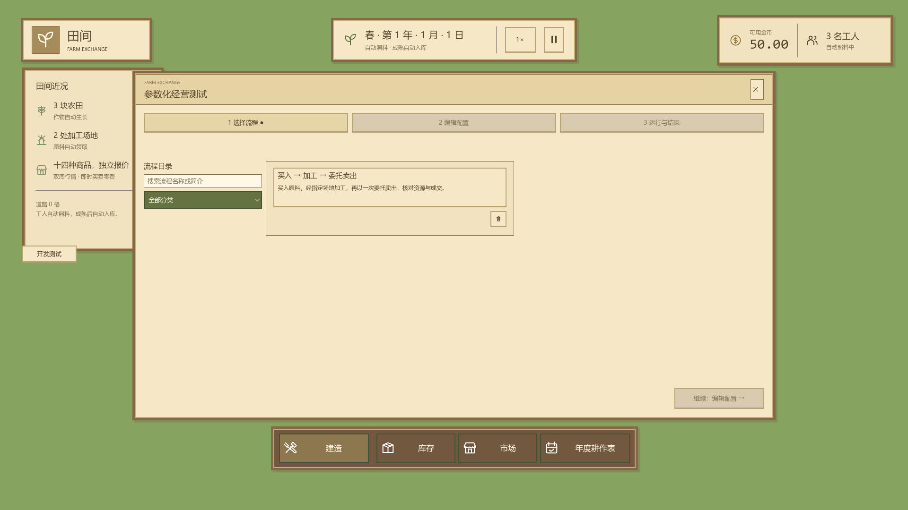

## 最新完成记录

### 2026-10-06 — C分步流程目录、通用配置编辑及点击倍率（#104）

- 成果：日期卡内倍率循环；分类搜索、双列小字号流程卡；三个独立步骤与中文元数据自动表单；另存修订1、覆盖递增；流程及单配置垃圾桶二次确认和实际持久删除。内置示例只读，项目用户配置长期纳入Git，历史报告保留。
- 审查与验收：基准`44a9e85981b0088e2d1fe5f560cdf6fa2df1ed75`；独立初审发现枚举中文映射问题，修复后新审查员完整复审无待修问题。Godot 4.7.2 Mono Debug/ExportRelease零警告零错误，完整自动化及实际图形场景通过；原始总体覆盖率7673/7877（97.41%），15模块全部超过80%。满地图50tick为84.07ms；1080P平均498.8FPS、P95为3.152ms。Windows Release/Dev导出及程序集/PCK排除检查通过，Dev包三示例与来源原字节一致；实际根目录`build/windows/FarmExchange.exe`启动Exit0、stderr0。Dev真实1080P窗口从Temp工作目录运行：Q=1 / 105tick / 8项检查全Passed；Q=3 / 80tick / 8项检查全Passed，另存包旁配置并核对原文件SHA-256，配置删除取消/确认及流程删除取消均通过，历史报告保持，正常关闭Exit0、stderr0。
- 交付状态：已验收、待人工合并；更新[PR #102](https://github.com/Fotally/Farm-Exchange/pull/102)（dev → main）。生产仅提交已确定设计与真实截图；HTML原型保留独立来源分支。
- 证据：本地`build/issue104-validation/`中的`full-tests.log`、`coverage-modules.json`、`exportrelease-build-final.log`、两份导出与资源检查、`release-start.json`、`native-dev-results.json`、性能JSON及前后截图；临时证据不纳Git。构建验收使用同基准dev隔离副本，只复制本任务文件，避免既有无关生成HTML资源影响Godot导入；根工作区规则链接与114份文档静态检查通过，隔离副本全仓格式检查通过。macOS路径有夹具验证，本机未运行macOS原生包。

### 逐模块覆盖率

逐模块按文件和行号去重，同一行任一类型命中即记覆盖；原始总体使用Cobertura及项目脚本的7673/7877计数，去重模块合计为7608/7809（97.43%）。

| 模块 | 已覆盖 / 有效行 | 覆盖率 |
| --- | ---: | ---: |
| `characters` | 74 / 76 | 97.37% |
| `cultivation` | 287 / 292 | 98.29% |
| `development` | 925 / 967 | 95.66% |
| `economy` | 31 / 35 | 88.57% |
| `farming` | 223 / 224 | 99.55% |
| `gameplay` | 465 / 493 | 94.32% |
| `inventory` | 82 / 85 | 96.47% |
| `land` | 100 / 101 | 99.01% |
| `market` | 225 / 225 | 100.00% |
| `processing` | 71 / 71 | 100.00% |
| `time` | 77 / 77 | 100.00% |
| `trading` | 391 / 399 | 97.99% |
| `ui` | 3968 / 4066 | 97.59% |
| `workers` | 118 / 122 | 96.72% |
| `world` | 571 / 576 | 99.13% |

性能前证据复用同一基准44a9e85的既有实测（641.2FPS / P95 1.931ms）及原截图；本次后证据为498.8FPS / P95 3.152ms。两次均达项目门槛，后台负载与采样不同，不据此宣称性能提升或退化比例。

# 点击倍率与分类流程配置界面设计

设计来源 [#103](https://github.com/Fotally/Farm-Exchange/issues/103)，实施由 [#104](https://github.com/Fotally/Farm-Exchange/issues/104) 承接，基准为 `dev` 的 `44a9e85` 和 [PR #102](https://github.com/Fotally/Farm-Exchange/pull/102)。本文记录已确认方案、实际实现与完整验收；已交付真实Godot界面，等待PR人工合并。

## 实施状态

2026-10-06 已授权按C设计实施，保存、倍率和持久目录细则均已确认。

| 单元 | 唯一负责人 | 状态与验收 |
| --- | --- | --- |
| 字段定义、严格加载、配置库与草稿 | flow_configuration | 已验收；旧配置兼容、文件保存/删除、目录持久化与失败状态 |
| 通用表单及C三步界面 | flow_editor_ui | 已验收；真实控件、字段兼容、取消与确认、倍率重排及草稿保持 |
| 主倍率、资源分发、测试接入 | flow_main_export | 已验收；点击循环、构建排除、开发包示例来源和回归连接 |
| 文档索引、系统结构、独立审查及完整验收 | 主Agent | 独立修复复审、编译、完整测试、逐模块覆盖率、两种导出及实际包验收均通过 |

## 已确认需求与当前交付

- 主界面倍率变为点击循环：`1× → 2× → 0.5× → 1×`，位于日期卡竖线右侧、暂停按钮左侧。
- 开发窗口列出流程的中文名字与简要介绍，按分类管理并支持搜索；主要操作不需要文件地址。
- 选定流程后，可选择不同配置并可视化编辑；同时提供另存为和覆盖保存。
- 字段自动扫描并使用同一套表单；不同流程的配置形状不同，不应逐流程重写窗口。
- 采用C分步布局：选择流程、编辑配置、运行与结果，三个步骤分别维护。
- 流程卡片缩小名称与简介字号，每行两张；右下角垃圾桶先打开删除确认弹窗。
- 流程删除同时移除目录项及其所有可写配置；配置页也提供单个可写配置文件的删除确认。
- 保持当前经营驱动、暂停、固定流程、严格校验、JSON报告和开发/发布排除约定。

设计与实际实现已完成；C布局、删除范围及保存修订细则均已验收。原型只操作内存，不写配置、不推进真实经营、不生成真实报告，不能替代实现验收。

## 主界面倍率

日期卡的一行结构为：`日期与说明 ｜ [1×] [暂停]`。倍率按钮使用现有木框纸面按钮，显示驱动的实际倍率，悬停说明下一次点击的目标。日期卡初步按520×93设计，按真实内容最小宽度重排并保持水平居中，不再把倍率单独锚定在卡片外面。

初始为1×，点击后依次2×、0.5×、1×。暂停时仍可改速；点击不自动恢复经营。所有点击提交现有 `SimulationDriver.SetRate(..., Player)`，保留未完成tick，现场自动流程按原规则中断。

开发工具将当前局设为5×、20×等额外倍率时，主按钮显示实际值，点击返回1×，之后进入上述公共循环。公共按钮只提交0.5、1、2。

## 开发窗口与分类

采用C「分步操作」：第一步选择流程，第二步选择配置并编辑参数，第三步运行与查看结果。1080P窗口初步1360×740，顶部与底部沿用现有避让区域；正文滚动，继续、返回、保存和中止等当前步骤的操作保持可见。

第一步左侧显示搜索与分类，右侧流程列表按两列排列；只有一个流程时仍占一列，不拉成整行。卡片名称初步15px、简介12px，保持比原型卡片更小的文字，按统一字体倍率重排。卡片右下角单独放置垃圾桶图标，图标与卡片选择分别处理；点击垃圾桶不会同时选中流程或进入下一步。

目录以已登记流程为来源，每项展示名字和一段简介；流程标识、C#类名和文件地址不出现在主列表。当前实际只有「买入 → 加工 → 委托卖出」，归入「生产与交易」。新增流程登记分类名称后自动出现对应分类；分类只显示非空项，支持「全部」和按名字、简介搜索。搜索保留当前分类筛选，没有结果时明确显示空列表。

分类由流程定义维护；本次不增加玩家创建分类、目录树、插件安装或任意脚本流程。流程执行步骤仍由固定C#代码维护。原型另外提供「目录容量示意」，检验多分类、多流程的筛选密度；这些条目不是真实可执行流程。

提供三个结构不同、同主题的布局供比较：

| 方案 | 结构 | 取舍 |
| --- | --- | --- |
| A 分栏工作台（比较方案） | 左目录、右编辑，配置选择在编辑区顶部 | 适合反复换配置与调整，流程和参数同时可见 |
| B 页签目录 | 顶部分类和流程卡，下面整宽表单 | 适合字段较宽的配置，长目录需要滚动 |
| C 分步操作（已选定） | 选流程→编辑配置→运行与结果 | 每步内容明确，可按三个视图分别维护 |

界面原型位置及打开方法在本页最后记录。原型沿用真实主场景截图作环境参照，地图不运行。

## 流程与配置的删除确认

垃圾桶打开木框主题确认弹窗，显示流程名称与「取消」「确认删除」。取消、关闭或Esc都保持目录和当前选择；只有确认才执行删除意图。运行中锁定流程选择及删除。删除选中的最后一个目录项后，第一步显示空状态并禁用继续；后两步不能沿用已删除流程的旧配置或结果。

流程删除的范围已确定：从流程目录移除该流程，同时删除归属该流程的所有可写配置文件。内置只读示例及已有历史报告保留，固定C#实现不作为文件删除对象。配置库在用户目录的`.hidden-flows.json`持久保存移除标记，不能仅依赖配置数量推导可见性。先删除可写文件，再保存标记；若中途失败，界面按实际剩余文件刷新并报告错误，已完成的文件删除不冒充回滚。

配置编辑页在配置选择控件旁提供垃圾桶，只针对当前选中的可写配置文件。弹窗显示配置名，说明「删除此配置文件，已有报告保留」，并提供取消和确认删除；内置只读示例的垃圾桶禁用且说明原因。确认后才提交文件删除意图，文件删除成功后更新列表并清除该配置的草稿引用；选择仍存在的配置，没有剩余配置时显示空状态，不能运行已删除配置。删除失败保留实际仍存在的条目并明确反馈，不假报成功。运行中同样禁用删除。

原型只从内存目录移除流程及对应可写配置，或移除单个可写配置；切换布局、分类及目录容量示意不恢复已删流程，刷新页面重置。取消、关闭和Esc保留目录、配置与草稿；弹窗另外明确说明没有删除真实文件。内存操作不作为持久化删除验收。

## 配置选择、另存为与覆盖

流程与配置是两层：流程定义固定操作，配置是该流程的一组参数。选择流程后只列它的配置名称和修订，不列路径。配置名称使用现有 `caseId`，中文名称也是合法字符串；旧英文标识原样显示，不添加需要迁移的新名称字段。

已确认保存规则如下：

| 操作 | 行为 |
| --- | --- |
| 选择配置 | 加载一次为独立草稿，修改不触碰原文件；显示「未保存修改」 |
| 另存为 | 输入新配置名，创建新的持久配置，初始修订1；原配置保持 |
| 覆盖保存 | 明确改写选中的可写配置，保留它的文件引用，修订递增；不复制一份历史配置 |
| 内置示例 | 明示只读，可以编辑草稿并另存为；保存为自己的配置后可覆盖 |
| 删除配置 | 垃圾桶二次确认后删除选中的可写配置文件；内置只读示例和已有报告保持 |
| 运行 | 使用已保存的配置。存在未保存修改时明确要求保存；不静默把草稿当成旧配置运行 |

覆盖是显式按钮操作，不增加二次权限确认。界面用一行说明「覆盖会更新此配置，已有报告保留原摘要」。已有报告继续引用当时原文件与SHA-256；覆盖后内容不符，就不能拿新内容核验旧报告，不自动备份或在报告目录复制配置。

运行中沿用现有行为：锁定本窗口的流程、配置选择与编辑保存，显示本次固定配置名称、修订和进度；中止按钮可用。主游戏其他操作继续可用，主动改速仍会中断现场流程。结束后恢复草稿编辑，不自动清空配置。

新修订数值由配置库统一计算，校验成功并写入成功后才更新列表与草稿。写入失败保留原文件和草稿并明确反馈，不替换输出位置。

## 自动扫描的来源

采用「可编辑配置类型 + 字段元数据」，通过反射扫描已登记配置类型的序列化成员及嵌套类型。中文名、简介、分组、单位、可选值及特殊编辑方式附在配置字段定义上；同一份定义用于生成表单和基础结构校验。实际描述、草稿及配置库约定见[配置编辑接口](../architecture/development/interface-scenario-configuration-editor.md)。

`ScenarioConfiguration` 是加载后的运行参数，同时包含 `SourcePath`、`Sha256`、`ProductCommodity`、日期换算等内容。不能直接把它的所有公开属性做成编辑项。`ScenarioEditableConfiguration`专门对应JSON形状；文件引用、摘要与推导值继续留在加载结果，窗口读取描述而不自行猜测它们。

`schemaVersion`、`flow`、`revision`由配置模块维护，作为说明而不提供任意编辑。`caseId`、`run`、`execution`和`parameters`对应现有可编辑数据。保留当前JSON键名与层次，包含游戏日期、原料标识和数量的严格语义。

单看JSON当前值无法推断：空数组的元素类型、可选字段、游戏日期的28日制、原料选项、种子何时允许、数字的有效范围。因此JSON负责存值，配置定义负责说明字段；不另维护一份相互独立的表单JSON规则。

字段定义举例（当前实现）：

```csharp
[JsonPropertyName("quantity"), ConfigField("买入数量", Minimum = 1, Maximum = int.MaxValue, Unit = "份")]
public int Quantity { get; set; }
```

新增受支持字段时，只补配置属性及其中文元数据，扫描、排列、编辑和基础校验随之更新。流程的实际业务行为仍需在原固定流程中实现；自动表单不解释步骤或业务表达式。

## 通用表单的支持范围

下表是正式Godot实现的目标，不表示内存原型已实现全部控件能力。当前原型的时间段数组支持添加和删除，尚未提供顺序调整；有序数组排序仍保留在生产实施及其验收范围中。原型仅用于确认分步布局、基础字段形状与交互，不能替代完整表单实现。

| 字段形状 | 公共控件及约定 |
| --- | --- |
| 文本 | 文本输入；保留必填状态、中文说明及字段错误 |
| int32 / uint32 | 整数输入；完整保留符号与容量，不经过浮点取整保存 |
| 有限数值 | 数值输入；倍率额外复用现有允许规则，不能把1.5视为合法开发倍率 |
| 布尔 | 勾选项 |
| 枚举或有限选项 | 中文下拉，保存正式值；原料选项读取唯一作物目录 |
| 嵌套对象 | 按字段分组递归显示，如加工场地X/Y |
| 有序对象数组 | 添加、删除和调整顺序的行列表，如多个时间段；错误定位到对应行 |
| 游戏日期 | 年/月/日输入组合，按游戏日历的01–99年、12月、每月28日显示和校验 |
| 条件字段 | 由配置定义决定显示和序列化，如独立局显示种子、当前局不写seed |

本次真正需要的编辑形状为文本、整数、倍率选项、嵌套对象、有序时间段和条件种子。布尔控件只作为基础字段兼容形状验证，不为此增加可运行流程。

不支持任意对象图、字典键编辑、多态插件或递归配置。登记了不支持的字段时，开发工具明确提示该定义不受支持，不能悄悄漏掉字段或转成自由JSON执行器。

字段路径及数组位置由草稿模块管理，UI不依赖 `rawCommodity` 等具体键名。表单更新值、条件显示与错误，不在每秒状态刷新时重建输入控件；焦点、光标、滚动、数组行及未保存修改保持。

## 按codebase-design划分Module

以下是已确定的Module职责；实际Interface见[配置编辑接口](../architecture/development/interface-scenario-configuration-editor.md)与[开发窗口接口](../architecture/ui/developer-tools-window/interface-developer-tools-window.md)。仅有一个Implementation的Module不预先声明C# interface。

| Module | 唯一拥有的状态与Implementation | 对调用方的Interface |
| --- | --- | --- |
| 流程目录与配置定义 | 已登记流程的名字、简介、分类、配置类型；扫描并缓存字段描述、基础约束及条件显示规则 | 列出流程摘要、取得该流程的配置描述；UI不读取C#类名或经营对象 |
| 配置库与草稿 | 配置来源、修订、编辑值、文件引用、目录可见性与保存/删除结果；扫描目录、结构校验、编码与持久化 | 列配置、打开/新建草稿、修改字段、校验、另存为/覆盖、删除单个可写配置、移除流程及其可写配置；保存成功返回固定文件引用，删除返回实际结果 |
| 通用配置表单 | 由描述生成的Godot控件及焦点、展开和滚动状态 | 接收描述和草稿快照，发出字段修改意图；不读写文件、不计算业务规则 |
| 流程选择视图 | 分类、搜索、目录滚动与删除确认弹窗的UI状态 | 接收流程摘要与当前选择，发出选择、确认删除及继续意图；不读写配置文件 |
| 配置编辑视图 | 配置选择控件、删除确认与通用表单的排版、提示及保存入口 | 接收该流程的配置列表和草稿，转交字段修改、另存、覆盖、确认删除配置及返回/继续意图 |
| 运行结果视图 | 固定运行快照的展示、结果滚动及启动/中止入口 | 接收已保存配置摘要与执行快照，发出运行、中止及返回意图；不推进经营或重算检查 |
| 开发窗口 | 当前步骤、选中的流程/配置及运行上下文；组装三个视图，协调导航与失效选择 | 转交选择、编辑、保存、删除与运行意图；调用已有固定流程和唯一驱动 |

真正变化的Seam是「配置描述与草稿 ↔ 通用表单」：同一表单可处理两种运行对象的不同字段，以及以后另一个流程的字段。字段约束和存储复杂性集中在配置Module中，窗口不散落文件搜索、序列化和逐字段判断。

三个步骤是独立维护的视图，分别封装本步UI状态与操作；步骤切换不重新加载或清空草稿。选中的流程/配置只由外层窗口拥有，配置值与修订只由配置库与草稿拥有，运行快照由原执行模块拥有，各视图不再复制一套同名状态。不为三个视图额外建立通用向导框架或继承树。

现有 `BuyProcessSellScenario` 继续拥有固定步骤、检查及执行报告；`SimulationDriver`拥有倍率和未完成tick。此次不建立流程插件框架或先定义假想执行器继承树。以后第二个实际流程出现时再按共同执行约定收拢启动接入，表单无需改动。

删除通用表单后，类型控件、对象分组、数组、条件字段和焦点保持会重新散落到多个窗口；这是它提供Depth的部分。流程目录只是实际登记与检索，不把一个单项列表包装成复杂注册系统。

## 配置发现与两种构建

编辑器将现有三份长期用例作为只读示例，自动读取已知配置目录；用户配置使用项目内独立的可写子目录，避免覆盖UI配置时改坏固定测试夹具。开发包从包内只读示例与包外用户配置库构造同一目录，无需先使用文件选择器。

用户配置库：编辑器 `tests/scenario-configs/user/`；Windows dev包为exe旁 `configs/scenario-configs/`，macOS为`.app`父目录的同名目录。仅首次保存时创建目录；位置不可写明确拒绝，不换路径。项目内用户配置长期持久化并纳入Git管理，不作为临时输出忽略；保存操作只修改文件，版本提交由正常协作流程完成。用户配置不打包进开发程序。

内置示例继续以现有JSON文件为权威来源；dev导出仅白名单分发已登记的内置示例，排除用户配置、测试脚本和场景。只读包内资源先成为草稿，显式另存为后产生持久输入文件；执行始终加载已保存文件并记录原字节摘要。不在每次运行复制示例，不把配置写入报告目录，也不维护两份示例参数。

发布构建仍排除开发目录、额外倍率入口、流程配置及专用资源；CI不增加dev包。主倍率按钮属于公共能力，两种构建都保留。

## 兼容约定

1. 现有schemaVersion=1的完整合法配置能原样读取；键名、类型、枚举文本、日期、预算与条件种子规则保持。
2. 新表单的基础结构校验与JSON加载共用字段定义，重复键及未知键仍拒绝；不能因为扫描到某个键就接受任意字段。
3. 额外业务检查继续由原流程和正式经营命令负责；表单不重新计算金币、库存、场地占用或成交。
4. 新增可选字段要明确定义缺省语义；新增必填字段或改变旧含义时提供明确版本迁移，不能自动补值后冒充旧文件原始输入。
5. 文件或草稿的后续修改不影响已加载运行参数和终止快照；报告仍是唯一report.json并引用运行时原文件及SHA-256。
6. 覆盖允许旧历史输入无法再从原位置核验；不会把保存成功当成旧报告可复现。另存为保留原输入，可继续核验原报告。
7. 表单共用 `UiElements` / `UiScaling`，1080P、2K、4K及整体/字体倍率调整均真实重排，不拉伸窗口、不挤掉保存与中止入口。

## 实施验收清单

- 三次点击恢复1×；竖线、倍率、暂停位置正确；暂停改速零tick推进、现场改速中止且保留玩家倍率；实际开发高倍率状态按确认行为处理。
- 分类和搜索能在大量目录条目的夹具下组合使用；正式目录只有真实登记的流程，未知流程配置明确拒绝。
- C第一步在1080P每行两张卡片，缩小字号；垃圾桶独立于卡片选择，取消保持、确认后按已明确范围删除；空目录、已删选择及运行中锁定正确。
- 流程删除移除目录项及该流程全部可写配置，单个配置删除只删除选中文件；两种弹窗对象明确，内置只读示例与历史报告保留，配置删除取消保持草稿，失败不假报成功。
- 老三份JSON能无损读写；字段缺失、重复、未知、非法类型、日期和倍率仍拒绝，错误定位到字段或时间段。
- 同一生成器处理独立/当前两种字段形状，并通过不登记为真实流程的第二种配置形状检查自动新增字段、对象、数组和布尔。
- 另存为保留旧文件；覆盖成功才递增修订；保存失败保留原文件和草稿；运行从保存后的原字节生成摘要；运行中不接受草稿替换。
- 真实Godot界面在1920×1080及更大窗口和字号组合下，搜索、配置、动态数组、错误提示、焦点与固定操作区可用。
- 实施后完成独立代码/文档审查、完整自动化、逐模块80%覆盖率、满地图与图形性能、Windows Release/dev导出及实际程序验收，再更新PR。设计原型不能代替这些结果。

## 原型来源与已确定结论

完整三布局原型保存在独立分支[原型来源769ca0e](https://github.com/Fotally/Farm-Exchange/tree/769ca0e25e68d2a162cc669cd72e14133f5e9f8a/docs/architecture/ui/developer-tools-window)，不进入生产main。原型的HTML与八张浏览器截图均为设计证据，不能作为真实Godot、文件删除、经营推进或导出验收。

已确定采用C：三个步骤分别维护、名称15px/简介12px、每行两张流程卡片；流程和配置都以垃圾桶发起二次确认。流程删除移除目录及其全部可写配置，单个配置删除选中文件；内置只读示例与历史报告保留。另存从修订1开始、覆盖递增、开发高倍率点击回1×；项目内用户配置长期纳入Git管理。真实实现的进度与验收在本计划顶部记录。

## 实际Godot界面证据

以下为指定Godot 4.7.2 Mono图形后端的实际截图，不是HTML示意。五个定向headless场景、三个真实图形场景、完整测试与覆盖率、两种导出和实际包验证均已完成。



[配置编辑](../architecture/ui/developer-tools-window/godot-config-editor-1920.png)、[另存为](../architecture/ui/developer-tools-window/godot-config-save-as-1920.png)、[流程删除确认](../architecture/ui/developer-tools-window/godot-flow-delete-confirm-1920.png)、[配置删除确认](../architecture/ui/developer-tools-window/godot-config-delete-confirm-1920.png)与[运行结果](../architecture/ui/developer-tools-window/godot-flow-result-1920.png)来自1920×1080。

[2560×1440](../architecture/ui/developer-tools-window/godot-config-editor-2560.png)、[3840×2160](../architecture/ui/developer-tools-window/godot-config-editor-3840.png)与[字体1.2倍](../architecture/ui/developer-tools-window/godot-config-editor-font-1-2.png)检查固定操作区、滚动表单及窗口可用区域。保存、删除与异常夹具只使用本次隔离测试目录，未修改仓库用户配置。
