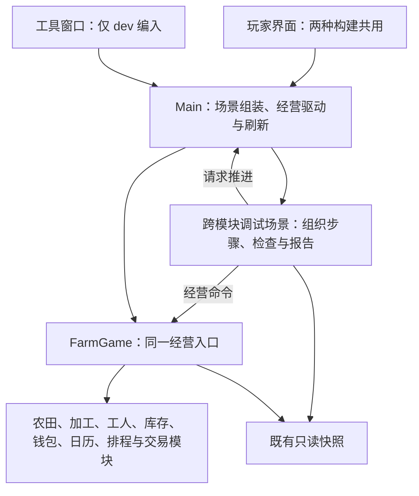

# 开发者工具与 dev / release 双构建设计草案

历史设计说明：下文保留设计阶段的方案与当时接口事实；#100 / #101 已按[参数化测试主计划](developer-tools-parameterized-tests.md)恢复实施，现行代码与构建接入见主计划及其接口、使用文档。未选用的候选能力仍属于后续设计。

关联 [#97](https://github.com/Fotally/Farm-Exchange/issues/97)。调研日期：2026-10-05。本文用于和用户讨论；本次只维护设计与研究文档，不修改经营、场景或构建代码。

用户明确先确定架构、只维护一套代码，dev仅本地构建、不进入CI，可覆盖Windows/macOS。发布0.5/1/2经营速率已在后续确认；开发额外倍率、具体工具与时间方案细节仍是建议，报告目录暂定。日志沿用#82已确认边界，具体更新见下文。

用户要求补充跨模块自动调试并继续明确：采用测试思路，流程固化、参数文件可变；买入→加工→一次卖单为首个流程，现场操作按玩家真实结果处理，考虑两种运行对象共用底层。职责与当前接口见[跨模块补充](developer-tools-cross-module-debugging.md)，参数与报告目录建议见[参数化测试设计](developer-tools-parameterized-tests.md)。本轮仍处于设计阶段，只改文档，没有代码或构建实施授权。

最新确认：经营速率是公共能力，发布版0.5×、1×、2×，开发版可额外加速；游戏日期区间与倍率纳入测试参数，日期采用 `yy-MM-dd`。现场手动改速即中断整个自动流程，不进行后续处理；报告先只输出JSON。时间接口及实现单独归入[#100](https://github.com/Fotally/Farm-Exchange/issues/100)，本设计仅保留整体接入边界。现场允许证据不足，报告目录暂定，配置长期保存并在报告中引用，不生成副本。

## 先确定一套代码的架构

建议维持一个 C# 项目、一套主场景和同一组经营模块。dev 构建在这些公共实现之上编入开发工具，release 构建排除开发专用实现。种植、加工、交易、工人、年度排程、日历与地图的算法和状态都只有一份；后续修复经营缺陷或修改规则时只修改其原拥有模块，两种构建使用同一份修改。

代码组织建议采用以下约束：

1. **经营实现共用。** 不创建 `DebugFarmGame`、另一套模拟器或按构建类型选择的生产算法；正式操作与开发工具能复用的操作都调用现有接口。
2. **开发代码集中。** 工具窗口、诊断绘制及工具自己的输入处理集中在开发专用源码中。构建选择只出现在场景组装处和开发专用文件的编译范围，不散布到农田、工人和交易算法的分支中。
3. **专用能力仍由原模块封装。** 将来确有工具必须使用的操作时，在其状态和规则所属模块补充必要能力，`FarmGame` 仅提供必要协调入口；可用开发专用 partial 文件组织。校验、暂停恢复及完整关联影响封装在经营模块，调用原模块方法也需履行完整联动；工具不得直接修改容器或复制业务校验。
4. **经营驱动唯一。** `Main` 继续协调 tick 的调用与统一刷新。若以后选择时间控制能力，正常计时和工具请求进入同一个推进调用路径，不能同时运行两条独立经营循环；是否需要把驱动从 `Main` 提取为小模块，由确认后的实际复杂度决定。
5. **暂不增加扩展框架。** 目前没有插件装载、任意脚本执行、多种经营实现的需求，因此不先建命令总线、注册系统、依赖注入框架或独立工具程序集。诊断查询按实际功能补具名快照。
6. **流程独立组织。** 跨模块开发调试场景准备条件、串联操作、请求推进、检查并报告，不拥有业务状态。源码允许放在独立开发调试目录，不将流程或断言全部放进 `FarmGame`、`Main` 或窗口；“场景”不预设必须是 Godot 场景文件。

`partial` 只是同一个类的源文件拆分：公共成员与开发补充成员编译为同一个 `FarmGame`，并不维护两个游戏类。release 排除开发补充成员后，公共经营实现仍保持完整。若某项能力需要提取公共执行方法，只提取一次，两种构建共同调用，不能复制一个“开发版 tick”。

架构的验收依据应是：两种构建使用相同公共源文件；相同初始化与操作序列得到相同经营结果；开发工具只维护显示、输入和诊断状态；release 无开发专用入口。具体工具功能待这组约束讨论完成后再确定。

后续根据用户要求补充[公开 C# 案例](../research/developer-tools-csharp-cases.md)与[C# 源码组织讨论](developer-tools-csharp-organization.md)，比较 partial 分文件、同项目编译范围及运行时工具开关。具体源码布局与剔除方式保持待讨论，不将案例或配置片段当作已批准实现。

## 目标与当前事实

当前开发涉及真实工人移动、作物跨季处理、年度排程、双周报价、库存保留线和订单冻结。调试要同时解决“现在是什么状态”“怎样快速抵达出问题的时点”“怎样复现同一问题”。这些场景用于解释后续候选能力；当前先确定共用实现与开发附加代码的职责。

| 当前事实 | 证据与含义 |
| --- | --- |
| 每次调用推进一个经营秒，经营阶段集中执行 | [FarmGame](../../scripts/gameplay/FarmGame.cs) 的 `AdvanceTick()`；工具应复用这一完整路径 |
| 暂停有多处门禁 | `FarmGame.AdvanceTick()`、[WorkerScheduler](../../scripts/workers/WorkerScheduler.cs) 和 [GameCalendar](../../scripts/time/GameCalendar.cs) 都检查暂停；不能仅绕过最外层检查 |
| 场景计时器负责每秒调用并刷新 | [主场景](../../scenes/main.tscn) 的 `TickTimer` 和 [Main](../../scripts/ui/Main.cs) 的 `OnTick()` / `RefreshAfterGameChange()` |
| 已有多数业务只读快照 | `GetFarmDetails()`、`GetProcessorDetails()`、`GetWorkers()`、`GetFarmCultivation()`、`GetCultivationPlans()`、`GetTradeOrders()`、`GetMarketSnapshot()`，以及库存、余额查询 |
| 可以指定新局随机种子 | `FarmGame(int? marketSeed)` 将实际种子同时交给开局布局与市场；`Main` 当前直接 `new()`，没有玩家可用的种子入口，也未保存抽到的实际种子供查询 |
| 当前没有存档与业务日志实现 | [路线](roadmap.md) 将存档列为待确认；[#82](https://github.com/Fotally/Farm-Exchange/issues/82) 及[日志设计](https://github.com/Fotally/Farm-Exchange/issues/82)仍是设计阶段 |
| 已有满地图性能夹具 | `FillWorldForBenchmark()`、`FillWorldForPresentationBenchmark()` 是内部测试入口，不是可以直接作用于任意运行中游戏的工具命令 |
| 导出目前没有开发工具专用预设 | [导出配置](../../export_presets.cfg)有 Windows / macOS 两个预设，两个平台工作流当前导出 release；详见[构建证据](../research/developer-tools-builds.md) |

## 候选入口比较

| 入口 | 独立 dev 包可用 | 操作与状态反馈 | 对经营的影响 | 建议 |
| --- | --- | --- | --- | --- |
| Godot 编辑器调试、远程场景树与外部 C# 调试器 | 依赖调试连接或外部工具 | 适合断点、节点和代码定位；不直接表达业务拒绝原因 | 断点会中断执行；直接改节点属性不能保证业务一致性 | 保留，用于代码问题定位 |
| 游戏内开发者窗口 | 是 | 能显示选中农田、工人、日期与命令结果 | 只读查询不修改经营；推进与注入必须通过经营入口 | 推荐作为主要入口 |
| 文本控制台 | 是 | 需要记命令、解析输入和维护帮助 | 同样需要正式经营接口 | 暂缓，当前按钮与数值输入足够 |
| 启动参数 | 是 | 适合种子及自动化启动，运行中操作反馈有限 | 可改变新局初始化配置 | 推荐先仅用于可复现新局；参数名称待定 |

开发窗口建议只在 dev 中注册，从可见的“开发工具”按钮打开，快捷键候选为 F8。dev 标识始终可见，窗口开关只控制显示；关闭窗口不退出 dev 构建、不关闭 #82 的默认 Debug 日志，也不隐式暂停或恢复经营。专项 Trace 的起止应有独立控制，不能因窗口隐藏而无法判断是否仍在采集。

按至少 1920×1080 设计，复用 `DraggableWindow`、`UiElements` 和 `UiScaling`。窗口内容滚动、避让顶部与底部；覆盖地图时阻止选地和建造，输入框使用键盘时不触发地图操作。此处是布局约束，不是已经绘制或验收过的界面。

## 后续功能讨论的候选资料

以下保留前轮调研的能力比较，不作为首版功能选择或开发优先级。先讨论上述架构，随后才选择需要实现的能力。

| 能力 | 用途与实现方式 | 状态影响 / 取舍 | 建议 |
| --- | --- | --- | --- |
| 总览、选中设施检查 | 显示累计经营秒、暂停、总/可用/冻结资金与库存，农田状态、水分、进度、排程引用，加工等待状态 | 复用已有快照，不维护第二份状态 | 待选择 |
| 工人检查和目标连线 | 显示三人位置、目标锚点和活动；用现有坐标接口绘制位置与目标线 | 不改变调度；现有快照不含完整内部任务凭据，缺什么再增加具名诊断字段 | 待选择 |
| 暂停单步 | 候选时间调试功能 | 是否纳入工具仍待选择；具体时间接入另行设计，本文不指定接口或封装方案 | 待选择 |
| 经营速率 | 发布0.5×/1×/2×已确认；开发版额外高倍待细化，共用驱动改变完整tick频率 | 不改作物时长、工人每步速度或报价规则；公共接口保留，测试区间和开发额外权限排除 | 已确认设计方向，未实施 |
| 推进至下一日 / 下一季 / 下一报价 | 逐 tick 运行直到真实日期或正式报价边界，最终暂停 | 不直接设置日历；各中间收获、清理、播种、加工与委托照常执行 | 待选择 |
| 固定种子新局 | 首版建议仅在启动前指定种子，显示实际使用值；重新启动复现相同开局与随机行情 | 现有 `Main`、地图和人物绑定同一游戏实例，运行中重开需统一重新组装，单独确认；同种子还需相同命令及 tick 顺序才能复现，不等于完整回放 | 待选择 |
| 性能摘要 | FPS、经营 tick 耗时、地图同步耗时、实例数量 | 按现实时间采样；日常诊断不能替代正式 FPS/P95 验收 | 待选择 |
| 日志控制与定位 | 打开日志目录，选择农田 / 工人 / 订单开启专项 Trace | 复用 #82 框架、过滤与 schema；日志尚未实施，此能力依赖日志落地 | 联动 #82 |
| 增加金币 / 商品 | 减少布置大规模建筑或交易场景的等待；由原状态拥有者执行增量写入 | 不重置或消费其他订单的冻结；失败零修改；新增原料是即时触发加工领取还是等下 tick，需要明确，不能冒充买入或自产 | 由用户决定是否纳入首版 |
| 降雨实验 | 调用已有真实供水路径，观察播种、浇水与成长 | 是开发命令，不代表天气生成规则；单次还是指定 tick 下雨需要确认 | 有调试需要再加入 |
| 满地图 / 季末等预设局 | 快速创建独立压力或边界场景 | 现有满地图夹具会直接改内部状态，不能原样对运行中局执行；需有明确定义的新局初始化 | 后续按真实需求加入 |
| 设置任意日期、瞬间成熟、强制成交、任意反射改字段 | 快速制造指定状态 | 会绕过换季、年度凭据、工人任务或冻结结算；需要另行定义完整业务语义 | 当前不推荐 |

若后续选择加速或定点推进，其反馈应显示“请求倍率/目标、已推进秒数、当前日期、运行/完成/中止”。若选择资源注入，应显示操作前后值和成功/拒绝原因，不能把开发赠送伪装成销售、收获或正常收入；dev 构建身份和本局是否发生资源注入分别标记，关闭工具窗口不清除后者。这些条件要求不将相应功能纳入首版范围。

## 模块接入建议

继续保持现有状态的唯一拥有者，先采用以下最小接缝（Seam），不增加通用命令总线、脚本解释器或第二套经营模型：

| 模块（Module） | 对外约定（Interface）与内部实现（Implementation） |
| --- | --- |
| `FarmGame` | 保留正式 `AdvanceTick()` 与快照。原业务模块维护真实状态与专用能力，经营入口封装必要协调、校验、完整执行顺序和结果。可以用开发专用 partial 源文件组织少量成员，release 编译排除；不向 UI 暴露容器，不加入具体场景断言和报告 |
| `Main` | 继续拥有场景的经营驱动与统一刷新。接收开发窗口意图，协调正常计时器和批量推进，确保同一时刻只有一个驱动；不复制 tick 内部阶段 |
| 共用时间能力（#100） | 发布0.5/1/2与开发高倍率的接口及实现单独设计；开发流程只提交请求、观察完整tick及日期，不创建自己的时间驱动 |
| 开发调试场景 | 独立开发目录中组织固定测试步骤和检查，加载可变参数；两种对象共用流程、正式经营路径和报告，差异限于准备、驱动与证据；细节待确认，未实施 |
| 开发者窗口 | 只持有控件草稿、显示选择与诊断采样，启动选定场景、展示进度和结果；不承载全部流程；仅 dev 创建和订阅输入 |
| `WorkerPresentation` / 地图表现 | 处理单步后的位置更新与倍率下的插值，目标线根据快照和统一坐标绘制；不推进经营 |
| 日志模块（#82 后续实现） | 维护日志生命周期、级别、文件及专项过滤；开发窗口仅提交选择和开关，不另写日志系统 |

`FarmGame` 当前不是 partial；采用分文件方式需要后续修改声明。上表是组织建议，不意味着必须创建额外的开发者经营协调模块。具体成员只随最终确认的能力增加。

开发测试只约定完整经营路径、统一驱动、真实日期观察与统一刷新。具体改速接口、计时算法、暂停接入及高倍率表现由#100另行设计，不在本设计预先指定；暂停单步等候选工具仍需单独选择，不能当作已批准功能。

## dev / release 构建方案

建议两种产物来自同一提交和同一套经营代码，分别使用 Godot 的 debug / release 导出；以 C# 编译配置排除开发实现，以导出过滤排除开发资源。普通 `dotnet build -c Release` 与 Godot 的 `ExportRelease` 不能混为一谈；具体配置、编译符号及官方证据见[构建调研](../research/developer-tools-builds.md)。

| 项目 | dev 产物（建议） | release 产物（建议） |
| --- | --- | --- |
| 使用方式 | 编辑器开发和可独立启动的开发包 | 玩家运行及正式发布 |
| Godot 导出 | `--export-debug` / `ExportDebug` | `--export-release` / `ExportRelease` |
| 开发工具 | 包含测试窗口、专用操作与诊断资源，支持额外倍率 | 开发专用成员、控件、输入和资源排除；保留公共经营速率接口，参数不能解锁开发倍率 |
| 经营规则与速率 | 初始1×，同一开局/经营规则；含发布0.5/1/2及获准额外速率 | 初始1×，同一开局/经营规则；允许0.5/1/2，不跳过经营相位 |
| 业务日志（日志落地后） | runtime 与 debug，专项 Trace 手动选择 | 只有 runtime，关闭详细数据采集 |
| 包标识 | 明确 dev、平台、提交标识 | 明确 release、平台、提交标识 |
| 正式 GitHub Release | 不进入正式版本附件 | 继续沿用 main 同提交两平台 CI 产物的发布流程 |

建议保留当前正式预设 `Windows` / `macOS`，新增 `Windows Dev` / `macOS Dev`，共四个预设。保留 release 的 `build/windows/`、`build/macos/` 输出约定，dev 另放 `build/dev/windows/`、`build/dev/macos/`，避免改动已确认的正式发布包目录。两种产物在本地分别导出完整包，不能只复制 exe 或混用程序集。覆盖 Windows 与 macOS 是平台预设配置，不为两个平台维护不同的开发工具实现；各平台的实际启动由对应环境验收。

用户已明确 dev 目前仅在本地生成，不进入 CI，也不上传 CI 开发工件；撤回前轮双包 CI 的建议。现有 CI 与正式发布继续生成和使用 release，保持 main、同提交、两平台成功、版本号及 macOS ZIP 字节约定。[现有正式发布规则](release.md)

这里的 dev 是产物类型，不等于 Git 的 dev 分支。C# `DEBUG`、Godot 运行时 debug feature、自定义 feature 分别属于编译和运行层，不能互相替代；只隐藏按钮不能证明 release 移除了工具。测试资源的 `exclude_filter` 也不能证明测试 C# 已从程序集移除，后续需核对实际编译项。

## 与日志、测试及可复现验收的边界

- #82 负责日志框架、文本 `.log`、目录、轮转、schema 和采集开销；#97 负责开发工具入口、能力与构建身份。首批状态检查和时间推进可以独立交付，但专项 Trace 等待日志模块。
- [日志 schema 草案](https://github.com/Fotally/Farm-Exchange/issues/82)目前 `BuildKind=Debug/Release`。若产品称 dev，建议日志继续明确它对应 Debug 导出，不直接更改已登记含义；新增开发命令、倍率、真实种子、资源注入标记等字段时先在该文档登记。MAC 日志位置仍待 #82 确认，不照搬 Windows exe 同级规则。
- 正式单元、集成、e2e、满地图 50 tick 和图形性能工具继续作为验收依据。开发窗口可以启动选定的跨模块检查流程，但不将整个 TestSuite 搬入现场、不重建测试框架；稳定流程可接入既有测试入口复用，不把手工快进截图当自动化测试通过。
- 验证固定种子、相同初始化与命令序列下，正常逐秒与开发逐 tick 推进所得经营结果一致；查询、窗口开关与性能查看不消耗业务随机数。
- 暂无存档，当前无需新建存档迁移或双存档系统。只保留本局注入标记与清晰反馈；将来实现存档时再讨论 dev / release 的目录和兼容性，不能承诺现在能存盘回放。
- 性能对比区分 release 正常 1×、dev 默认日志、dev 专项 Trace 与加速场景。1080P 主验收继续要求平均至少 60 FPS、P95 帧间隔不超过 16.67 ms；大幅快进是否要求同一指标需明确，不以 dev 的诊断额外开销代替 release 性能结论。

Godot 自带远程场景树可查看节点，内置脚本 Profiler 目前不支持 C#；因此本项目诊断窗口建议增加 tick / 地图同步耗时，函数级性能定位仍使用外部 C# 工具。[Godot 调试工具](https://docs.godotengine.org/en/stable/tutorials/scripting/debug/overview_of_debugging_tools.html)、[Godot Profiler](https://docs.godotengine.org/en/stable/tutorials/scripting/debug/the_profiler.html)

可借鉴的经营模拟实践是“暂停后跑指定 tick，再恢复暂停”：Factorio 官方运行接口分别暴露暂停、推进数量和模拟速度。这里只借鉴操作语义，不移植其 Lua 控制台或每秒 60 更新的时间规则。[Factorio LuaGameScript](https://lua-api.factorio.com/latest/classes/LuaGameScript.html#ticks_to_run)

## 待讨论的决定与后续验收

当前先讨论公共经营模块、开发专用文件、场景组装和构建筛选的职责是否清楚，确保新增或修复经营规则只需维护一份实现。功能清单、首版优先级、具体操作语义与参数随后讨论。

首个流程、公共0.5/1/2速率、现场证据不足标准和配置引用方式已确认，报告路径暂定。已确认现场手动改速中断整个自动流程、报告先只输出JSON，详见参数化设计；当前整体设计没有新的待决策问题。时间接口、实现和开发高倍上限转交#100。设计确认不等于授权实现，失败只报告证据，不直接认定根因。

已确认的构建约束是 dev 本地生成、不进入 CI，可覆盖 Windows 与 macOS；这不代表工具能力或具体架构实现已经获得开发授权。架构及能力确认后补齐 #97 的设计结论，再决定是否拆分实施 issue；#82 继续承接日志设计。不要把本文候选当作已确认路线。

后续架构与构建验收包括：两种产物实际启动；共用经营实现与状态拥有者；release 程序集和资源排除检查；完整现有测试与逐模块覆盖率；两平台产物识别、dev 仅本地生成及正式发布只取 release。

功能验收仅在选择对应能力时适用：开发窗口及输入入口选择后验收1080P布局、遮挡、FPS/P95和release入口不可启用；单步选择后验收恰推进一秒并更新工人画面；时间推进选择后验收跨季、年度表、报价及订单冻结的真实逐 tick 一致性；种子功能选择后验收复现；资源注入选择后验收前后反馈及失败零修改。此清单不确定首版功能。当前文档阶段仅做静态检查与独立只读审查，不声称完成这些运行验收。
