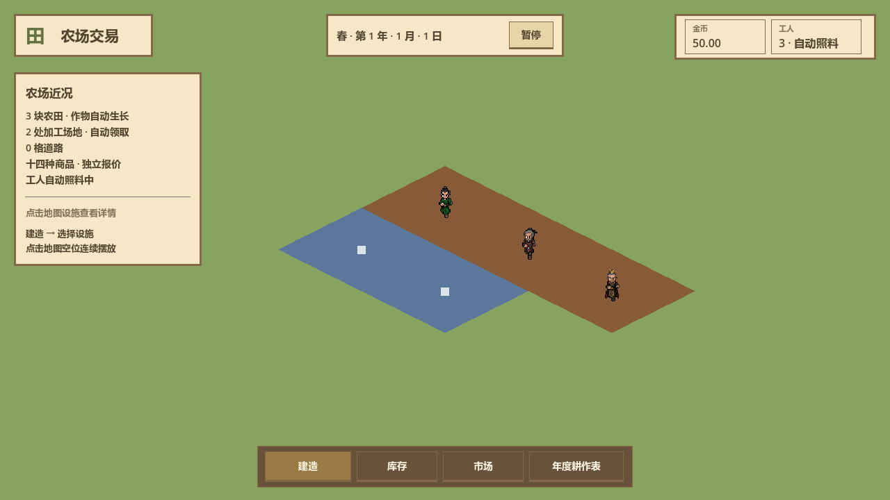

# UI 视觉升级原型

关联 [#94](https://github.com/Fotally/Farm-Exchange/issues/94)。HTML 设计阶段已交付可操作的视觉工件；2026-10-04 已完成正式 Godot UI/UX 实现与本地运行验收，独立复核及 PR 状态见 #94。采用田园版元素布局，搭配复古像素、木质面板和更强的游戏感；删除原左上角英文标题、中文标语及下方小字整组文案，不添加替代标语。本轮保留当前地图与人物素材。

## 打开与比较

直接双击 [HTML 原型](../architecture/ui/main/prototype-visual.html)，无需构建、服务器或网络。也可从仓库根目录执行：

```powershell
Start-Process './docs/architecture/ui/main/prototype-visual.html'
```

默认 B「像素田园」，组合 A 的布局与 B 的像素木作风格。底部方案按钮及左右箭头切换 A / B / C；URL 中的 `?variant=B` 可保留方案，重新打开页面重置经营示例。输入框内的方向键继续编辑输入值。

| 方案 | 信息结构 | 视觉取舍 |
| --- | --- | --- |
| A 田园 | 顶部浮动状态、底部经营工具、右侧详情 | 奶油白与鼠尾草绿，圆角轻面板，优先留出地图 |
| B 像素田园（主稿） | 左上品牌、顶部日期、右上资源、左侧近况、右侧田块详情、底部中央经营操作 | 采用 A 的元素布局，保留方形木框、纸张底、阶梯状林木与麦穗、立体按键，中文使用系统字体保持可读 |
| C 轻简 | 左侧纵向工具、顶部状态、右侧检查面板、左下紧凑摘要 | 浅灰绿、较少装饰，以工具空间和地图面积为重点 |

B 主稿去除标语后，将左侧近况面板上移至与右侧详情对齐，释放地图空间；A / C 对照也不再显示这组标语。A / B 现在用于比较同布局的圆角田园与像素木作表现，C 保留不同布局。B 尚未形成统一像素网格与完整游戏素材图集；加工建筑、河流和局部作物仍为矢量示意。所有绘图均内嵌 SVG / CSS，无第三方图片、字体、远程依赖。窗口页眉可以拖动，Esc 关闭；方案切换重置详情位置。

## 已可体验的路径

- 建造 → 搜索或筛选 → 选择农田、七种加工场地或道路 → 点击地图空位连续摆放。候选按基础格显示，占用冲突变红；失败不扣费；Esc、右键或取消退出，拖动地图不建造，界面遮挡时隐藏预览。
- 点击地图设施 → 查看详情。农田支持立即改种、预备下一轮、年度表入口；两种手动动作展示对当前轮的影响；移除前显示损失和不退款说明。
- 库存 → 原料 / 加工品筛选与名称搜索 → 修改非负整数保留底线。界面展示总量、冻结和可用量。
- 市场 → 十四商品数量买入、卖出或按品种全卖；金额采用整数分演示，零费同价结算。错误数量、资金或库存不足拒绝；交易保留输入数量。
- 暂停 → 人物装饰待机停止，仍可交易。日期、作物进度和产出始终是固定示例，原型不运行经营计时器。
- 左键拖动地图、滚轮或加减按钮缩放、回到中心；键盘可聚焦地图设施并用 Enter / 空格打开详情。

## 规则依据与明确边界

| 正式入口 | 原型映射 | 边界 |
| --- | --- | --- |
| `Main`、`DraggableWindow` | 状态、导航、拖动窗口、详情、暂停 | 原型窗口逐个打开；正式游戏的并存窗口和位置保持未完整复刻 |
| `BuildCatalogWindow` | 九种建筑目录、连续建造 | 沿用生产设施 10.00、道路 1.00、3×3 / 1×1；仅展示中心附近 26×26 格，非完整 384×384 地图 |
| `FarmDetailsPanel`、`CropSelectionWindow` | 详情、七作物、立即改种与下一轮 | 作物定义与时长来自现行文档；不执行工人调度、生长、供水和季节判断 |
| `InventoryWindow` | 十四商品、数量、底线 | 初始演示库存非新游戏库存；没有真实订单，所以冻结示例均为零；底线不触发模拟加工 |
| `MarketWindow` | 十四商品、数量交易、独立报价说明 | 使用 `CommodityCatalog` 初价；不伪造走势、预测和公告；不模拟双周价格推进 |
| `TradeOrdersWindow` | 市场内的委托入口、编辑字段与订单摘要 | 明示视觉草稿；不建单、不冻结、不计算委托成交；正式 1% 费用说明保持 |
| `CultivationWindow`、`CultivationTimeline` | 共享表、四季轨道、短条悬浮、勾选农田 | 明示布局示意，不执行拖放校验、年度凭据、跨季环绕、保存或应用 |
| `WorldMap`、`WorkerPresentation` | 田垄、林木、河流、加工建筑、三个人物 | 仅比较画面语言；装饰不代表新增建筑、地形规则或道路效果 |

玩法依据：[作物与选种](../gameplay/production/crop-growth.md)、[开局与建造](../gameplay/land/opening-and-building.md)、[商品行情](../gameplay/trading/market-quotes.md)、[年度表操作](../gameplay/production/seasonal-cultivation-ui.md)。浏览器状态独立且只保存在内存，不调用 Godot、不写存档。

## 视觉参数与 Godot 落地范围

B 主稿采用深木色框 `#846848`、纸面 `#f6e8c6`、正文深棕 `#53452f`、橄榄绿主按钮 `#657342`。详情区按“选中设施 → 当前状态 → 进度 → 产量与报价 → 下一步操作”排列；移除为低强调的末尾操作。市场用表格对齐报价、库存和数量，避免每个字段都单独装入深色卡片。

正式实现由 `UiElements` 集中维护木框、纸面、字色、按钮与输入控件状态；`Main` 组装浮动状态、近况、底部经营入口与右侧详情。目录、选种、库存、市场、委托及年度表复用主题，窗口读取真实快照并提交原有经营意图，控件刷新继续保留未提交输入。地图美术不在本轮范围，复用现有地图、人物、坐标与占地，不从原型复制第二套经营状态。

布局、像素木作主题与移除标语已确认；正式实施范围覆盖现有游戏窗口与操作反馈，保留 A / C 作为设计对照。原型仍只运行浏览器内示例状态。Godot 的编译、场景测试、覆盖率、图形检查及 Windows 导出启动已通过，结果记入[测试记录](testing.md)；下方浏览器验收记录仅描述 HTML 阶段。

## Godot 界面实测图

正式界面以真实主场景读取当前局状态；下图分别来自 1280×720 和 1600×900 窗口，地图与人物使用既有素材。两尺寸的建造末项、七作物末项与详情拆除可滚动到达，输入与勾选沿用统一主题。完整验收结果见[测试记录](testing.md)，最终独立审查及交付状态以 #94 为准。




| 工件 | 实际经营入口 |
| --- | --- |
| [农田详情](../architecture/ui/main/godot-visual-farm-detail-1280.png) | 作物状态、实际剩余、产量、报价和两种手动接管 |
| [建造目录](../architecture/ui/main/godot-visual-build-1280.png) | 九项设施、名称搜索、费用与连续摆放 |
| [库存](../architecture/ui/main/godot-visual-inventory-1280.png) | 十四商品、总量/可用/冻结及底线草稿 |
| [市场](../architecture/ui/main/godot-visual-market-1280.png) | 实时报价、消息与数量交易 |
| [委托](../architecture/ui/main/godot-visual-orders-1280.png) | 条件、预算、真实单据与草稿 |
| [年度表](../architecture/ui/main/godot-visual-cultivation-1280.png) | 共享配置、四季时间图与农田引用 |

## 浏览器验收记录

2026-10-04 使用本机 Microsoft Edge 无头浏览器检查离线 HTML：

- A / B / C × 1440×900 / 1280×720 × 建造 / 库存 / 市场 / 年度表 / 委托，共 30 组窗口边界与横向溢出检查通过。
- 目录九项、名称搜索、连续建造扣费、重复占地拒绝、退出摆放通过。
- 实际鼠标预览、道路建造、重复占地拒绝、拖动不建造、右键取消及键盘 Enter 选择设施通过。
- 买卖、余额不足、非整数拒绝、暂停交易、输入框方向键不切换方案通过。
- 库存底线合法 / 非法输入、两种改种动作、标题拖动、Esc 关闭通过。
- 浏览器 JavaScript 异常为零；截图人工检查 1280×720 主稿、市场、年度图与 1440×900 建造目录。长窗口内部滚动，较矮窗口中详情末尾操作可滚动到达。
- 田园布局＋像素风格修订后重跑上述 30 组检查及交互，全部通过；主稿弹窗默认避开顶部日期／暂停和底部操作栏，基准窗口的地图缩放位于详情下方。三行标语及对应节点已删除，七张截图同步更新。

| 工件 | 用途 |
| --- | --- |
| [B 主稿 1440×900](../architecture/ui/main/prototype-visual-pixel.png) | 默认像素田园全景，采用田园布局 |
| [B 主稿 1280×720](../architecture/ui/main/prototype-visual-pixel-1280.png) | 基准窗口适配 |
| [A 田园](../architecture/ui/main/prototype-visual-pastoral.png) | 圆角浮动布局对比 |
| [C 轻简](../architecture/ui/main/prototype-visual-minimal.png) | 纵向工具栏布局对比 |
| [建造目录](../architecture/ui/main/prototype-visual-build.png) | 建筑卡片与费用 |
| [市场](../architecture/ui/main/prototype-visual-market.png) | 表格密度与交易操作 |
| [年度表](../architecture/ui/main/prototype-visual-cultivation.png) | 四季轨道与共享应用层级 |

本轮静态检查通过，共检查 91 份文档、规则链接与脚本路径；`git diff --check` 通过。仅设计工件，未修改 C#、Godot 场景或正式玩法；不适用业务模块覆盖率、Windows 导出验收和功能 PR 闭环。独立审查结果在 #94 记录。
