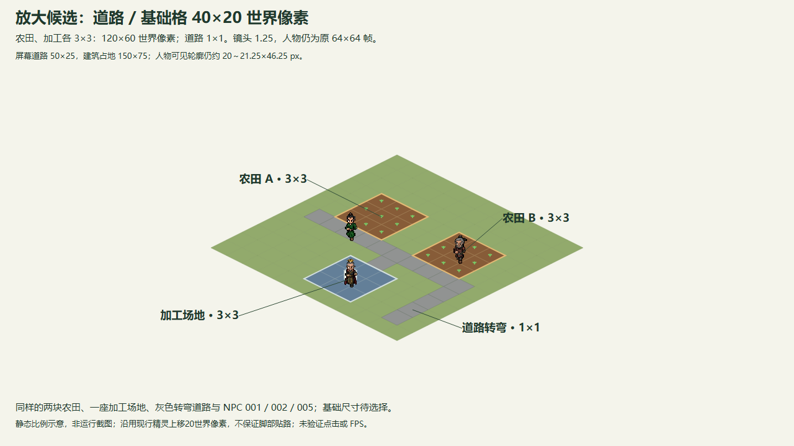
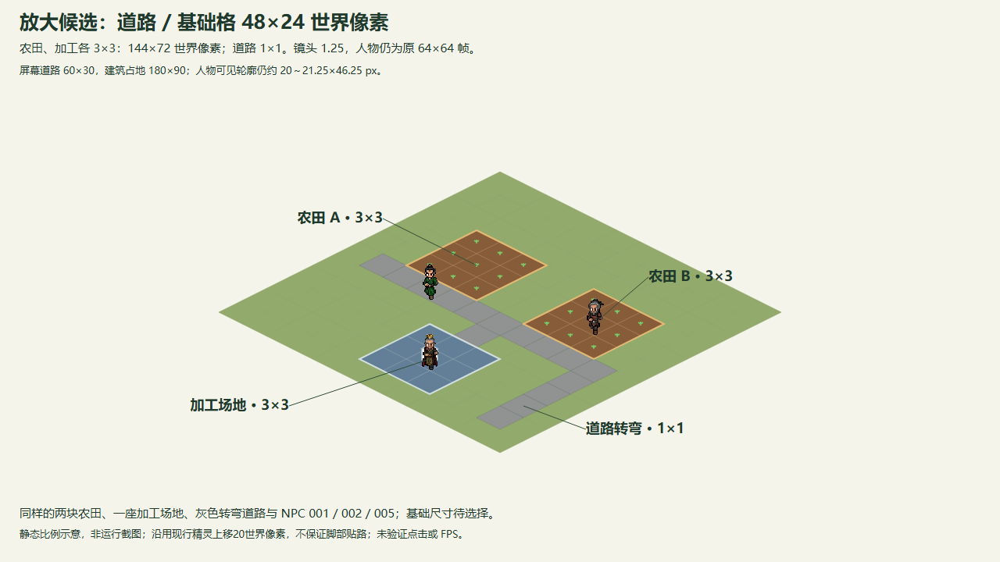
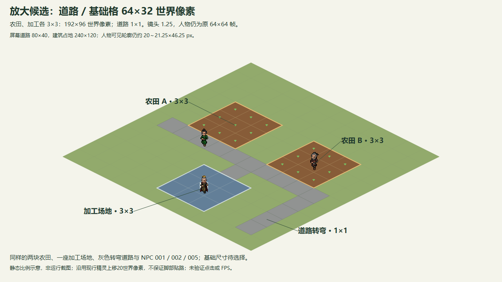

# 人物尺度、整数基础格与多格建筑调研（issue #74）

2026-10-01 最新状态：用户要求上一轮道路候选 **20×10、24×12、32×16 全部翻倍**，再看示例。三种放大示例已完成，用户最终选择 **64×32 世界像素**；人物仍为现有 64×64 图集帧，不随基础格放大。道路即最小基础格，田与加工各占 3×3，从道路尺寸得到建筑占地。**最终道路基础格为 64×32、农田与加工各 192×96 世界像素；20×10 旧建议没有生效。研究本身未修改运行代码，实施进入 [issue #75](https://github.com/Fotally/Farm-Exchange/issues/75)。**

## 已确认配套与最终尺寸

| 已确认配套 | 约定 |
| --- | --- |
| 地图 | 384×384 基础格；物理地图随最终格尺寸变化，不坚持旧物理边界。 |
| 农田、加工 | 各 3×3 格为一个实例，每座 10 金币；生产状态与产出按实例一次。 |
| 道路 | 每格 1×1，一个基础格一个道路实例，每格 1 金币。 |
| 摆放与操作 | 任意小格可作为锚点；任意占用子格选择同一整座实例，拆除整座。 |
| 工人 | 每经营秒 3 小格，采用用户确认的一标准田跨度及两日移动预算口径；不能称为保持旧世界像素速度。 |

下面三个示例具有同样的两块农田、一座加工场地、灰色转弯道路及 NPC 001 / 002 / 005，全部为 **1280×720、zoom=1.25**。人物帧矩形保持 80×80 屏幕像素，实际朝下可见人物约 20～21.25×46.25；变化的是道路与建筑占地。图中仅展示 12×12 局部基础格区域，不能把它当成完整地图。

### 候选 40×20：农田、加工各 120×60 世界像素

[可编辑 SVG](grid-character-scale-40x20.svg)。屏幕道路 50×25，建筑占地 150×75。

### 候选 48×24：农田、加工各 144×72 世界像素

[可编辑 SVG](grid-character-scale-48x24.svg)。屏幕道路 60×30，建筑占地 180×90。

### 最终选择 64×32：农田、加工各 192×96 世界像素

[可编辑 SVG](grid-character-scale-64x32.svg)。屏幕道路 80×40，建筑占地 240×120。

三个示例均沿用现行精灵中心上移 20 世界像素（屏幕 25）的表现约定，橙点为经营坐标；可见脚部底端约在此坐标下 11 世界像素。图中人物、作物点与加工标记用于静态比例比较，不能解释为运行寻路或未来美术定稿，也不保证脚部全部位于道路。实施使用 3×3 中间格作为工作点的自然几何位置；保留现有精灵上移 20 世界像素的表现约定。图片不是运行截图，未验证点击体验或 FPS。

## 重要计算

保持 2:1 等距投影。基础格宽高 W、H 均为整数，半宽半高也均为整数；名义菱形面积为 W×H÷2，连续一格宽路带的垂直厚度为面积÷√[(W/2)²+(H/2)²]。3×3 实例外框宽高为 3W、3H，面积是基础格九倍，道路/建筑占地面积为 1/9。

| 数值 | 40×20 | 48×24 | 64×32 |
| --- | ---: | ---: | ---: |
| 世界半宽 / 半高 | 20 / 10 | 24 / 12 | 32 / 16 |
| 3×3 世界宽×高 | 120×60 | 144×72 | 192×96 |
| zoom 1.25 道路屏幕宽×高 | 50×25 | 60×30 | 80×40 |
| zoom 1.25 连续路带厚度 | 22.36 | 26.83 | 35.78 |
| 道路名义屏幕面积（px²） | 625 | 900 | 1600 |
| zoom 1.25 建筑屏幕宽×高 | 150×75 | 180×90 | 240×120 |
| 384×384 地图世界外接宽×高 | 15,360×7,680 | 18,432×9,216 | 24,576×12,288 |

这些是名义几何计算，不含装饰、人物轮廓或现行地图用于遮缝的 0.75 像素外扩，也不是实际鼠标命中面积。朝下人物横宽约为三候选道路菱形横宽的 40%～42.5%、33.3%～35.4%、25%～26.6%；这只表达画面中的存在感，不能代替路带厚度或脚部接触宽度。人物不放大时，更大的候选会令道路、建筑占地相对人物更宽。本轮按用户要求展示更大比例，用户已看图选择 64×32，不把旧细道路偏好当成当前数值决定。

384² 共有 147,456 个占用槽；若整图只平铺 3×3 建筑，上限为 128²＝16,384 个生产实例。占用槽数不等于产能；九子格不能生成九份独立生产状态。工人速度已确认 3 小格/经营秒，基础像素越大其世界像素位移也越大，不再使用旧 64÷W 换算来决定速度。现有[作物时长](../gameplay/production/crop-growth.md)不因九格占地倍增或缩短。

## 人物测量证据

[WorkerPresentation](../../scripts/world/WorkerPresentation.cs)使用 [001](../../assets/gameplay/npc/npc_animation_001.png)、[002](../../assets/gameplay/npc/npc_animation_002.png)、[005](../../assets/gameplay/npc/npc_animation_005.png) 原图集，精灵中心上移 20 世界像素。[NpcCharacter](../../scripts/characters/NpcCharacter.cs)取 64×64 帧，使用第 7、8、9 行、每行 6 帧，分别用于朝下、朝左、朝上；暂停时使用列 0。Godot 的 AtlasTexture.region 只定义图集绘制区域，AnimatedSprite2D 默认将纹理居中；透明帧矩形不能当成人物实际大小。[AtlasTexture](https://docs.godotengine.org/en/stable/classes/class_atlastexture.html#class-atlastexture-property-region)、[AnimatedSprite2D.centered](https://docs.godotengine.org/en/stable/classes/class_animatedsprite2d.html#class-animatedsprite2d-property-centered)。

程序只读三张 PNG 的 alpha 通道，对上述每张 18 帧的 alpha>0 像素取紧包围框，再测可见框最下 8 行的水平覆盖宽；没有编辑或重新采样人物位图。坐标右/下边界不包含，宽高以坐标相减。

| 人物 | 朝下首帧可见框（左、上、右、下） | 首帧宽×高 | 18 帧宽范围 | 18 帧高范围 | 最下 8 行宽范围 |
| --- | --- | ---: | ---: | ---: | ---: |
| 001 | (25,26,41,63) | 16×37 | 15～25 | 35～38 | 10～19 |
| 002 | (25,26,42,63) | 17×37 | 15～25 | 35～38 | 8～19 |
| 005 | (24,26,41,63) | 17×37 | 15～27 | 34～37 | 15～19 |

单位为素材/世界像素。三个朝下首帧 alpha≥128 包围框与 alpha>0 相同；其最下 8 行宽分别为 11、8、16，最下 4 行宽分别为 5、5、14，005 还包含衣摆。这些条带只是可见像素统计，**不是脚底接触面、碰撞宽度或可通行宽度**。方向和动作改变轮廓，因此不能据此承诺脚部贴路。

[主场景](../../scenes/main.tscn)初始 zoom=1.25；64×64 帧显示为 80×80，16×37 人物轮廓显示为 20×46.25。示例的原尺寸查看不额外放大人物；系统缩放或视窗伸缩另乘对应变换。[Camera2D.zoom](https://docs.godotengine.org/en/stable/classes/class_camera2d.html#class-camera2d-property-zoom)、[Godot 坐标域](https://docs.godotengine.org/en/stable/engine_details/architecture/2d_coordinate_systems.html)。

## 最小 Interface 建议（未实施）

| Module / 调用方 | 建议的最小约定 |
| --- | --- |
| 土地 Module | 唯一拥有实例类别、锚点、固定 footprint 与子格→实例映射。身份沿用锚点索引，不另建永久 ID；只负责全部子格的几何检查、原子放置和完整移除，不接管费用或生产。 |
| FarmGame | 保留现有放置预检/执行及详情、改种、拆除的坐标形状；放置坐标解释为锚点，其他操作把任意子格解析到同实例。完整 footprint 和资金都通过后执行一次登记与扣费，失败零修改。 |
| 农田、加工、工人 | 每实例一份生产状态，步进、降雨、领取与认领按实例一次，维持稳定锚点顺序；沿用农田 Revision 阻挡同锚点重建的旧工作。3×3 的工作点可建议 anchor+(1,1)，作为 #75 的内部自然几何实现。 |
| 地图表现 | 读取占用与实例快照，任意子格选择同实例并画完整 footprint 选框；人物帧尺寸与基础格尺寸分开处理。 |

这是小 interface 封装多格一致性的深模块方向；不预建旋转、无限地图、寻路、可拆分建筑或泛用适配层。上述已确认摆放、费用、格数和速度的记录不代表代码已经实施；最终基础像素尺寸已确认 64×32。

## 前轮历史（均未生效）

第一轮固定旧 64×32 农田和旧物理地图边界，比较 2×2 / 3×3，并推荐过 2×2。原图保留：[PNG](grid-subdivision-comparison.png)、[SVG](grid-subdivision-comparison.svg)。其 256² / 384² 槽数来自固定旧物理边界的假设；不能拿来要求本轮维持旧地图大小。未找到以前已确认农田占四格的记录，因此没有认定现行单格代码是回归。

第二轮按人物起点比较 20×10 / 24×12 / 32×16，道路基础格派生 60×30 / 72×36 / 96×48 的 3×3 农田，建议过 20×10。该图保留：[PNG](grid-character-scale-comparison.png)、[SVG](grid-character-scale-comparison.svg)。用户随后要求三个候选翻倍，因此这些只是前轮示例，不能记为已选尺寸。

Godot 可分离等距网格与素材尺寸；当前项目仍为自绘分块网格，无需为了多格占用改用 TileMapLayer。[TileSet 使用说明](https://docs.godotengine.org/en/stable/tutorials/2d/using_tilesets.html)、[TileMapLayer.map_to_local](https://docs.godotengine.org/en/stable/classes/class_tilemaplayer.html#class-tilemaplayer-method-map-to-local)。

## 最终结论与自查

最终采用基础格 **64×32**、3×3 田/加工占地 **192×96**；384×384 格数、费用、任意小格锚点、整实例操作和 3 格/秒均已确认。工作点使用中间格，现有角色上移 20 世界像素不变。40×20、48×24 仅保留为未选对照；示例图内当时“待选择”注记是看图阶段记录，不再表示当前状态。后续实现应验证全 footprint 越界/冲突零修改、任意子格操作整实例、生产每实例一次、工人移动符合确认口径，以及实际角色/路/田/选框比例；负载夹具按 147,456 个占用槽与实际实例预算组织，图形验收仍需满足 60 FPS / P95 16.67 ms。静态图不声称已通过这些运行验收。

自查：三角色共 54 帧 alpha 只读统计；宽高、整数半宽半高、九格面积、路带厚度和地图外接尺寸已核对。新增三个原生 SVG 嵌入原 PNG 图集，用独立 Chrome headless profile 渲染同目录 1280×720 PNG，逐张目视确认两田、一加工、灰色转弯道路、人物尺寸与完整可读标注；原先两轮图保留。没有运行 Godot、放大人物或修改生产代码。
