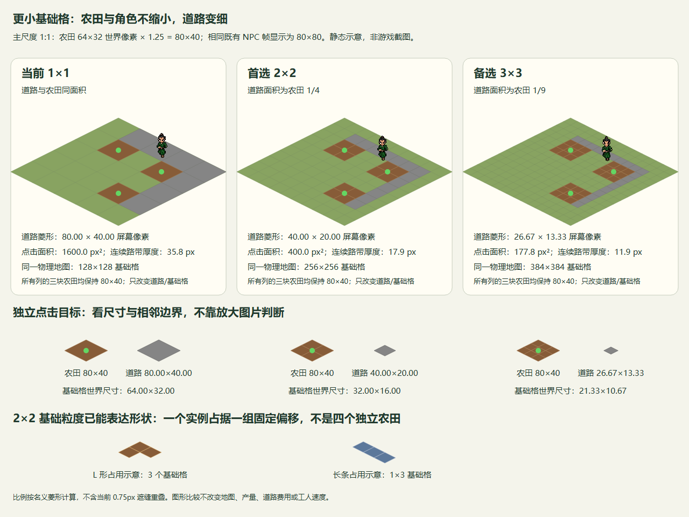

# 基础格细分与多格建筑调研（issue #74）

2026-10-01。本文只研究粒度与空间模型，未更改运行地图、生产规则、道路费用或工人速度。用户希望道路视觉面积为当前农田的四分之一或九分之一，并让未来农田、建筑能有不同形状；具体粒度尚待确认。推荐先采用 **2×2 细分**：保留农田与角色的世界尺寸，农田成为一个占四个基础格的实例，道路占一个基础格。

## 当前事实与比较口径

当前地图为 128×128 格，农田、加工场地和道路各占一个格（[FarmGame](../../scripts/gameplay/FarmGame.cs)、[土地占用](../../scripts/land/LandOccupancy.cs)）。[坐标换算](../../scripts/world/MapCoordinates.cs)中格菱形为 64×32 世界像素；[主场景](../../scenes/main.tscn)初始缩放 1.25，[镜头](../../scripts/world/CameraController.cs)允许 1.25～2。角色使用 64×64 图集帧（[NPC](../../scripts/characters/NpcCharacter.cs)），[工人表现](../../scripts/world/WorkerPresentation.cs)保留角色尺寸并将精灵上移 20 世界像素。64×64 是含透明区域的帧矩形，不能把 80×80 屏幕像素矩形当成实际人物轮廓。

本次核对未找到“农田以前已确认占四格”的记录，因此不能认定当前单格代码是回归。比较以现行单格农田为参照，只细分其底层空间。Godot 将节点、画布和视窗分成不同坐标域，Camera2D 通过画布变换影响视野；其 zoom 为 2 时画面尺寸放大两倍。因此以下比较以 1280×720 逻辑视窗、zoom=1.25 为屏幕尺度，窗口被系统或伸缩额外放大时需再乘对应变换。[Godot 坐标域](https://docs.godotengine.org/en/stable/engine_details/architecture/2d_coordinate_systems.html)、[Camera2D](https://docs.godotengine.org/en/stable/classes/class_camera2d.html#class-camera2d-property-zoom)。

## 同尺度图与计算

可编辑图源见[原生 SVG](grid-subdivision-comparison.svg)，PNG 为同一 SVG 的原尺寸浏览器渲染。

图是静态比例示意，使用项目 NPC 001 图集首帧；不是运行截图。每列农田保持 80×40 屏幕像素，角色帧保持 80×80；上部展示道路连续铺设，第二行给出单块尺寸，下部展示不同 footprint。名义菱形不含当前绘制用于遮缝的重叠边。

若每轴细分 n 份，基础格宽高分别除以 n，菱形面积 A=宽×高÷2，因此道路面积为农田的 1/n²，绝不能把四分之一面积误写为宽高各缩到四分之一。沿一个格轴连接的一格宽路带，其垂直厚度为 A/√[(宽/2)²+(高/2)²]。

| 同一物理地图的比较 | 当前 | 2×2 | 3×3 |
| --- | ---: | ---: | ---: |
| 基础格世界尺寸 | 64×32 | 32×16 | 21.333…×10.666… |
| 农田占用基础格 | 1 | 4（一个实例） | 9（一个实例） |
| 道路/农田面积 | 1 | 1/4 | 1/9 |
| 道路屏幕菱形（1.25） | 80×40 | 40×20 | 26.667…×13.333… |
| 道路点击面积（屏幕 px²） | 1600 | 400 | 177.778… |
| 连续路带厚度（屏幕 px） | 35.777… | 17.889… | 11.926… |
| 基础格地图尺寸 | 128×128 | 256×256 | 384×384 |
| 占用数组槽数 | 16,384 | 65,536 | 147,456 |
| 占用槽数相对当前 | 1 倍 | 4 倍 | 9 倍 |
| 可容纳同尺寸农田的面积上限 | 16,384 | 16,384 | 16,384 |

以上是本项目尺寸的数学推导，不是性能实测。保持地图物理边界时，原图边长由 128 个旧格改为 128n 个基础格；中心坐标原点须随新格中心约定校正，不能仅替换 MapSize。占用槽数增加不等于生产实体数增加，生产预算仍以建筑实例计数；不能把四格农田建成四个可独立产出的农田。

## 推荐及取舍

首选 2×2：道路已明显变细，在最低缩放下仍有 40×20 的菱形和约 17.9 像素路带；整数 32×16 世界尺寸也便于阅读和对齐。一个四格方形实例以及 1×2 长条、L 形偏移已经能够表达不同形状。3×3 更适合明确需要三分之一宽道路或更细形状轮廓的美术目标，但最低缩放下路带只有约 11.9 像素、点击面积只有当前的九分之一；占用槽数是 2×2 的 2.25 倍。该判断来自上述尺寸，不宣称某一粒度已通过点击体验或 FPS 验收。

粒度与形状是两个决定：2×2 是旧尺寸农田占用方式，不要求所有未来建筑都为 2×2。使用固定偏移集合即可定义矩形、长条、L 形；更复杂轮廓确实需要三等分时，再由实际资产和玩法确认 3×3。Godot 的 TileSet 支持等距形状且 tile_size 是网格尺寸，视觉素材与网格不必相同大小；TileMapLayer 的 map_to_local 返回格中心，素材 texture_origin 可以另作视觉偏移。这支持“格粒度与视觉尺寸分离”的方向，但当前项目是自绘分块网格，**本次不建议为了细分改用 TileMapLayer**。[TileSet 使用说明](https://docs.godotengine.org/en/stable/tutorials/2d/using_tilesets.html)、[TileMapLayer.map_to_local](https://docs.godotengine.org/en/stable/classes/class_tilemaplayer.html#class-tilemaplayer-method-map-to-local)。

## 最小空间模块方向

建议由现有土地模块唯一拥有“建筑实例、锚点、固定 footprint 与基础格到实例的映射”。调用方只需按锚点和建筑描述预检/放置，按任一占用子格查询实例或移除。模块内部统一检查 footprint 全部格是否越界、占用及资金条件；放置要全部成功才登记和扣费，移除要一次清除全实例，不能残留子格。点击任一子格返回同一农田/加工实例，详情、改种、拆除与工人认领使用同一身份。农田/加工系统继续各保存一份实例生产状态，地图表现只读占用与实例快照。

这是一个小 interface 封装多格一致性的深模块方向，不新增泛用层或 C# interface；不预建旋转、无限地图、路径搜索、可拆分建筑。道路仍是一格一个实例。锚点与 footprint 的合法范围在真实实施时统一定义，选框画完整 footprint。是否允许农田锚点落在任意基础格、道路每小格费用、未来新形状产量以及旧存档迁移均不在本研究中直接确定。

工人当前按 max(|Δx|,|Δy|) 计算路程并每经营秒推进一旧格（[调度实现](../../scripts/workers/WorkerScheduler.cs)）。采用 2×2 或 3×3 后，要保持相同世界速度，分别应推进 2 或 3 基础格/经营秒；若仍走一个基础格会无意减速一半或三分之二。角色动画与帧尺寸保持原样。现行作物时长与两日规则保持[作物规则](../gameplay/production/crop-growth.md)，空间细分不重新解释生产天数。

## 实施前需确认与验收

本 issue 交付调研和比例图，由用户确认粒度后另开运行实现范围。建议后续验收覆盖：同一物理地图边界与镜头限制；footprint 部分越界/冲突时金币与占用零修改；任一子格查询/改种/拆除指向同实例；农田每轮产量不随子格数倍增；工人同世界路程耗时不变；原始尺寸截图中道路、角色、选框比例；65,536 槽占用但保留原生产预算的负载，以及既有 60 FPS / P95 16.67 ms 图形要求。调研的计算核对与 SVG 视觉自查记录在本节，不能代替运行验收。

自查：2026-10-01 已核对面积、路带厚度、占用槽数与速度换算，使用独立 Chrome headless profile 以 1280×960 原尺寸渲染 SVG 检查，修正 L 形格之间的连接。三列农田/人物同尺度、文字完整可读；渲染临时图留在 coverage，不作为运行截图。
