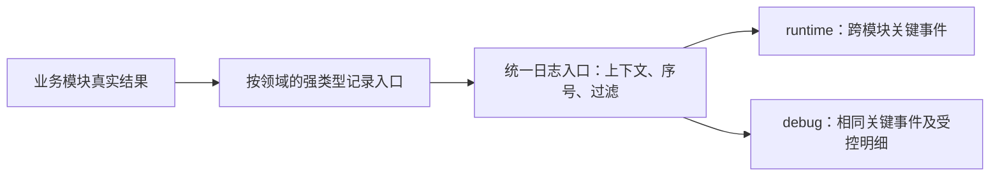

# 运行时日志现状与两类日志设计

初次调研：2026-10-02；设计修订与初版接入：2026-10-07（北京时间）。关联 [issue #82](https://github.com/Fotally/Farm-Exchange/issues/82)。历史对照吸收《Farm Exchange 运行时日志设计 版本 1.0》；当前初版与实际接入范围以下文及所属子议题为准。

用户已确认：日志分为给开发者的 Debug 日志和发布版本日志；前者可以详细，后者记录关键事件；Windows 发布包的业务日志放在游戏自身目录的 `logs/`，第一版输出可读 `.log`，两类日志都要有明确的 schema 和字段释义供 AI 分析。[日志 schema v1](../project/runtime-log-schema-v1.md)是字段与事件语义的唯一维护入口。经营规则仍以[系统规划](../project/roadmap.md)及玩法文档为准。

2026-10-07 已确认分层记录原则：玩家命令、交易、订单变化及异常逐条记录；自动播种、浇水、收获与加工按窗口汇总，指定对象的详细记录按需、有界开启。普通发布日志不承诺还原每座设施的每次动作。

## 初版实施基线

2026-10-07 已确认现有方案作为初版，先进入 [#126](https://github.com/Fotally/Farm-Exchange/issues/126)，用底层与一条真实买入验证 Interface。独立日志 Module、领域记录入口、统一输出、发布限制和经营指令关联作为共同基线。字段命名、文件拆分、formatter 与初始限额由实施选择、测试并按实际需要调整；不要求第一版预先完成所有领域或做到完美。

首版采用 MEL → Serilog → File 的同步输出和薄 formatter，保留单行具名结构与可见转义；序号分配和双目标提交串行化。多进程使用 File 的 `shared: true`，各 SessionId 独立排序，文件可能交错不同会话。日志模块不自写文件锁、轮转、清理器或事件合并器。初始文件预算采用下文 10 MiB×20 / 20 MiB×10，日轮转与大小轮转同时启用。普通日志故障只隔离观察工作，不更改路径或重试经营；异步丢弃/阻塞、保存位置变更和重放范围扩展仍须另行确认。[File 官方约定](https://github.com/serilog/serilog-sinks-file)

实现分阶段描述实际覆盖，后续事件目录不是已实现功能清单。#126 只覆盖进程/经营局生命周期及 `BuyCommodity` 的收到、单商品买入结算、结束和异常关联；#127～#130 保留各自范围与验收。下方历史对照中的“待确认”是当时状态，当前授权与选型以本节及实际接口文档为准。

后续接入以减少业务代码侵入和适配改动为约束：集中使用真实命令/提交点及少量领域 Interface，框架、字段与输出策略修改留在日志 Implementation；具体接入与审查要求见[低侵入接入约定](../architecture/logging/interface-logging.md#低侵入接入与维护约定)。本次补充约束不改变既定经营流程，也不扩大实施范围。

这一要求合理，判断需同时看接入点数量和调用方承担的知识。调用方若维护日志身份、字段、采集策略、快照顺序与去重，即使调用行数少，协议变化也容易传播到业务。现有买入把框架与投影封装在日志模块，但仍有显式开始/完成/异常终结手续；目前集中在一处，后续大量重复时须重新审视 Interface。业务事实含义改变时同步领域映射属于必要维护；仅调整框架、文件策略或文本排版，应保持业务调用点稳定。以关闭采集时经营结果、检查顺序和异常语义等价作为行为验收。

## 已确认的后续修正方向

2026-10-07 确定后续按需要记录业务事实的子模块组织日志入口，隔离领域记录与通用底座，并明确观察手续的归属。改进要求统一维护在 #82，由 [#127](https://github.com/Fotally/Farm-Exchange/issues/127) 承接：基于 #126 已验收实现，先修正职责，再扩展完整交易，随后推进 #128～#130。2026-10-08 职责修正已通过独立审查与统一回归，后半段接入主动交易、订单与行情；整项交付证据以 #82 顶部记录为准。当前成员与实际覆盖见[日志 Interface](../architecture/logging/interface-logging.md)。[业界调研](logging-coupling-practices.md)保留当时的证据和候选比较，不替代本节现行安排。

#127 的实际领域入口为 `TradingLog`、`TradeOrderLog` 与 `MarketLog`。订单等待采用每单现实 60 秒最多 8 次中间变化，首次等待和实际终止保留；订单配置按前 8 组、合计 32 条条件投影，截断只影响证据完整度，不限制合法业务。跨商品编辑同时观察新旧商品冻结。行情只记录实际公告与正式报价，公式明细和逐次订单诊断留给 #130；生产、耕作和流程仍按后续阶段实施。字段唯一依据见 [schema v1](../project/runtime-log-schema-v1.md)。

#128 沿用同一提交与观察契约，由 `GameplayLog` 记录完整建拆和底线命令，`ProductionLog` 统一每局生产增量及目标 60 秒窗口。工人成功回调、真实收获/完工入库、实际开工扣料及原换季清理循环提供事实；不扫描地图补历史，也不从动画或完工量倒算投入。完整推进结束才检查生产封窗，包含检查点中的正式命令；正常局结束补尾。尚未登记的夹具变更和采集缺口降低窗口覆盖，不把未来完整窗口当作过去证据已补齐。专项诊断由 #130 的显式范围采集控制与领域 Adapter 接入。

#129 的耕作、时间与流程实现沿用现有领域 Adapter 与共用观察。RunId 在真实报告目录创建后、首个流程业务命令前确定，报告保存结果独立于流程终结；详细字段见 schema，运行验收状态以 #82 顶部记录为准。

#130 采用显式事件与对象范围，锚点/坐标合计32、订单8、工人3、最长120秒及最多5000条明细，可请求更小预算。Release 在取得详细快照之前关闭采集；生产与工人沿原真实转换点、订单沿原实际求值、行情沿原整数公式记录。实际 AdvanceTicks 批次和进程帧各自按60秒目标窗口统计，不拆平静推进，也不把批次耗时冒称逐 tick 实测。同步输出保持；实际性能、故障与发布门禁证据在统一验收后记录。

#130 的异常补齐复用具名领域入口与内部共用观察：命令原接口保持，单 tick、批次及时间驱动观察真实异常和实际阶段，业务继续负责执行及原样传播。重复判断只覆盖本次活跃同步调用的异常传播，独立操作重新记录；命令终结、失败批次、初始化致命事件与报告保存失败保留各自事实。具体 Interface 与生命周期见[共用异常观察](../architecture/logging/implementation-exception-observation.md)，字段仍仅由 schema 维护。日志功能验收与图形性能达标分开；剩余压测及优化由 #66 跟踪，不以性能延期免除异常真实性和发布门禁验收。

### 按子模块组织领域记录入口

领域日志入口直接承担 Adapter：接收少量原请求、真实结果及必要的现有只读查询，维护所属事件身份、名称、级别、采集资格、字段投影与含义、快照、去重或汇总。调用方不再次逐字段复制结果，也不拼协议字典。没有实际记录需求的模块不建空 logger；不按每个类或函数机械增加一份适配器。

| 子模块/实际记录职责 | 所属记录内容 | 接入约束 |
| --- | --- | --- |
| trading | 主动交易、订单配置、等待与成交 | 完整提交或真实判断处记录；钱包、库存不重复记成同一笔成交 |
| market | 实际公告、正式报价及真实因素 | 复用已产生事实，不补抽随机数或重新算价 |
| farming、processing | 播种/供水、收获、清理、实际投入和完工 | 所属领域投影真实增量；库存流量在实际入库/扣除提交点采集，可由经营协调调用对应入口 |
| land/gameplay、cultivation | 完整建拆、计划配置、引用与手动接管 | 归属按事实确定，预览不冒充提交；跨模块事实明确一个正式记录点 |
| time、development | 暂停、倍率意图、流程与报告 | 复用真实来源/结果；发布底座不依赖开发类型 |

模块归属决定谁维护内容，真实事实的产生与提交决定在哪里调用。自动生产依旧按已确认粒度汇总；子模块划分不要求每秒逐对象输出。同一事实只指定一个正式记录点，跨模块协调和汇总可以共用，不复制状态拥有权。

### 稳定的通用提交 seam

业务面对具名领域 Interface；领域入口面对通用输出 Interface，提供事件描述、已投影属性及必要上下文关联。底座识别共同结构与值类型，拥有会话时间、统一序号、过滤、转义、尺寸预算、输出和健康处理；不理解商品、金额、生产或计划字段的业务含义。公共头及保留字段约束统一维护，领域不能覆盖底座身份或序号。

将 `RuntimeLog.EventNumber` 的领域名称分支归还领域事件描述；底座自身的生命周期/健康事件同样提供明确描述。新增合法领域事件不再要求修改输出实现的业务名单。`RuntimeLog` 可以保留方便的公开组装 facade，局绑定/领域上下文与纯输出职责必须明确区分；不为分类强制每项职责一个类，不在底座初始化硬编码全部业务类型的投影。

| 修改类型 | 应集中修改的位置 |
| --- | --- |
| 领域新增事件或输出字段 | 所属领域入口/投影及字段文档；缺少真实事实时补必要业务结果，通用底座保持不变 |
| 内部参数重构，业务含义不变 | 正常业务重构与受影响的集中映射；正式日志字段不随内部参数自动漂移，适配不散布到调用点 |
| 公共头、格式、文件、采集预算的内部调整 | 通用底座；业务调用和领域字段投影保持不变，消费者兼容另行核对 |
| 业务事实含义或共享提交 Interface 改变 | 明确适配相应记录入口并核对 schema；不承诺任意契约变化仍零适配 |

### 观察手续的协调

开始、正常完成、正常拒绝与异常终结属于一次操作的观察生命周期，共用局/命令观察机制拥有身份、关联、收到/结束配对和幂等终结；所属 Adapter 负责原输入与真实领域结果投影。业务执行、正常拒绝判断与原异常传播仍由原业务及现有经营协调层负责，日志不执行或重试业务回调。

#127 的职责修正阶段先迁移现有买入并验证开始/终结一次、异常原样传播、真实前后采样位置和资源边界。目前只有一个业务入口，不为消除几行代码创建泛用执行容器。随后扩展多条实际交易路径时，若出现相同协调手续，在既有经营协调层局部收敛；不要求每个子模块重新维护观察协议。自动生产事实不伪装为玩家命令，也不套用主动命令的开始/结束手续。

### 修正顺序与验收

顺序确定为 **#126 已验收基线 → #127（先职责修正，再完整交易）→ #128 → #129 → #130**。#127 内先以现有买入完成职责修正及集中审查，通过后再扩展原有交易、订单与行情范围；每个已划定的完整小单元分别审查，最终对整项验收。保留 #126 的完成证据，未实施内容不并入其完成记录。

职责修正保持当前事件名、字段含义/单位、顺序、实际拒绝与异常语义、同步框架、文件路径、发布限制和故障隔离。通过现有通用提交 Interface 增加合法测试事件描述应无需修改底座源代码；测试事件不登记为正式玩法。验证跨局关联、单事实单记录、一次终结、关闭/故障下经营等价及模块覆盖率。若实际需要改变 schema v1 的既有含义，回 #82 明确版本处理，不能借重构悄悄改变。

## 历史设计对照（初版确认前）

初版确认前核对了本地 `dev` HEAD `04534c42f8edc6d72795ad9b848b240b8d1fd97b` 及工作区；当时 #82 仍只要求设计。以下保留当时的对照结论，“待确认”不代表当前状态；初版授权后已采用的 formatter、预算、shared 和指令契约以上文基线及实际 Interface 为准。附件中的远端提交和分叉数量同样只属于历史快照。

| 主题 | 原落盘方案 | 附件带来的改进 | 本轮处理 |
| --- | --- | --- | --- |
| 日志组织 | 小型启动模块，业务直接调用 ILogger | 独立日志模块、按领域的强类型入口、每局上下文 | 采纳职责划分；不照搬文件数量、不建立通用事件总线 |
| 关联范围 | SessionId 加订单/锚点 | GameInstanceId 区分主局与独立开发局，RunId 关联流程报告 | 采纳；运行实例、流程、存档身份分开 |
| 等待解释 | 发布记录订单生命周期，等待细节主要在 debug | runtime 记录首次实际等待、原因变化及等待结束 | 采纳；维持真实短路，不额外求值 |
| 生产对账 | 收获、加工品产量及期末快照 | 开工原料实际消耗、期初/期末快照与覆盖状态 | 采纳；消耗和完工可以跨窗口，清理轮数不是库存损失份数 |
| 性能统计 | tick 平均/最大耗时 | AdvanceTicks 批次耗时及平静/事件秒数 | 采纳，替换已经不适合批量推进的旧口径 |
| 新增业务 | 没有系统覆盖年度表、手动接管、倍率与开发流程 | 补齐配置与实际生效结果 | 采纳事件范围；不为日志单独增加计划修订号 |
| 发布分流 | Information+ 进入 runtime | 由事件目录登记 runtime 资格，等级表达严重程度 | 采纳，避免第三方 Information 消息混入业务 schema |
| 诊断规模 | Debug 状态转换，Trace 指定对象 | 对象、时间和条数共同约束 | 采纳有界原则；高频生产/工人 Debug 也须受控 |
| 文本与故障 | 内置输出模板、异常续行、故障提示 | 明确转义、截断、健康状态和幂等关闭 | 采纳语义要求；薄 formatter、硬上限与关闭预算仍待实施前确认 |
| 多进程与保留 | 倾向 File sink 的 shared | 单安装目录单写入者 | 不直接替换旧建议；记录为待确认取舍，要求实际滚动/保留测试 |
| 额外状态 | 没有逐设施停工原因缓存 | 最近阻塞设施数、未知数、观察次数 | 首版暂不采用全场“当前原因”统计；专项观察须带观察时点，不把旧原因当当前事实 |

附件把日志定位为可解释业务的独立模块，这一点应吸收；其具体类名、`8 条/分钟`、`120 秒/5000 条`、`32 KiB` 等参数只是设计输入。当前没有负载证据足以把这些值设为验收门槛。

## 按职责组织与持续维护

现有 `scripts/logging/` 已承载生命周期、买入投影与统一输出等初版职责；后续逐步接入汇总和诊断。业务调用方只提交真实结果和必要纯值，不学习文件路径、Serilog 属性字典、轮转或异常转义规则。

模块内可按职责放置宿主、局上下文、通用事件描述及交易/生产/耕作等强类型入口；事件描述的具体值由所属入口维护，不建立所有领域共同修改的业务名单。这些是内部组织建议，不要求每种事件一个类，也不要求每个业务类配一个 Logger 类。格式器和框架 adapter 隐藏在模块内部。模块只保存日志序号、汇总计数和去重状态，不持有第二份库存、订单或计划执行状态。

### 目录结构提案

以下是分阶段接入的职责布局，不要求预先创建空文件；已实现部分以[日志 Interface](../architecture/logging/interface-logging.md)为准，其余按 #127～#130 落地。`scripts/logging/` 是独立一级模块，按项目规则单独验收覆盖率；表中的 `domains/` 只是可选内部组织目录，不形成独立业务系统。模块内命名空间遵循脚本目录规则。

```text
scripts/
  logging/                         # 公共日志模块
    LoggingHost.cs                 # 初始化、配置、文件目标与幂等关闭
    GameLogContext.cs              # 每局身份、日志生命周期与累计器归属
    LogEventDescriptor.cs          # 通用描述形状；具体事件值由所属领域维护
    LogOutput.cs                   # 统一序号、提交、两路分流和框架适配
    LoggingDiagnostics.cs          # 独立健康状态与限频故障通知
    DiagnosticCapture.cs           # 阶段 5 的对象、时间与条数控制
    domains/
      TradeLog.cs                  # 即时交易、订单生命周期与等待观察
      FarmingLog.cs                # 农田真实事实的领域投影
      ProcessingLog.cs             # 实际投入、完工事实的领域投影
      ProductionLog.cs             # 跨子模块共用的生产累计与汇总
      LandLog.cs                   # 建拆命令、锚点与实际费用
      CultivationLog.cs            # 年度表与手动接管
      MarketLog.cs                 # 公告、正式报价及已有计算信息
      SimulationLog.cs             # 暂停、倍率及批次/帧统计
      WorkerLog.cs                 # 按需工人任务与移动诊断
      PresentationLog.cs           # 按需地图/镜头等表现诊断
  development/
    logging/
      ScenarioLog.cs               # 开发流程适配，随开发代码排除
  gameplay/、trading/、farming/…    # 原业务模块，提供真实结果和原因

tests/
  unit/
    TestLogging.cs                 # 公共契约、顺序、分流与健康状态
    TestTradeLogs.cs               # 代表性领域行为；其他领域随阶段补充
  integration/
    TestLoggingFiles.cs            # 实际 provider、文件、滚动与关闭

docs/
  research/runtime-logging.md      # 当前设计、职责与取舍
  project/runtime-log-schema-v1.md # 字段与事件语义唯一入口
  architecture/logging/            # 已有接口/实现说明，后续同步扩展
    interface-logging.md          # 调用方约定与生命周期
    implementation-event-output.md # 输出、顺序与故障处理实现
```

`domains/` 维护所属事件描述和领域结果投影，去重/累计状态属于对应记录入口，共用生产窗口可集中维护；共用时钟、序号、文件和健康策略由底层维护。生命周期事件可由宿主/局上下文直接提交，不强制增加 SessionLog 转发层。目录中的名称仅作职责示意，不要求预建空文件；当前薄 formatter 已在模块内部实现。

开发流程的 ScenarioLog 依赖公共日志的纯值提交能力，所属开发入口声明自己的事件描述；公共输出不反向依赖开发配置/报告类型，Release 不加载开发适配。业务模块不读取日志缓存来作决策；UI 不从日志重建当前游戏状态。

生产累计器起初可封装在 ProductionLog 内，只有实现复杂度确有需要时再拆文件。各领域按需建立强类型结果与少量方法，不为每个业务类添加同名日志类，不建立任意属性字典作为业务调用接口。实际测试目录及聚合入口在实现时按测试规范接入，目录提案不预先增加第二套测试运行器。

### 各业务模块负责提供什么

| 事实来源与唯一记录责任 | runtime 要回答的问题 | 受控 debug 补充 | 不记录或不推导 |
| --- | --- | --- | --- |
| FarmGame 完整命令边界；LandOccupancy/PlacementRules 提供实际结果 | 在哪个子格请求建拆、解析哪座设施、实际费用、成功或拒绝 | 实际执行检查、占地冲突 | 鼠标预览不是已建造；土地/钱包不再重复记支出 |
| FarmGame 主动交易边界；TradeOrderBook 自动订单最终提交边界；TradingService 提供结算值 | 买卖、手续费、冻结和资金库存变化；订单为何等待 | 本次实际执行的条件与预算计算 | 不重新交易、不解析中文原因、不把一次成交记录两遍 |
| FarmingSystem/ProcessingSystem 的真实变更点提供增量；每局生产汇总统一输出 | 收获多少、加工投入多少、完工多少、清理多少轮 | 指定田/场地的播种、供水、开工和结束 | 不从完工量倒算投入；不扫描全场补造历史 |
| CultivationPlanBook 提供计划结果；FarmGame 完整命令后记录 | 哪张年度表被保存/删除/应用，手动接管保留了什么 | 指定条目的定位、年度凭据、休耕判断 | 草稿拖动不等于保存；应用不等于已经播种 |
| WorkerScheduler 提供真实任务变更 | 常规通过生产结果解释播种与供水；真实异常有对象标识 | 指定工人认领、失效、释放和真实移动 | 动画不能证明作业成功；默认不逐工人逐秒输出 |
| MarketQuotes 正式公告/报价提交点 | 哪天公告、何时报价真正改变、前后价和因素 | 本次已有公式输入和取整 | 不重新抽随机数；公告不当成交价 |
| SimulationDriver 的选择意图与 FarmGame 推进边界 | 暂停、倍率选择、每局批量推进成本 | 专项实际事件阶段耗时 | 不拆开平静区间获取逐秒日志 |
| 开发流程入口及报告保存边界 | 哪次运行、在哪局、实际结果及报告是否保存 | 配置修订/哈希与检查点诊断 | JSON 验收报告仍是报告；流程结束不等于主局结束 |
| Main/WorldMap/CameraController/表现层 | 进程环境、窗口及真实异常 | 视口、块重建及指定表现问题 | 不再记录同一笔经营成功，不逐帧写位置 |
| 日志模块自身 | 启停、输出是否故障、已知采集缺口 | 格式/目标诊断 | 不用业务 logger 递归记录自身故障 |

钱包和库存仍是资源的唯一拥有者，但不承担每笔业务日志的归因：单看一次扣量无法知道它是交易、加工还是建造。责任应落在拥有完整业务结果的位置。一个命令内部触发加工领取时，命令结算与加工投入分别记录各自实际变动，取值边界须避免把后续投入混入交易自身的库存差额。

### 原因属于业务，记录策略属于日志

当前 `TradeOrderBook.WaitingReason` 是中文文本，`ProcessingSystem.TryStart` 返回 bool；它们尚不能提供附件所需的全部稳定原因。后续只在实际存在的判断分支补充轻量强类型结果，保持原判断顺序、短路和调用次数。UI 与日志消费同一原因，不从 UI 展示字符串反向归类，不为了输出“全部原因”追加检查。加工是否需要细分拒绝原因，按首版要回答的问题确定；记录实际投入本身不要求先做全场停工分析。

日志调用先判断 profile 和对象范围，再构造专用快照。快照、投影与格式化的异常隔离限于日志工作，业务提交和异常传播在隔离区外。业务线程提取纯值，后台不得读取 Node 或可变业务对象。少量领域方法优于到处手拼 Dictionary；也不增加几十参数的通用日志入口。[Microsoft 高性能日志](https://learn.microsoft.com/en-us/dotnet/core/extensions/logging/high-performance-logging)

### 玩家指令记录与未来重放

2026-10-07 确认：玩家指令留下可关联的输入记录，为未来重放准备。未来目标包括建造、交易、选种、计划、暂停和倍率等经营过程与结果，不要求还原镜头、窗口与鼠标轨迹。#126 实现单商品买入的指令契约，其他命令留给后续阶段；记录输入不等于已有重放执行能力。原草案仅在业务结果中分散记录请求参数，统一契约是本轮初版补充。

建议在实际语义命令入口记录“收到什么指令”，在命令完成后记录“实际怎样结束”，两者用同一 CommandId 关联；领域结果事件继续解释资金、库存等真实变化。收到指令不表示通过验证或已经生效，正常拒绝也应有原始输入，原异常仍按原方式传播。鼠标按下本身不等于建造命令；预览、悬停与重复界面刷新也不自动成为经营指令。

共同身份、时刻、来源和指令结果由日志公共能力管理；各领域明确自己的命令名及强类型参数投影。原输入与执行时解析的锚点、计算出的实际量分别保存，不能用生效值覆盖请求。例如“卖出全部可用小麦”应保存其操作模式，随后成交结果再写实际卖出数量。年度表与订单编辑保存本次提交的内容，不能只记可能随后改变的对象名称。

已登记的配对和字段见 [schema 的指令契约](../project/runtime-log-schema-v1.md#玩家指令契约提案)。一条指令触发领域结算和加工等结果时，只在真实领域事件记录各自资源变化，通用指令结束记录不再记第二份收支。内部自动生产、订单自动成交是推进产生的结果，不冒充新的玩家指令；开发流程发出的命令注明其实际来源。

普通 runtime 保留的是可诊断的指令历史，仍可能轮转、截断或因故障缺失。未来要实现可靠重放，还需单独设计完整起始状态、规则/数据版本、随机状态或确定的随机输入、全部影响经营的外部输入、同一经营秒内命令插入的精确位置及完整持久化。只记录初始种子和玩家指令不能证明所有运行都可重放；初始化摘要不等于完整起始状态，生产汇总和结算结果也不能作为第二份输入再次执行。

先补语义输入与结果关联可以复用到以后重放；本阶段不实现重放执行器、存档快照、跨版本兼容或额外 replay 文件。已确认的经营重放目标不要求高频镜头/窗口/鼠标记录，不将这些输入加入发布日志。#126 先验证一笔交易的指令记录，后续阶段逐领域接入，具体事件组合在 #82 收敛后实施。

### 文档、目录和代码如何一一对应

1. 本文件维护职责、取舍、采集预算和实施次序；[schema](../project/runtime-log-schema-v1.md)唯一维护事件、字段与解释规则。附件不再成为第三套同步修改的规范。
2. 代码中的事件描述由所属领域入口声明 EventName、所属领域、严重程度、runtime 资格及适用 schema 版本；领域入口落实字段投影，底座不维护集中业务名单。中文字段与语义仍只在 schema 文档维护，用契约测试核对必填字段、类型、等级和分流。
3. 现有日志接口/实现文档随所属阶段更新，业务模块接口只写它负责提供的结果及提交时点，链接 schema，不复制整套字段表；未实施内容明确标为计划。
4. 每次修改玩法命令、资源来源、拒绝原因或推进方式，在该 issue 中判断是否影响已有日志契约；受影响时一起修改结果投影、事件登记、中文 schema 和代表样例。没有可观察语义变化时不机械新增事件。
5. 新事件先写清“要回答的问题、唯一记录者、提交时点、身份、字段、采集策略、缺口含义”；再实现并验证。已有事件含义、单位、必填条件和记录时点变化必须升 schema 版本。
6. 为首版保存实际 provider 生成的少量长期样例：成功/拒绝交易、等待到成交、跨窗口加工、同号不同局、异常/截断。流水日志和重复截图留在验收产物，不进入文档库。

这套维护方式支持以后增加存档、天气或搬运：在新业务的实际提交点补事实与事件，复用共同输出能力；现在不预建这些系统的日志类、永久建筑 ID、分布式 trace 或远程平台。按领域分类通过 SourceContext 和 EventName 完成，不把文件拆成十几个模块日志，避免跨模块问题需要手工拼接大量文件。

## 当前并非完全没有运行日志

本节保留 2026-10-02 的现状调查：当时 `dev` HEAD 为 `1baa79b991818a2e025dd2986b53099c9e973786`，包含用户原有的未提交改动；本地 godot.log 大小等数据不是本轮重新测量值。2026-10-07 的设计对照以本文开头的基线为准。

| 检查项 | 证据 | 结论 |
| --- | --- | --- |
| 游戏主动日志 | 搜索 `scripts/` 的 `GD.Print`、`GD.PushError`、`GD.PushWarning`、`Console`、`ILogger`、Serilog、NLog、Trace 等调用，未发现主动日志记录 | 缺少业务运行日志 |
| 框架依赖 | [FarmExchange.csproj](../../FarmExchange.csproj)仅有 `Godot.NET.Sdk/4.7.2`，目标 `net8.0`，没有日志包 | 没有接入 .NET 日志框架 |
| 项目配置 | [project.godot](../../project.godot)没有显式覆盖文件日志配置 | 不能据此判断引擎文件日志被禁用 |
| 实际日志 | `C:\Users\l\AppData\Roaming\Godot\app_userdata\Farm Exchange\logs\` 有 `godot.log` 和 4 个带时间的历史文件 | 已有 Godot 自动文件日志 |
| 当前日志内容 | 检查时 `godot.log` 为 185 字节，包含 Godot 4.7.2 Mono、OpenGL、驱动和 GPU 信息 | 能了解启动环境，不能追查交易、生产或工人任务 |
| 测试与构建输出 | `tests/` 使用 `GD.Print`、`GD.PushError`；`coverage/`、`build/` 中保留验收输出；历史 Godot 日志也含测试输出 | 开发验收日志已有，但不等于玩家业务日志 |

Godot 官方说明：桌面默认写入 `user://logs/godot.log`，每次运行轮转，默认保留 5 个日志。Release 中 stdout 的刷新行为与 Debug 不同，stderr 会逐次刷新；不能把输出到控制台等同于业务事件已可靠写入文件。[Godot Logging](https://docs.godotengine.org/en/stable/tutorials/scripting/logging.html)

## 同类作品可参考什么

| 参考对象 | 一手资料证明的做法 | 本项目可采用的思路 |
| --- | --- | --- |
| Factorio（异星工厂） | 用户数据目录保存 `factorio-current.log` 和 `factorio-previous.log`；记录运行秒数、版本、系统、图形与初始化过程，官方问题报告需要日志 | 启动环境、相对运行时间、保留历史，以及让用户容易找到日志。[官方 Wiki](https://wiki.factorio.com/Log_File) |
| Stardew Valley 的 SMAPI 模组工具 | 提供 `SMAPI-latest.txt` / `SMAPI-crash.txt` 的查找和分享说明；解析页面展示游戏版本、系统、启动时间和级别筛选 | 按级别区分信息，保留错误上下文，提供清楚的取日志步骤。[SMAPI 官方日志页面](https://smapi.io/log) |

SMAPI 是第三方模组工具，这不是对原版《星露谷物语》内部日志的断言。上述公开资料证明的是诊断方式，并没有给出商业游戏全部业务事件清单。下面的交易、工人、生产记录是结合 Farm Exchange 现有代码提出的设计，不冒充同类游戏已经采用的方案。

## 已确认的两类日志

| 项目 | 发布日志 `runtime` | 开发者日志 `debug` |
| --- | --- | --- |
| 目的 | 还原关键操作和结果，诊断玩家报告的问题 | 解释某次判断、状态转换或性能异常为何发生 |
| 构建 | Debug 和 Release 都生成 | 仅开发构建生成 |
| 分流与级别 | 领域事件描述声明 runtime 资格；关键业务通常为 Information，异常按严重程度 | 包含同一关键事件，并额外记录受控 Debug；Trace 只用于专项调试 |
| 内容 | 已提交的业务事件、有限周期汇总、异常 | 执行输入、检查结果、中间计算、状态变化、耗时 |
| 高频过程 | 按时间聚合，不能逐格逐秒落盘 | 记录状态变化；逐步移动等 Trace 限定观察对象并主动开启 |
| 数据采集 | 只收集关键事件所需字段 | Release 应在构造详细数据前关闭采集，不只关闭文件输出 |

建议 Debug 构建同时写两类文件，便于验证发布日志是否足够；开发者文件包含关键事件，排查时可单独阅读。Release 只创建 `runtime` 文件。Godot 自带 `godot.log` 继续承担引擎诊断，两类业务日志不替代它。

正常玩家操作失败（钱不够、库存不足、地块被占用、季节不适宜）属于业务结果，不自动升级为 Warning 或 Error。自动策略条件未满足属于正常等待；不应每秒记录“未成交”。

## 发布日志记录清单

| 类别与事件 | 记录时点及字段 | 建议级别 |
| --- | --- | --- |
| `SessionStarted`、`SessionEnded` | 启动及正常退出；游戏版本/构建标识、Godot/.NET 版本、系统、渲染方式、窗口尺寸、运行时长、最终经营秒、暂停状态 | Information |
| `GameInitialized` | 初始化实际使用的随机种子、3 座农田与 2 座加工场地的锚点/作物、开局金币；种子只用于定位初始化和随机行情，不承诺完整重放 | Information |
| 建造、拆除、改种、库存底线调整 | 命令完成后一次记录：输入子格、解析的锚点、设施/作物、费用、修改前后值或稳定失败原因；道路按实际完成的建造命令记录 | Information |
| 暂停、继续 | 状态确实变化时记录经营秒；不能每次刷新按钮都记录 | Information |
| 即时交易 | 商品、方向、请求量、实际成交量、执行报价、货值、费用、金币/库存/冻结前后值和失败原因；失败也记录真实零修改结果 | Information |
| 委托创建、同 ID 编辑、撤销、启停 | 已有订单 ID、频率、预算方式、数量/目标、条件组、现金基准/保留线、本单冻结前后值、结果 | Information |
| 委托成交及生命周期变化 | 订单 ID、实际成交量/价/货值/手续费、本单及总冻结前后值、剩余单据状态；只有真实成交或状态变化才写 | Information |
| 订单等待变化 | 首次实际求值进入等待、稳定原因改变、真实等待结束；保持实际短路，重复原因不写，超预算的中间变化明确合并 | Information |
| 共享年度表与手动接管 | 创建/保存/删除/应用的请求与生效结果；区分立即改种和保留当前轮，不把同种重启过滤为无变化 | Information |
| 倍率选择与开发流程 | 接受的倍率选择及来源；流程运行 ID、经营局、配置哈希、实际终结结果、报告保存结果 | Information |
| 行情报价及公告 | 公告实际出现、商品报价实际更新时记录商品、前后价、相关因素、报价日和下次排期；不记录每秒检查 | Information |
| `ProductionSummary` | 每局分别累计工人实际成功播种/浇水次数、实际收获、加工开工原料消耗、加工品入库与越季清理轮数；次数不参与库存等式，降雨不计工人浇水。期初/期末钱包和十四商品快照标明覆盖状态与尾段，暂停主动交易也属于经营变更 | Information |
| `PerformanceSummary` | 按局统计 AdvanceTicks 完整调用耗时、实际推进/平静/事件秒数；进程帧统计独立记录；不把批次平均值称为单 tick 耗时 | Information |
| 业务异常 | 异常类型、消息、堆栈、发生阶段、相关命令或订单/锚点、经营秒；同一异常由接收它的边界记录一次 | Error |
| 无法初始化或继续运行的异常 | 已实际发生且确实导致当前流程终止时记录原因和阶段 | Critical |

周期用单调现实时间，建议目标间隔 60 秒；到期后在下一完整命令/推进批次结束的安全边界封窗，长批次可以使实际窗口更长，不补造多个整齐窗口。按计数器实际切换归属增量，期末快照作为下一窗口期初；暂停且没有经营变化可以延长窗口，退出或局释放补尾段。具体周期按顶部已确认的工程预算授权，在所属阶段选择、测试并登记实际值。降雨目前没有主场景天气生成，不将它描述为已经发生的玩家事件。

发布日志按提交结果记账：不能在成功检查、扣款之前写“成交成功”。这些日志是排错记录，受轮转、写入失败和异常退出限制，不是永久账本、存档或事件重放系统。

## 开发者 Debug 日志额外记录什么

| 模块 | Debug 信息 | 控制记录量的方法 |
| --- | --- | --- |
| 放置/播种规则 | 输入、范围/占用/余额判断、季节、预计成熟时刻、检查失败原因 | 实际命令与状态变化时记录；鼠标悬停预检不逐帧记录 |
| 农田/加工 | 播种、供水、生长开始、成熟、清理、领取、加工开始/完成；锚点、作物、数量、前后状态 | 默认汇总；指定锚点专项采集才展开密集状态转换 |
| 工人 | 任务认领、目标锚点、任务完成/失效/释放、版本凭据重验原因 | 指定工人并受预算约束；Trace 才记录真实移动，不逐帧写插值 |
| 即时交易 | 数量、报价、资金、可用库存、冻结、容量各项执行检查 | 每次实际命令记录一次，不在 UI 刷新时计算或记录 |
| 委托策略 | 组内条件结果、组间结果、动态目标差额、可用预算、保留线、费用计算与取整 | 只观察真实执行的求值，批量平静秒不补造检查；默认稳定原因变化，逐次细节仅对选定订单专项采集 |
| 市场 | 供需、季节、事件、原料成本、目标价格及限幅前后值 | 只在公告/报价变化时记录 |
| 经营性能 | 收获、加工、领取、工人、换日、委托阶段的耗时与累计统计 | 默认聚合；具体单 tick 阶段明细只在专项调试开启 |
| 地图/镜头/UI | 视口尺寸变化、倍率/中心变化、块重建数量、命令分发 | 记录变化和操作边界，不记录每帧位置或重复界面刷新 |

完整地图有 16,384 个生产实例、147,456 个占用子格。生产进度每秒逐实例记录会迅速放大文件和分配开销；即使开发版本，也必须控制对象范围或使用聚合。常规采集不遍历整图重建日志快照，不序列化 Godot Node 或完整对象树。

专项采集应同时指定对象、事件集合、现实截止时间和总条数预算，任一预算耗尽即停止；输出开始/结束及抑制数量，局释放时清理范围。runtime 交易等关键结果不消耗此明细预算。订单高频等待变化另作有界合并，首次等待和真实终止仍保留；合并不是业务再次求值，也不能推断精确等待时长。预算的实际采用值与后续候选分开登记在 schema 的初始采集与格式预算表。

## 统一字段与可读格式

使用 UTF-8 可读文本 `.log`，固定事件头、中文消息和具名字段；不是把 JSONL 改扩展名。两类文件共享同一 schema，Debug 扩充事件与字段，异常可以带多行堆栈。具体格式、字段类型/单位、必填条件、枚举、事件记录时点、汇总区间和 AI 分析注意事项均见[日志 schema v1](../project/runtime-log-schema-v1.md)，本研究文档不再复制字段字典。

采用框架的消息模板和结构化属性，在文件输出时用 Serilog 文本 formatter 呈现；不要让变量含义只藏在中文句子里。微软 `ILogger` 支持类别、级别、模板及结构化字段。[Microsoft Logging](https://learn.microsoft.com/en-us/dotnet/core/extensions/logging/overview)

## 如何存放和清理

按用户确认，Windows 发布包的业务日志写在 `FarmExchange.exe` 同级的 `logs/` 下。使用 `OS.GetExecutablePath()` 取得导出程序路径并定位其父目录；不使用进程工作目录或 C# 程序集子目录猜测发布包根目录。目录须可写，实际失败时明确报告，不自动换回 AppData。[Godot 程序路径接口](https://docs.godotengine.org/en/stable/classes/class_os.html#class-os-method-get-executable-path)

```text
FarmExchange/
  FarmExchange.exe
  logs/
    schema-v1.md                     # 发布时随包附带的同版本字段说明
    runtime/
      farm-20261002.log              # 关键事件，两种构建都写
      farm-20261002_001.log          # 当天达到大小限制后滚动
    debug/
      farm-debug-20261002.log        # 仅开发构建创建
      farm-debug-20261002_001.log
```

`logs/schema-v1.md` 已在 #126 的 Windows 本地导出步骤与 CI 中从仓库同提交文档复制随包附带，不由每次运行生成，也不参与 `.log` 轮转。编辑器运行写到项目 `build/logs/`，不写 Godot 安装目录；macOS `.app` 的目录约定在其日志接入时单独确定，不把 Windows 的 exe 父目录规则照搬到 app 内部。

Godot 自带日志当前仍位于 `%APPDATA%\Godot\app_userdata\Farm Exchange\logs\godot.log`。它由引擎启动期管理，并未随本次设计调整被移动；若将它也纳入发布包目录，需要在实际接入时配置引擎启动期日志路径并验证，不能宣称 C# 初始化后改设置就能迁移早期输出。[Godot 日志说明](https://docs.godotengine.org/en/stable/tutorials/scripting/logging.html)

建议采用下面的初始预算，由框架轮转和清理匹配的文件：

| 类别 | 时间轮转 | 单文件上限 | 保留数量 | 预算含义 |
| --- | --- | --- | --- | --- |
| 发布关键日志 | 每个现实日 | 10 MiB | 最新 20 个文件 | 常规约 200 MiB；20 个文件不是保证保留 20 天 |
| 开发 Debug 日志 | 每个现实日 | 20 MiB | 最新 10 个文件 | 常规约 200 MiB，详细记录会更快轮转 |
| Godot 引擎日志 | 保持现有按会话轮转 | 本次不改变 | 现有默认 5 个 | 独立于业务日志预算 |

时间和大小两种轮转必须同时启用；只设置大小上限而不启用大小轮转可能停止记录。文件数预算不是严格磁盘配额：单条事件和格式开销可能使文件略超上限，长时间没有新写入时也不等于后台持续清理。该建议用数量限制保持配置简单，不额外开发清理程序。[Serilog File sink](https://github.com/serilog/serilog-sinks-file)

启动追加写入，依靠 `SessionId` 区分一天内多次运行，稳定文件模式跨会话统一保留预算，不给每次会话各建一套保留范围。Debug 文件夹在 Release 中不创建；以前开发运行留下的文件也不能被误认为本次发布生成。#126 初版采用 `shared:true`，由成熟 File sink 负责并行写入、滚动与保留；同目录双宿主测试验证各会话完整性和单会话顺序，真正跨进程同时启动仍属环境验收项。不自写锁或清理器。

第一版提供文档中的目录定位和按发生时间选择文件的方法即可。玩家报告问题时提供对应时间段的 runtime 文件和 godot.log；开发者额外提供 debug 文件。新增“打开日志目录”按钮、自动打包和远程上传不纳入本次设计实施范围。

## .NET 框架选型

| 方案 | 已有能力及限制 | 判断 |
| --- | --- | --- |
| `Microsoft.Extensions.Logging` | 官方 `ILogger` / `ILoggerFactory`，支持级别、类别和结构化模板；官方通用 provider 包含 Console、Debug、EventSource 等，没有通用本地滚动文件 provider，Azure 文件 provider 是特定托管环境 | 适合作为业务代码接口，配文件框架。[官方 providers](https://learn.microsoft.com/en-us/dotnet/core/extensions/logging/providers) |
| Serilog + File | 结构化事件、文本/JSON 文件、按时间/大小轮转及保留数量；`Serilog.Extensions.Logging` 可接到 `ILogger` | 推荐，适合此处两个文件目标和明确级别过滤。[File](https://github.com/serilog/serilog-sinks-file)、[ILogger 集成](https://github.com/serilog/serilog-extensions-logging) |
| NLog | File target 支持 UTF-8、文件归档和保留限制，也有 .NET 日志集成 | 同样可用，当前没有要求需要同时引入两个框架。[官方 File target](https://github.com/NLog/NLog/wiki/File-target) |
| 仅 Godot 内置日志 | 已有引擎输出收集和会话轮转；自行约定消息内容仍需开发，当前不能满足两类结构化业务记录 | 保留作引擎日志，不另造业务文件框架 |

首版组合为 `Microsoft.Extensions.Logging` 8.0.1、`Serilog` 4.3.0、`Serilog.Extensions.Logging` 8.0.0、`Serilog.Sinks.File` 7.0.0，锁定在项目文件并通过实际编译验证。使用薄 `ITextFormatter` 保留字符串转义、异常边界和事件尺寸约束；文件写入与滚动交给成熟框架。adapter 的 8.x 版本与当前 net8 目标匹配。[官方 adapter 版本建议](https://github.com/serilog/serilog-extensions-logging)、[File 包](https://www.nuget.org/packages/Serilog.Sinks.File/7.0.0)

第一版以低频、聚合事件的 File sink 直接写入，普通记录不启用额外缓冲；正常退出关闭 logger factory 和文件目标。这样配置简单，但文件 I/O 仍可能影响主线程，必须在满地图场景测量，不能宣称零性能开销。Serilog File 官方支持默认逐事件 flush；flush 不等于断电时必然持久化。[File sink 性能说明](https://github.com/serilog/serilog-sinks-file#performance)

`Serilog.Sinks.Async` 可把写入转到后台，但默认队列满会丢弃新事件，选择阻塞会改变主线程等待行为，退出还需排空。因此暂不作为第一版必装组件；若性能测量确实要求改为异步，先沟通丢弃/阻塞策略，再实施。[Async 官方说明](https://github.com/serilog/serilog-sinks-async)

## 接入边界与异常

建议按前文的日志模块统一管理启动、关闭、事件和采集，业务通过少量领域强类型入口提交事实，模块内部使用 `ILogger`。Godot 场景继续手动组装依赖，不引入 Web Host、完整 DI 容器、插件系统或另一个经营状态仓库。

日志初始化早于 `new FarmGame`，才能记录真实初始种子和开局配置。#126 已将 [Main](../../scripts/ui/Main.cs) 的字段初始化改为首次访问局时先建立日志、再创建真实局，保持测试在 `_Ready` 前取得同一个局的约定。不能等 `_Ready` 结束才开始采集初始化事件。

命令/经营汇总放在 [FarmGame](../../scripts/gameplay/FarmGame.cs)；自动订单实际结算在 [TradeOrderBook](../../scripts/trading/TradeOrderBook.cs)，正式报价/公告在 [MarketQuotes](../../scripts/market/MarketQuotes.cs)，各自于完成提交的位置记录一次。农田、加工、工人的详细记录只在需要 Debug 事件的地方接入。钱包、库存、每个 UI 刷新或快照查询不重复记录同一笔业务。

发布过滤以实际构建元数据和 profile 为基础：Debug/ExportDebug 使用 Development，Release 使用 Runtime，测试可 Disabled。开发的 MEL 与 Serilog 根级别须允许已启用等级；后续修正按领域描述的 runtime 资格执行共同分流，发布只注册 runtime，且不构造详细数据。未登记第三方消息不得混入业务 schema。MEL EventId.Name 不能假定自动产生顶层 EventName，必须显式映射和测试。[EventId adapter 源码](https://github.com/serilog/serilog-extensions-logging/blob/dev/src/Serilog.Extensions.Logging/Extensions/Logging/EventIdPropertyCache.cs)

专项 Trace 启用时，开发构建的 MEL 根级别调整为 Trace，Serilog 根级别和 debug 文件目标同时调整为 Verbose；runtime 资格保持不变。另以选定订单/工人/锚点限制详细采集范围。专项结束后恢复默认 Debug 级别；Release 不开放这个开关。[级别转换源码](https://github.com/serilog/serilog-extensions-logging/blob/dev/src/Serilog.Extensions.Logging/Extensions/Logging/LevelConvert.cs)

采集详细数据前检查构建类型及 `IsEnabled(Debug)`；专项 Trace 同理。关键事件只需要少量字段，不能为产生日志再次执行交易、重跑随机算法或重新推演工人任务。周期统计在现有状态转换处累计并定期输出，不增加遍历 147,456 子格的日志扫描。[微软级别守卫](https://learn.microsoft.com/en-us/dotnet/core/extensions/logging/high-performance-logging#log-level-guarded-optimizations)

异常需要保存 C# 原异常及堆栈。Godot 4.6 的 [CSharpInstanceBridge](https://github.com/godotengine/godot/blob/4.6-stable/modules/mono/glue/GodotSharp/GodotSharp/Core/Bridge/CSharpInstanceBridge.cs#L34)和 [ExceptionUtils](https://github.com/godotengine/godot/blob/4.6-stable/modules/mono/glue/GodotSharp/GodotSharp/Core/NativeInterop/ExceptionUtils.cs#L91)展示了绑定层捕获部分调用异常再输出的路径。因此不能承诺只挂 `AppDomain.UnhandledException` 就收齐异常；该源码证据固定在 4.6，具体接入还需用项目 4.7.2 引擎验收，不将 GDScript 调用栈设置当成 C# 异常方案。日志记录不得把异常转换成成功、重试或继续经营的兜底方案。

第一版保留引擎错误到 `godot.log`，在实际业务命令和 tick 边界记录带经营上下文的异常，遵循原有失败语义。Godot 4.5 起提供 `Logger` 与 `OS.AddLogger`，本机 4.7.2 的 GodotSharp API XML 已确认有相应 C# 接口；是否将引擎错误再转到业务日志是后续独立选择。无需为了第一版日志替换整个引擎输出流。[Godot Logger](https://docs.godotengine.org/en/stable/classes/class_logger.html)

正常退出补记周期汇总和 `SessionEnded`，释放日志目标。强制杀进程、断电或原生崩溃不能保证退出事件和最后记录一定存在；缺少 `SessionEnded` 只能作为未完整退出的线索，不能直接判定具体崩溃原因。官方说明原生崩溃堆栈的可用性取决于匹配的调试符号，文件日志不替代 crash dump。[Godot 崩溃日志](https://docs.godotengine.org/en/stable/tutorials/scripting/logging.html#crash-backtraces)

关闭协调须幂等：停止命令与推进，结束诊断/等待合并尾段，输出各局生产和推进统计尾段，记录 GameEnded，再输出进程帧统计和 SessionEnded，最后关闭目标并退出。覆盖窗口关闭、主动退出、场景替换和独立局释放；原地流程结束不关闭主局。同步关闭只能在调用返回后报告完成/失败，不能承诺故障磁盘上的硬超时或末条必达。

初始化或写入实际失败时明确输出日志故障到既有诊断渠道；不静默假装文件已写入，不自动改路径、转云端或添加重试策略。两类业务文件由成熟 File sink 管理，游戏不自行实现文件系统容错。

日志健康状态应保存可观察的首次故障和累计数，独立诊断限频，SelfLog 不调用业务 logger；无法确认丢失条数时明确未知。日志专用工作失败不改变业务结果，也不吞掉原有业务异常。这是旁路观察的职责隔离，不是对失败交易或玩法的兜底。故障、截断或采集不完整须在可用证据中标明，恢复输出也不证明缺口已补齐。

默认不记录完整环境变量、配置文件、存档或任意 Node 树；路径优先相对路径。名称、异常消息与堆栈可能含私人内容，限长不等于自动脱敏。分享由用户选择范围；原始日志保留，后续裁剪工具只改副本。

## 后续实施顺序与待讨论决策

原有五个实现阶段保留；#126 已验收，职责修正并入 #127 的前半段。#82 跟踪共同基线与分阶段交付，各项以同步入库的契约及实际覆盖为依据。现行修正安排见[已确认方向](#已确认的后续修正方向)。

| 阶段 | 已创建子议题 | 依赖 |
| --- | --- | --- |
| 1 | [#126 日志底层与单笔交易贯通](https://github.com/Fotally/Farm-Exchange/issues/126) | #82 公共契约确认 |
| 2 | [#127 先职责修正，再完整交易、订单等待与行情](https://github.com/Fotally/Farm-Exchange/issues/127) | #126 已验收基线 |
| 3 | [#128 建造与生产资源流向](https://github.com/Fotally/Farm-Exchange/issues/128) | #126；完整对账依赖 #127 |
| 4 | [#129 耕作计划、倍率与开发流程](https://github.com/Fotally/Farm-Exchange/issues/129) | #126；完整流程验收依赖 #127、#128 |
| 5 | [#130 有界诊断、批量性能与整体验收](https://github.com/Fotally/Farm-Exchange/issues/130) | #126～#129 |

### 三层职责与同一条事件流

从代码依赖看，底层提供公共能力，领域记录入口依赖底层，业务提交点调用对应入口；从运行数据流看，顺序如下：



底层封装初始化/关闭、时钟与身份、事件提交顺序、两类输出、格式、轮转和健康状态，不理解订单条件或加工配方。领域记录入口封装字段投影、该领域去重或累计，接收业务已取得的纯值，不重新检查业务。真实规则和失败原因仍由对应业务模块维护。

runtime 从第一条事件开始就是跨模块统一日志；debug 是同一逻辑事件流的另一种筛选结果。首版无需模块各写文件，也无需第三个 all.log 或事后合并服务。文件滚动只是同一事件流的存储分段，不改变身份和序号。

“统一时间线”与“周期统计汇总”须分开：交易/建拆等独立事件保留发生顺序；ProductionSummary 在封窗时插入日志，明确描述此前整个区间。它无法还原被聚合掉的每次生产顺序；确需定位某座田的一次动作时，使用预先开启的有界对象诊断。不能同时承诺省略大量明细和精确还原所有动作。

统一排序以 SessionId 内的 Sequence 为准，现实时间用于定位，单调时间用于间隔，经营秒用于解释玩法。同一经营线程在实际结果产生处按顺序提交日志，不能等下一帧通过状态扫描补造顺序。首版建议在统一入口把序号分配与两个目标的提交放在同一串行步骤中，使单进程各文件中已成功写出的记录按序号递增；仅使用原子自增计数并不能防止多个调用线程交错写出。该步骤不调用业务方法或扩大业务锁，也不承诺无 I/O 延迟。

跨线程时序号只证明进入统一入口的先后，不证明跨线程业务因果；跨进程仍按 SessionId 分开。#126 已采用共享文件，物理文件可以交错不同会话，各会话单独排序。玩家指令使用已登记的 CommandId，关联收到指令、指令结束和领域结果；当前只接入单商品买入，后续命令按各子议题接入，不扩展为完整 trace 系统。

### 阶段交付范围

| 阶段与后续 issue 范围 | 集中改动位置 | 本阶段完成后能回答什么 | 核心验收证据 |
| --- | --- | --- | --- |
| 0．在 #82 收敛公共契约 | 两份设计文档 | 什么算一条事件、谁记录、如何排序、哪些内容还未接入 | 首批事件样例与责任表；确认文本、多进程、预算决策；不要求先列尽未来所有模块事件 |
| 1．日志底层及一笔主动交易贯通（#126 已验收） | logging；Main 初始化/退出；FarmGame 单商品交易提交点；相应测试与文档 | 哪局启动、一次买入成功或拒绝、是否正常结束 | 真实文件、同序号分流、成功只记一次、拒绝零修改、日志关闭/故障不改结果、正常关闭幂等；小阈值滚动及核心格式测试 |
| 2A．底座与子模块记录职责（#127 前半段） | 领域入口/描述、通用输出 seam、共用观察机制及现有买入 | 领域扩展是否只改所属记录，公共输出调整是否保持业务调用稳定 | 合法测试事件无需底座名称分支；既有字段/时序/结果一致；一次终结、关闭与故障等价 |
| 2B．完整交易、订单与行情（#127 后半段） | 交易领域入口、FarmGame 交易命令、TradeOrderBook、MarketQuotes | 订单为何等待、何时因正式报价变化成交、冻结和费用如何变化 | 仅 runtime 解释等待到成交；一次/持续单、预算、撤销/编辑、短路不增加求值、不同局同号订单不串线 |
| 3．建造与生产资源流向 | FarmGame 建拆/实际收获入库；FarmingSystem/ProcessingSystem 必要结果点；每局累计器 | 金币为何用于建造，原料去了哪里，何时产出加工品 | 期初/期末及跨窗口等式；暂停主动命令、新建触发全场领取、单秒/批量路径；不扫描全图补日志，不改变生产规则 |
| 4．耕作配置、倍率与开发流程 | CultivationPlanBook/FarmGame 命令；SimulationDriver；开发流程组装/报告边界 | 哪张表实际生效，手动接管保留什么，哪次流程为何结束 | 拒绝输入不冒充生效配置；同种重启/两种接管区分；同值倍率意图、RunId 和局生命周期一致；发布编译不依赖开发类型 |
| 5．有界诊断、性能及整体验收 | WorkerScheduler/生产/表现模块的选定诊断点；推进与帧采样边界；日志内部采集控制 | 选定对象为何出现问题，日志自身成本是否可接受 | 指定对象/时间/条数到限停止，Release 不构造明细，批量统计不拆平静秒，满图与高倍率对比、故障和退出完整矩阵 |

阶段 1 已通过真实买入验证初版。#127 内先完成职责修正，后续扩展复用修正后的职责与公共契约，按上表顺序完成。每阶段可以留下明确范围的可用日志，但不得把尚未接入的业务描述成已覆盖；ProductionSummary 的完整覆盖声明须等相关资源路径齐备。进程内采集完整也仍不保证用户提供的文件齐全。

每个含代码的阶段独立完成所属 issue 的中文文档、只读审查及修复，再按项目约定完成编译、自动化场景测试、覆盖率、Windows Release 导出与启动，提交 dev 并创建关联 PR 等待人工合并；图形或负载受影响时补对应性能验收。格式、日志故障隔离和顺序测试从阶段 1 开始，阶段 5 扩展全覆盖负载矩阵，不能把风险检查全部拖到最后。

### 控制仓库改动范围与协作

这是跨多个核心模块的专项，主要风险是事实归属、重复记账、部分接入和性能，不是每个文件都需要加日志。FarmGame 已集中了多数玩家命令，订单/行情有自己的真实提交点；优先利用这些位置。纯快照 getter、静态目录、坐标换算、钱包/库存基础增减和 UI 刷新不机械添加日志。复杂原因若现有结果没有表达，只在对应模块补必要结果，不借机重写调度或推进算法。

后续如使用开发子 Agent，底座与共同提交契约指定一名负责人，各领域事件定义和投影由所属负责人维护；字段文档由主 Agent 统一协调。FarmGame、Main 等共同文件每阶段只有一个编辑者，其他人通过 Interface 提交接入需求；最多三名开发 Agent。先完成 #127 职责修正的串行验证，再在不共享文件的领域考虑并行。每阶段完成后另起独立审查员，不让作者自审替代独立审查。

每个实现 issue 均写清：要回答的业务问题、所属事件和唯一记录点、允许修改的文件、禁止改变的经营规则、成功/拒绝/等待/缺口样例、该阶段实际覆盖范围和验收项。新增业务以后沿用这个清单增补事件，不再发起一次全仓日志重构。

文本 formatter、共享写入及初始文件预算按本页初版基线执行，专项采集上限随 #130 的实际接入落实。计划修订号、全场阻塞原因缓存、远程平台、自动上传和异步队列均不作为首版前置；若性能证据要求异步，再讨论队列溢出和关闭语义。

## 后续实施验收建议

1. Debug 实际运行生成 runtime 与 debug 两类文件；Release 实际运行仅新生成 runtime，详细采集关闭；运行正常和拒绝的建造、交易、订单命令，核对结果及资源前后字段。
2. 验证真实自动订单成交、冻结释放和按整数分收取的手续费；发布文件不出现每秒条件未满足噪声。成熟、加工与越季清理的累计量和实际库存变化一致。
3. 用缩小的测试文件阈值验证时间/大小轮转、跨会话数量清理、中文与异常边界；按最终选定的多进程约定验证；从不同工作目录启动仍写在 exe 同级 `logs/`。
4. 验证暂停后仍可记录主动交易，经营汇总不虚构 tick；正常退出补记尾段、关闭文件。针对实际异常路径验证一次记录，不以强制杀进程保证最后一条落盘为验收要求。
5. 用指定 Godot 对 Debug 与 Windows Release 导出测试；满地图负载、真实窗口 FPS 前后对比，检查正式日志采集没有每实例每秒写入；性能指标沿用项目既有平均至少 60 FPS、P95 帧间隔不超过 16.67 ms 的标准。
6. 逐事件核对 schema 的必填字段、类型、单位、枚举与语义；发布包附带同版本 `schema-v1.md`，给 AI 的日志截段能据此区分实际时间/经营时间、总量/可用量/冻结量、成交/拒绝/等待，以及异常续行。
7. 每个实施 issue 完成中文模块文档、AGENTS 系统结构、独立代码审查、模块覆盖率与编译/场景/导出/启动闭环。#82 的原始调研阶段只执行文档检查和研究结论审查；当前 #126 实施结果以该 issue 的最新验收记录为准，不把 #127～#130 的未来验收写成已通过。
8. 仅 runtime 加同版本 schema 能解释等待到成交；同进程两局同号订单互不串线；加工消耗与完工跨窗口仍可核对；缺尾段时明确证据不足。
9. 同种子同输入，在关闭、runtime、development 和日志故障下，经营结果、随机使用、短路/订单求值次数及异常语义一致；日志不得拆开 QuietTicks。真实 provider 样例验证 EventName、双文件去重、未知字段、长文本和伪事件头。

初版框架组合、同步共享文件输出、formatter 和初始保留预算已按顶部实施基线落实，不再作为待用户逐项确认的事项。专项对象诊断随 #130 实施；新增异步队列策略、改变保存路径或加入重放执行器等范围变更仍需另行确认。
